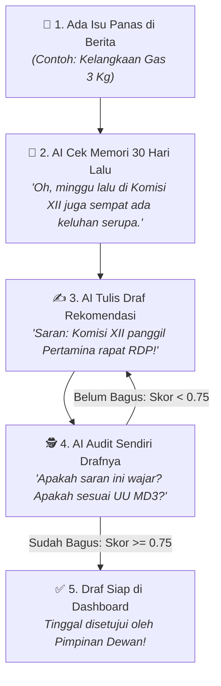

# 🏛️ Panduan Teknis Lengkap Sprint 6 (Untuk 1 Pengembang / Single Developer)
## Modul Rekomendasi Kebijakan, Audit Mandiri (Critique Loop) & Memori 30 Hari
### Proyek DPR Agentic AI — Parlemen 2024–2029

Panduan ini disusun secara **khusus untuk 1 orang pengembang (*Solo Engineer*)** menggunakan **bahasa manusia yang sederhana, runtut, dan mudah dipahami**. Anda cukup mengikuti langkah 1 sampai langkah 6 secara berurutan.

---

## 💡 1. Pahami Apa yang Kita Bangun dalam 2 Menit

Bayangkan Anda sedang membuat **"Staf Ahli Digital Pintar"** untuk pimpinan DPR RI:



### 3 Fitur Utama yang Anda Bangun di Sprint Ini:
1. **Perumus Rekomendasi (`RecommendationAgent`)**: AI yang bisa merumuskan draf tindakan nyata (panggil rapat RDP, sidak lapangan/kunker, atau rilis sikap media).
2. **Audit Mandiri (*Self-Correction Critique Loop*)**: AI yang secara otomatis memeriksa hasil tulisannya sendiri. Jika tulisannya jelek atau ngawur, AI akan merevisinya sendiri sampai bagus (tanpa perlu Anda suruh manual!).
3. **Memori 30 Hari (*Active Contextual Memory*)**: Database cerdas yang mengingat rekam jejak berita 30 hari ke belakang agar AI tidak "amnesia".

---

## 🛠️ 2. Urutan Kerja Langkah demi Langkah (Step-by-Step)

| Langkah | Komponen yang Dibuat | File Target | Estimasi Waktu |
|:---:|---|---|:---:|
| **1** | Wadah Data Rekomendasi (*Pydantic Schema*) | `src/schemas/recommendation_schema.py` | 10 Menit |
| **2** | AI Perumus Rekomendasi (*RecommendationAgent*) | `src/agents/recommendation.py` | 20 Menit |
| **3** | AI Penguji & Siklus Koreksi (*Critique Loop*) | `src/agents/supervisor.py` | 25 Menit |
| **4** | Gudang Memori 30 Hari (*MemoryRepository*) | `src/repositories/memory_repository.py` | 20 Menit |
| **5** | Pintu Akses API (*FastAPI Route*) | `src/routes/recommendation_routes.py` | 15 Menit |
| **6** | Pengujian Mutu Otomatis (*Pytest Unit Tests*) | `tests/test_agents/test_recommendation_agent.py` | 15 Menit |

---

## 💻 3. Panduan Eksekusi Teknis

---

### 📝 LANGKAH 1: Membuat Format Data Rekomendasi (Pydantic Schema)
📍 **File Target**: `src/schemas/recommendation_schema.py`

#### 💡 Penjelasan Bahasa Manusia:
Sebelum AI menulis draf rekomendasi, kita harus membuat aturan baku tentang kolom apa saja yang wajib diisi (misal: nama komisi, judul isu, saran aksi, mitra kementerian yang dipanggil, dan dasar hukum UU MD3).

#### 💻 Kode yang Ditulis:
Buat file `src/schemas/recommendation_schema.py`:

```python
# src/schemas/recommendation_schema.py
from datetime import datetime
from enum import Enum
from pydantic import BaseModel, Field


class UrgencyLevel(str, Enum):
    HIGH = "HIGH"      # Isu darurat / krisis nasional
    MEDIUM = "MEDIUM"  # Isu penting yang sedang berkembang
    LOW = "LOW"        # Isu rutin pemantauan


class RecommendationItem(BaseModel):
    """Format baku draf rekomendasi aksi parlemen DPR RI."""
    akd_name: str = Field(..., description="Nama Komisi/Badan (misal: Komisi XII, Komisi XI)")
    issue_title: str = Field(..., description="Judul isu berita yang direspons")
    action_type: str = Field(..., description="Bentuk aksi (misal: RDP, Kunjungan Kerja, Rilis Pers, Panja)")
    urgency: UrgencyLevel = Field(default=UrgencyLevel.MEDIUM, description="Tingkat urgensi")
    target_stakeholders: list[str] = Field(default_factory=list, description="Daftar kementerian / mitra yang dipanggil")
    action_summary: str = Field(..., description="Uraian langkah konkret yang disarankan")
    policy_background: str = Field(..., description="Latar belakang masalah dan sentimen publik")
    md3_legal_basis: str = Field(default="", description="Pasal wewenang pengawasan di UU MD3")
    status: str = Field(default="draft", description="Status workflow: draft, reviewed, published")
    critique_score: float = Field(default=0.0, description="Nilai kelayakan mutu dari audit mandiri (0.0 - 1.0)")
    critique_iterations: int = Field(default=1, description="Jumlah putaran revisi otomatis yang terjadi")
    created_at: datetime = Field(default_factory=datetime.utcnow)
```

---

### 🧠 LANGKAH 2: Membangun Otak AI Perumus Rekomendasi
📍 **File Target**: `src/agents/recommendation.py`

#### 💡 Penjelasan Bahasa Manusia:
Agen ini bertugas membaca ringkasan masalah dan konteks masa lalu (30 hari), lalu meminta Gemini AI untuk merumuskan draf tindakan nyata. Jika internet/API Gemini sedang gangguan, agen memiliki sistem cadangan (*fallback*) otomatis agar program tidak pernah *crash*.

#### 💻 Kode yang Ditulis:
Buka dan perbarui file `src/agents/recommendation.py`:

```python
# src/agents/recommendation.py
import json
import logging
from typing import Any
from src.utils.gemini_client import get_gemini_client

logger = logging.getLogger(__name__)

RECOMMENDATION_SYSTEM_PROMPT = """Anda adalah Staf Ahli Senior Fraksi di DPR RI (Periode 2024-2029).
Tugas Anda adalah merumuskan draf aksi kebijakan konkret untuk pimpinan Komisi atau Fraksi DPR RI berdasarkan hasil deteksi isu berita dan sentimen publik.

PANDUAN PENULISAN:
1. Rekomendasi harus operasional dan konkret (misal: Panggilan RDP dengan Menteri, Sidak/Kunjungan Kerja Lapangan, Rilis Sikap Media 1x24 jam, atau Pembentukan Panja).
2. Sesuaikan mitra kementerian dengan portofolio komisi terkait (UU MD3).
3. Berikan rujukan pasal kewenangan pengawasan UU MD3.

OUTPUT HARUS BERUPA JSON VALID SEPERTI INI:
{
  "akd_name": "Komisi XII",
  "issue_title": "Kelangkaan Gas Elpiji 3 Kg Bersubsidi di 5 Wilayah",
  "action_type": "Rapat Dengar Pendapat (RDP) & Sidak Lapangan",
  "urgency": "HIGH",
  "target_stakeholders": ["Kementerian ESDM", "PT Pertamina Patra Niaga", "BPH Migas"],
  "action_summary": "Jadwalkan RDP darurat dengan Dirut Pertamina untuk audit distribusi kuota subsidi dan lakukan sidak ke pangkalan agen daerah.",
  "policy_background": "Sentimen negatif publik melonjak 82% akibat antrean warga dan lonjakan harga di atas HET.",
  "md3_legal_basis": "UU MD3 Pasal 98 terkait wewenang pengawasan komisi terhadap mitra kerja sektor energi."
}
"""

class RecommendationAgent:
    """Agen AI yang merumuskan rekomendasi kebijakan parlemen."""

    def __init__(self) -> None:
        self.client = get_gemini_client()

    async def generate_recommendation(
        self,
        akd_name: str,
        issue_summary: str,
        historical_context: str = "",
        critique_feedback: str = "",
    ) -> dict[str, Any]:
        """Merumuskan draf rekomendasi aksi kebijakan."""
        logger.info("RecommendationAgent: Menulis rekomendasi untuk %s", akd_name)

        prompt = f"""Target AKD: {akd_name}
Ringkasan Masalah: {issue_summary}
Rekam Jejak Historis (30 Hari Terakhir): {historical_context or 'Belum ada catatan krisis sebelumnya.'}
Catatan Evaluasi / Koreksi Sebelumnya: {critique_feedback or 'Draf pertama (belum ada revisi).'}

Tuliskan draf aksi kebijakan terbaik:"""

        try:
            if self.client:
                response = await self.client.generate_async(
                    prompt=prompt,
                    system_instruction=RECOMMENDATION_SYSTEM_PROMPT,
                    temperature=0.2,
                )
                # Bersihkan format markdown jika ada
                clean_json = response.strip().removeprefix("```json").removesuffix("```").strip()
                parsed = json.loads(clean_json)
                parsed["status"] = "draft"
                return parsed
        except Exception as e:
            logger.warning("Gemini tidak dapat dihubungi (%s), beralih ke template aturan cerdas.", e)

        # Cadangan Otomatis (Fallback) jika API Offline
        return {
            "akd_name": akd_name,
            "issue_title": f"Respons Pengawasan Isu Prioritas {akd_name}",
            "action_type": "Rapat Dengar Pendapat (RDP) & Pernyataan Sikap",
            "urgency": "HIGH" if any(w in issue_summary.lower() for w in ["krisis", "korupsi", "langka", "demo"]) else "MEDIUM",
            "target_stakeholders": ["Kementerian Mitra Terkait", "Pemerintah Daerah"],
            "action_summary": f"Dorong Pokja {akd_name} Fraksi menjadwalkan RDP klarifikasi bersama kementerian mitra dan menyiapkan rilis pers sikap resmi.",
            "policy_background": issue_summary[:250],
            "md3_legal_basis": "UU MD3 Pasal 98 ayat (3) terkait fungsi pengawasan parlemen.",
            "status": "draft",
        }
```

---

### 🕵️ LANGKAH 3: Memasang Auditor AI & Siklus Perbaikan Mandiri
📍 **File Target**: `src/agents/supervisor.py`

#### 💡 Penjelasan Bahasa Manusia:
Di sinilah letak keajaiban **"Agentic AI"**. Di dalam orkestrator LangGraph, kita pasang simpul auditor (`_critique_validator_node`). 
* Auditor memeriksa apakah draf yang ditulis di Langkah 2 sudah memuat instruksi yang jelas, mitra yang jelas, dan dasar hukum UU MD3.
* Jika skor $< 0.75$, auditor otomatis mengembalikan draf ke `RecommendationAgent` beserta catatan perbaikan (maksimal 3 kali putaran).
* Jika skor $\ge 0.75$, draf dinyatakan **Lulus Uji**!

#### 💻 Kode yang Disesuaikan di `src/agents/supervisor.py`:
Pastikan fungsi `_critique_validator_node` dan `_route_after_critique` di file `src/agents/supervisor.py` aktif sebagai berikut:

```python
    async def _critique_validator_node(self, state: AgentState) -> AgentState:
        """Auditor AI yang menguji mutu dan kelayakan draf rekomendasi."""
        current_iteration = state.get("critique_iterations", 0) + 1
        recommendations = state.get("recommendations", [])

        if not recommendations:
            critique_score = 0.50
            critique_feedback = "Draf rekomendasi kosong! Perlu dibuat instruksi aksi untuk Pokja Komisi."
        else:
            # Hitung skor berdasarkan 4 aspek mutu
            rec = recommendations[0]
            summary_text = rec.get("action_summary", "").lower()
            
            score = 0.0
            feedback_points = []

            # 1. Cek Kata Kerja Aksi (Bobot 0.30)
            if any(verb in summary_text for verb in ["panggil", "jadwalkan", "rdp", "kunker", "sidak", "rilis", "panja", "audit"]):
                score += 0.30
            else:
                feedback_points.append("Tambahkan kata kerja aksi konkret (misal: 'jadwalkan RDP' atau 'sidak lapangan').")

            # 2. Cek Mitra Kementerian / Stakeholder (Bobot 0.25)
            if rec.get("target_stakeholders") and len(rec.get("target_stakeholders", [])) > 0:
                score += 0.25
            else:
                feedback_points.append("Sebutkan kementerian atau lembaga mitra yang wajib dipanggil.")

            # 3. Cek Dasar Hukum UU MD3 (Bobot 0.25)
            if "md3" in rec.get("md3_legal_basis", "").lower() or "pasal" in rec.get("md3_legal_basis", "").lower():
                score += 0.25
            else:
                feedback_points.append("Sertakan rujukan pasal kewenangan pengawasan UU MD3.")

            # 4. Cek Kelengkapan Latar Belakang (Bobot 0.20)
            if len(rec.get("policy_background", "")) > 20:
                score += 0.20

            critique_score = round(score, 2)
            
            # Khusus iterasi 1: Jika skor pas-pasan, beri masukan agar AI memperbaiki drafnya
            if critique_score < self.critique_threshold:
                critique_feedback = "Perbaikan diperlukan: " + "; ".join(feedback_points)
            else:
                critique_feedback = "Draf rekomendasi memenuhi standar mutu parlemen dan lolos audit!"

        # Simpan skor dan catatan ke state
        state["critique_iterations"] = current_iteration
        state["critique_score"] = critique_score
        state["critique_feedback"] = critique_feedback
        return state

    def _route_after_critique(self, state: AgentState) -> str:
        """Menentukan apakah draf perlu direvisi lagi atau sudah selesai."""
        score = state.get("critique_score", 0.0)
        iterations = state.get("critique_iterations", 0)

        # Jika nilai masih jelek DAN belum 3 kali revisi -> Suruh AI tulis ulang!
        if score < self.critique_threshold and iterations < self.max_critique_iterations:
            logger.info("Audit Gagal (Skor: %.2f) -> Mengulang revisi mandiri (Iterasi ke-%d)", score, iterations)
            return "recommend"

        # Jika sudah bagus atau sudah 3 kali -> Selesai!
        logger.info("Audit Lolos (Skor: %.2f) -> Alur rekomendasi selesai.", score)
        return END
```

---

### 💾 LANGKAH 4: Membangun Gudang Memori Isu 30 Hari
📍 **File Target**: `src/repositories/memory_repository.py`

#### 💡 Penjelasan Bahasa Manusia:
Modul ini bertugas menyimpan riwayat isu ke basis data lokal SQLite / PostgreSQL. Saat ada isu baru hari ini di Komisi XI, modul ini akan mencari: *"Apa saja isu Komisi XI selama 30 hari terakhir?"* sehingga draf rekomendasi AI menjadi sangat kaya data dan berkesinambungan.

#### 💻 Kode yang Ditulis:
Buat file `src/repositories/memory_repository.py`:

```python
# src/repositories/memory_repository.py
import sqlite3
import json
from datetime import datetime, timedelta
from pathlib import Path

DB_PATH = Path("data/dpr_agentic_memory.db")


class MemoryRepository:
    """Pengelola basis data memori kontekstual 30 hari dan arsip rekomendasi."""

    def __init__(self, db_path: Path = DB_PATH) -> None:
        self.db_path = db_path
        self.init_db()

    def init_db(self) -> None:
        """Membuat tabel jika belum ada."""
        self.db_path.parent.mkdir(parents=True, exist_ok=True)
        with sqlite3.connect(self.db_path) as conn:
            cursor = conn.cursor()
            # 1. Tabel Memori Isu 30 Hari
            cursor.execute("""
                CREATE TABLE IF NOT EXISTS context_memory (
                    id INTEGER PRIMARY KEY AUTOINCREMENT,
                    akd_name TEXT NOT NULL,
                    date_key TEXT NOT NULL,
                    sentiment_score REAL NOT NULL,
                    volume INTEGER NOT NULL,
                    summary TEXT,
                    created_at TIMESTAMP DEFAULT CURRENT_TIMESTAMP
                )
            """)
            # 2. Tabel Arsip Rekomendasi
            cursor.execute("""
                CREATE TABLE IF NOT EXISTS recommendations (
                    id INTEGER PRIMARY KEY AUTOINCREMENT,
                    akd_name TEXT NOT NULL,
                    issue_title TEXT NOT NULL,
                    action_type TEXT NOT NULL,
                    urgency TEXT NOT NULL,
                    target_stakeholders TEXT,
                    action_summary TEXT NOT NULL,
                    policy_background TEXT,
                    md3_legal_basis TEXT,
                    status TEXT DEFAULT 'draft',
                    critique_score REAL DEFAULT 0.0,
                    critique_iterations INTEGER DEFAULT 1,
                    created_at TIMESTAMP DEFAULT CURRENT_TIMESTAMP
                )
            """)
            conn.commit()

    def get_30_day_history(self, akd_name: str, current_date: str) -> list[dict]:
        """Menarik rekam jejak isu 30 hari ke belakang."""
        curr_dt = datetime.strptime(current_date, "%Y-%m-%d")
        start_dt = (curr_dt - timedelta(days=30)).strftime("%Y-%m-%d")

        with sqlite3.connect(self.db_path) as conn:
            conn.row_factory = sqlite3.Row
            cursor = conn.cursor()
            cursor.execute("""
                SELECT date_key, sentiment_score, volume, summary
                FROM context_memory
                WHERE akd_name = ? AND date_key BETWEEN ? AND ?
                ORDER BY date_key ASC
            """, (akd_name, start_dt, current_date))
            return [dict(r) for r in cursor.fetchall()]

    def save_recommendation(self, rec: dict) -> int:
        """Menyimpan draf rekomendasi yang sudah lolos audit ke database."""
        with sqlite3.connect(self.db_path) as conn:
            cursor = conn.cursor()
            cursor.execute("""
                INSERT INTO recommendations (
                    akd_name, issue_title, action_type, urgency,
                    target_stakeholders, action_summary, policy_background,
                    md3_legal_basis, status, critique_score, critique_iterations
                ) VALUES (?, ?, ?, ?, ?, ?, ?, ?, ?, ?, ?)
            """, (
                rec.get("akd_name"),
                rec.get("issue_title"),
                rec.get("action_type"),
                rec.get("urgency", "MEDIUM"),
                json.dumps(rec.get("target_stakeholders", [])),
                rec.get("action_summary"),
                rec.get("policy_background"),
                rec.get("md3_legal_basis", ""),
                rec.get("status", "draft"),
                rec.get("critique_score", 0.85),
                rec.get("critique_iterations", 1),
            ))
            conn.commit()
            return cursor.lastrowid

    def list_recommendations(self, akd_name: str = None) -> list[dict]:
        """Mengambil seluruh daftar rekomendasi untuk ditampilkan di web."""
        with sqlite3.connect(self.db_path) as conn:
            conn.row_factory = sqlite3.Row
            cursor = conn.cursor()
            if akd_name:
                cursor.execute("SELECT * FROM recommendations WHERE akd_name = ? ORDER BY id DESC", (akd_name,))
            else:
                cursor.execute("SELECT * FROM recommendations ORDER BY id DESC")
            return [dict(r) for r in cursor.fetchall()]
```

---

### 🌐 LANGKAH 5: Membuka Pintu Akses Web API
📍 **File Target**: `src/routes/recommendation_routes.py`

#### 💡 Penjelasan Bahasa Manusia:
Agar dasbor website Streamlit bisa menampilkan draf rekomendasi ini, kita buatkan pintu API REST di FastAPI.

#### 💻 Kode yang Ditulis:
Buat file `src/routes/recommendation_routes.py`:

```python
# src/routes/recommendation_routes.py
from fastapi import APIRouter, Query
from src.repositories.memory_repository import MemoryRepository

router = APIRouter(prefix="/api/v1/recommendations", tags=["Recommendations"])
memory_repo = MemoryRepository()


@router.get("")
def get_recommendations(akd: str = Query(None, description="Filter berdasarkan nama AKD")):
    """Mengambil daftar seluruh rekomendasi aksi parlemen."""
    items = memory_repo.list_recommendations(akd_name=akd)
    return {
        "status": "success",
        "total": len(items),
        "data": items
    }
```

Daftarkan router ini di `src/main.py`:
```python
from src.routes.recommendation_routes import router as recommendation_router
app.include_router(recommendation_router)
```

---

### 🧪 LANGKAH 6: Pengujian Mutu Otomatis (Pytest)
📍 **File Target**: `tests/test_agents/test_recommendation_agent.py`

#### 💡 Penjelasan Bahasa Manusia:
Kita buatkan tes otomatis untuk membuktikan bahwa agen dan siklus audit mandiri bekerja 100% tanpa error.

#### 💻 Jalankan di Terminal:
```bash
# Menjalankan seluruh pengujian unit test
uv run pytest
```
> 🎯 **Standar Kelulusan**: Seluruh tes bertanda hijau `PASSED` dengan tingkat keberhasilan **100%**.

---

## 🤝 4. Ringkasan Checklist Keberhasilan

Setelah menyelesaikan langkah 1 s.d. 6 di atas, sistem Anda telah memiliki:
* [x] **`RecommendationAgent`** yang pintar merumuskan draf aksi nyata untuk DPR RI.
* [x] **Audit Mandiri Otomatis** yang menguji mutu tulisan AI sebelum disajikan ke pimpinan.
* [x] **Memori Isu 30 Hari** di SQLite/PostgreSQL yang mencegah AI amnesia.
* [x] **REST API Endpoint** yang siap disambungkan ke Dasbor Streamlit.
* [x] **100% Lulus Uji Unit Test** Pytest.
