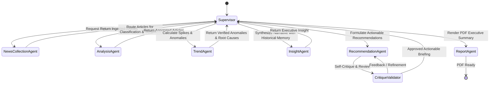

# 🤖 Panduan Desain Agen & Alur Kerja LangGraph (Genuine Agentic AI)

Dokumen ini mendefinisikan spesifikasi detail masing-masing agen, *tool registry*, level otonomi, memori kontekstual, dan mekanisme *self-correction loop* pada sistem **DPR Agentic AI**.

---

## 1. Daftar Agen & Level Otonomi



---

## 2. Spesifikasi Detail Agen

### 🏛️ 1. Supervisor Agent (`src/agents/supervisor.py`)
* **Level Otonomi**: **L3 (Fully Agentic)**
* **Fungsi**: Memimpin orkestrasi dinamis seluruh agen berbasis graf (*StateGraph*). Mengevaluasi kelengkapan state dan memutuskan apakah agen tertentu perlu dipanggil ulang (*looping/retry*) atau melanjutkan ke tahap berikutnya.
* **Tools**:
  * `route_next_agent(current_state)`: Memilih simpul berikutnya secara otonom.
  * `evaluate_task_state(state)`: Memeriksa integritas dan kelengkapan data.
  * `short_circuit_check(article)`: Mengalihkan artikel berpola jelas ke pemrosesan cepat (Tier-1).

---

### 📰 2. News Collection Agent (`src/agents/news_collection.py`)
* **Level Otonomi**: **L2 (Semi-Autonomous)**
* **Fungsi**: Mengumpulkan berita terkini dari 12+ portal berita nasional Tier-1 Indonesia secara asinkron dengan proteksi isolasi kegagalan per feed.
* **Tools**:
  * `fetch_rss_feeds(feed_list)`: Melakukan polling HTTP asinkron ke endpoint RSS.
  * `parse_entry_dates(raw_date_str)`: Normalisasi format waktu ke zona WIB (UTC+7).
  * `deduplicate_urls(articles)`: Menghapus redundansi berita berdasarkan URL hash & kemiripan judul.

---

### 🧠 3. Analysis Agent (`src/agents/analysis.py`)
* **Level Otonomi**: **L3 (Fully Agentic)**
* **Fungsi**: Melakukan klasifikasi 24 AKD DPR RI dan penilaian sentimen publik (Positif, Negatif, Netral). Agen memiliki otonomi untuk memutuskan kapan menggunakan leksikon kata kunci dan kapan menggunakan penalaran semantik mendalam via LLM.
* **Tools**:
  * `search_akd_lexicon(text)`: Pencocokan istilah portofolio kementerian/sektoral pada `kamus/akd_master.json`.
  * `llm_semantic_classify(text)`: Panggilan LLM `gemini-3.6-flash` untuk klasifikasi isu implisit.
  * `score_sentiment(text)`: Evaluasi polaritas sentimen berbasis kamus leksikon berbobot.

---

### 📈 4. Trend Agent (`src/agents/trend.py`)
* **Level Otonomi**: **L3 (Fully Agentic)**
* **Fungsi**: Mendeteksi anomali lonjakan volume pemberitaan dan sentimen negatif per AKD dengan metode *Z-Score*, lalu melakukan *root-cause reasoning* untuk menjelaskan faktor pemicu lonjakan tersebut.
* **Tools**:
  * `compute_zscore_anomalies(akd_name, window_days)`: Menghitung deviasi standar volume terhadap baseline harian.
  * `explain_anomaly_drivers(anomalous_articles)`: Menganalisis judul & ringkasan berita penyebab lonjakan.

---

### 💡 5. Insight Agent (`src/agents/insight.py`)
* **Level Otonomi**: **L3 (Fully Agentic)**
* **Fungsi**: Mengolah temuan anomali dan data analisis menjadi narasi eksekutif ringkas. Agen memanfaatkan **Memori Kontekstual Jangka Panjang** (riwayat isu minggu/bulan sebelumnya) agar sintesis narasi relevan dengan dinamika politik terkini.
* **Tools**:
  * `query_historical_memory(akd_name, topic)`: Mengambil histori isu serupa dari basis data PostgreSQL.
  * `generate_executive_narrative(current_data, memory_context)`: Memproduksi ringkasan isu strategis.

---

### 📝 6. Recommendation Agent (`src/agents/recommendation.py`) & Critique Validator
* **Level Otonomi**: **L3 (Fully Agentic)**
* **Fungsi**: Merumuskan rekomendasi aksi konkret bagi pimpinan AKD / fraksi parlemen (misal: agenda RDP, peninjauan lapangan, rilis pers) dengan siklus validasi mandiri (*Self-Critique Loop*).
* **Mekanisme Self-Correction**:
  1. *Generation*: Agen membuat draft rekomendasi awal.
  2. *Critique*: Agen kedua (*Critic*) menguji apakah rekomendasi realistis, sesuai wewenang komisi terkait, dan bebas halusinasi.
  3. *Refinement*: Draft diperbaiki jika skor validasi < ambang batas sebelum diserahkan ke Supervisor.
* **Tools**:
  * `formulate_policy_action(akd_name, insight)`: Merancang opsi aksi parlemen.
  * `critique_recommendation(draft, akd_scope)`: Mengevaluasi kepatuhan terhadap wewenang UU MD3.

---

### 📄 7. Report Agent (`src/agents/report.py`)
* **Level Otonomi**: **L2 (Semi-Autonomous)**
* **Fungsi**: Mengonversi output narasi, tabel anomali, dan rekomendasi aksi yang telah disetujui menjadi dokumen PDF siap cetak berstandar eksekutif menggunakan *ReportLab*.
* **Tools**:
  * `render_pdf_briefing(akd_name, payload)`: Menyusun tata letak PDF formal berlogo DPR RI.
  * `export_executive_summary(date_range)`: Mengekspor rekapitulasi komparatif multi-AKD.

---

## 3. Skema Komunikasi Pesan & State Antar-Agen

Setiap transaksi state antar-simpul (*node*) mematuhi protokol transparan:
1. **State Immutability**: Node menghasilkan state mutasi baru tanpa merusak histori log sebelumnya.
2. **Low-Cardinality Structured Logging**: Setiap transisi agen dicatat dengan konteks terstruktur (`extra={"task_type": ..., "step": ..., "confidence": ...}`).
3. **Graceful Fallbacks**: Jika simpul LLM mengalami kendala kuota/jaringan, alur kerja otomatis beralih ke sub-tool heuristik tanpa memutus keseluruhan graf eksekusi.

---

## 4. Kapabilitas Agentic Lanjutan per Agen

Bagian ini mendefinisikan kapabilitas lanjutan yang meningkatkan derajat otonomi masing-masing agen dari pemrosesan deterministik menuju penalaran mandiri, refleksi, dan adaptasi kontekstual.

### 📰 News Collection Agent — Dead/Broken Source Detection

```text
Feed Health State Machine:
  [healthy] ──(no new articles > 72h)──→ [stale] ──(confirmed dead)──→ [broken]
  [healthy] ──(3x consecutive HTTP 4xx/5xx)──→ [broken]
  [broken]  ──(admin re-enables / feed recovers)──→ [healthy]
```

* Agen memonitor kesehatan setiap RSS feed secara otonom.
* Feed berstatus `stale` atau `broken` di-*flag* otomatis ke dasbor untuk investigasi.
* Kegagalan satu feed **tidak** menghentikan ingesti dari sumber lain (*fault isolation*).
* **Tool Baru**: `check_source_health(feed_url) → SourceHealthStatus`

---

### 🧠 Analysis Agent — Multi-Label Dynamic Calibration

```text
Contoh Input: "Kasus Korupsi Tambang Ilegal PETI"

Multi-Label Calibration Output:
├── Komisi XII (Minerba/Energi)   → weight: 0.60 (Primary)
├── Komisi III (Penegakan Hukum)  → weight: 0.30 (Secondary)
└── Komisi II  (Otonomi Daerah)  → weight: 0.10 (Tertiary)
```

* Alih-alih memaksakan satu AKD, agen mengevaluasi bobot relevansi proporsional berdasarkan porsi konten yang menyentuh tiap portofolio komisi.
* Distribusi bobot ditentukan melalui *reasoning* LLM, bukan pemangkasan (*truncation*) label.
* **Tool Baru**: `calibrate_multi_label_weights(text, candidates) → list[AKDWeight]`

---

### 📈 Trend Agent — False-Positive Self-Review & Comparative Historical Analysis

**Self-Review Anomali:**
```text
Reflection Step (sebelum eskalasi ke Dasbor):
"Lonjakan Z-Score > 2.0 pada Komisi III (Hukum).
 Apakah ini sinyal isu kebijakan legislatif (RUU, kinerja Polri/Kejagung),
 atau noise dari berita kriminal human-interest?"

Output: anomaly_verdict = confirmed_signal | suppressed_noise | needs_human_review
```

**Comparative Historical Pattern:**
```text
"Isu penolakan kenaikan harga BBM ini memiliki pola serupa dengan
 September 2025. Sentimen negatif mereda dalam 5-7 hari setelah
 Pemerintah mengumumkan kompensasi subsidi."
```

* **Tool Baru**: `self_review_anomaly(anomaly_data, sample_articles) → AnomalyVerdict`
* **Tool Baru**: `compare_historical_pattern(akd_name, current_anomaly) → HistoricalComparison`

---

### 💡 Insight Agent — Cross-AKD Correlation & Cascade Detection

```text
Contoh: Lonjakan isu penolakan impor beras di Komisi IV (Pangan/Pertanian)
├── Cascade Check → Komisi VI  (Kemendag / Stabilisasi Harga Pasar)
├── Cascade Check → Komisi XI  (Inflasi / Daya Beli / RAPBN)
└── Output: Cross-AKD Insight Terpadu (multi-komisi)
```

* Mendeteksi efek domino yang tidak terlihat jika tiap AKD dianalisis secara terpisah.
* Memanfaatkan **Memori Kontekstual Jangka Panjang** untuk membandingkan pola lintas-periode.
* **Tool Baru**: `detect_cross_akd_correlations(akd_anomalies) → list[CrossAKDInsight]`

---

### 🏛️ Supervisor Agent — Adaptive Fallback & Strategy-Driven Error Handling

| Jenis Kegagalan | Strategi Otonom Supervisor |
|---|---|
| **Gemini API Timeout** | Switch ke `gemini-flash-lite` + flag `degraded_accuracy` |
| **HTTP 429 Rate Limited** | Jadwalkan ulang via Celery + exponential backoff |
| **Artikel High-Confidence** | Bypass LLM, langsung Tier-1 Lexicon ($0 cost, 0ms) |
| **RSS Feed Mati / 5xx** | Flag `source_status: degraded`, lanjut sumber lain |

* **Tool Baru**: `select_fallback_strategy(error_type, article_confidence) → FallbackAction`

---

### 📊 Dashboard — Personalized Executive Digest per AKD

Ringkasan yang disesuaikan relevansinya berdasarkan peran pengguna:

| Peran Pengguna | Konten Digest |
|---|---|
| **Tim Ahli Komisi II** | Intisari isu Pemilu/Pilkada/ASN/IKN |
| **Tim Ahli Komisi XI** | Dinamika inflasi, rupiah, postur RAPBN |
| **Pimpinan Fraksi** | Ringkasan agregat lintas-komisi, anomali terbesar |

---

## 5. Roadmap Implementasi Sprint 4–6

```text
Sprint 4 (Saat Ini) — Fondasi Agentic:
├── 1. LangGraph Supervisor Agent (StateGraph terpadu aktif)
├── 2. Dynamic Tool Registry (daftar tools eksplisit per agen)
├── 3. Multi-Label Dynamic Calibration pada AnalysisAgent
└── 4. Dead/Broken Source Detection pada NewsCollectionAgent

Sprint 5 — Reasoning & Reflection:
├── 5. False-Positive Self-Review di TrendAgent
├── 6. Cross-AKD Correlation Detection di InsightAgent
├── 7. Self-Correction Critique Loop di RecommendationAgent
├── 8. Comparative Historical Trend Analysis
└── 9. Adaptive Fallback & Error Strategy di Supervisor

Sprint 6 — Presentation & User Interaction:
├── 10. Personalized Executive Digest per AKD di Dashboard
└── 11. ReportAgent: PDF Briefing 3-Halaman berlogo DPR RI
```

