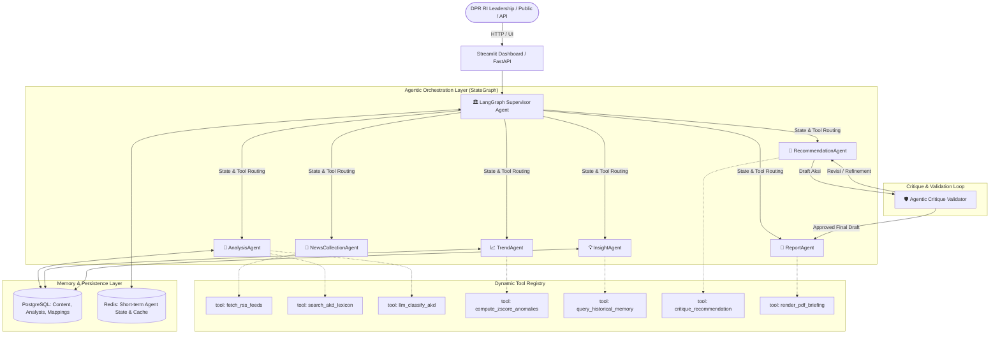

# 🏛️ Arsitektur Sistem DPR Agentic AI (Genuine Agentic Architecture)

Dokumen ini merinci arsitektur teknis dan spesifikasi sistem **DPR Agentic AI** yang mengadopsi standar **Genuine Agentic AI Multi-Agent Orchestration** menggunakan **LangGraph**, **Dynamic Tool Registry**, **Autonomous Routing**, **Stateful Memory**, dan **Self-Correction Reflection Loops**.

---

## 1. Paradigma: Dari Pipeline Linear Menuju Genuine Agentic AI

| Aspek | Arsitektur Linear Sebelumnya | **Genuine Agentic AI (Arsitektur Baru)** |
|---|---|---|
| **Orkestrator** | Script sekuensial statis (*Hardcoded pipeline*) | **LangGraph Supervisor Agent** dengan *Dynamic State Graph* |
| **Pengambilan Keputusan** | `if-else` deterministik | **Autonomous LLM Decision-Making & Dynamic Routing** |
| **Interaksi Modul** | Pemanggilan fungsi langsung | **Dynamic Tool-Use Registry** (Agent memilih tools secara dinamis) |
| **Analisis Tren** | Statistik Z-Score murni | **Reasoning & Root Cause Reflection** oleh Trend/Insight Agent |
| **Memori Sistem** | Database pasif (*Storage only*) | **Active Contextual Memory** (Histori memengaruhi rekomendasi) |
| **Kualitas Output** | Single-shot generation | **Self-Correction & Critique Loop** sebelum finalisasi draft |
| **Sumber Data** | Campuran | **12+ Portal Media Berita Nasional Tier-1 (Pure News Ingestion)** |

---

## 2. Diagram Arsitektur Multi-Agent Global



---

## 3. Komponen Inti & Level Otonomi (*Autonomy Levels*)

Sistem mengklasifikasikan kapabilitas setiap agen berdasarkan **Tingkat Otonomi (Autonomy Level)**:
- **L1 (Rule-Based)**: Deterministik, pemrosesan cepat berbasis aturan eksplisit (0ms).
- **L2 (Semi-Autonomous)**: Menggunakan heuristik dan LLM fallback bersyarat.
- **L3 (Fully Agentic)**: Autonomous reasoning, tool calling, reflection, dan self-correction.

| Agen | Tanggung Jawab Utama | Tool yang Digunakan | Autonomy Level |
|---|---|---|---|
| **Supervisor Agent** | Menentukan alur eksekusi dinamis, evaluasi kelengkapan state, dan koordinasi antar-agen. | `route_next_agent`, `evaluate_task_state`, `terminate_workflow` | **L3 (Fully Agentic)** |
| **News Collection Agent** | Mengumpulkan berita dari 12+ portal nasional, parsing RSS, ekstraksi metadata, sanitasi HTML. | `fetch_rss_feeds`, `parse_entry_dates`, `deduplicate_urls` | **L2 (Semi-Autonomous)** |
| **Analysis Agent** | Klasifikasi AKD (24 struktur), analisis sentimen, dan ekstraksi entitas kunci. | `search_akd_lexicon`, `llm_semantic_classify`, `score_sentiment` | **L3 (Fully Agentic)** |
| **Trend Agent** | Menghitung anomali Z-score volume/sentimen dan melakukan *root-cause reasoning*. | `compute_zscore_anomalies`, `explain_anomaly_drivers` | **L3 (Fully Agentic)** |
| **Insight Agent** | Mensintesis narasi strategis berdasarkan data agregat dan histori memori. | `query_historical_memory`, `generate_executive_narrative` | **L3 (Fully Agentic)** |
| **Recommendation Agent** | Merumuskan rekomendasi aksi parlemen/fraksi dengan validasi mandiri. | `formulate_policy_action`, `critique_recommendation` | **L3 (Fully Agentic)** |
| **Report Agent** | Mengkompilasi berkas ringkasan eksekutif PDF siap cetak untuk pimpinan dewan. | `render_pdf_briefing`, `export_executive_summary` | **L2 (Semi-Autonomous)** |

---

## 4. Alur Kerja LangGraph & Skema Komunikasi State (*AgentState*)

Komunikasi antar-agen diatur secara terstruktur melalui skema state bersama:

```python
from typing import TypedDict, Annotated, Sequence
from langchain_core.messages import BaseMessage

class AgentState(TypedDict):
    """Skema state terpadu untuk orkestrasi LangGraph."""
    messages: Sequence[BaseMessage]
    task_type: str                         # "full_cycle", "daily_monitoring", "adhoc_akd"
    target_date: str                       # e.g., "2026-08-18"
    raw_articles: list[dict]               # Artikel mentah hasil koleksi
    analyzed_articles: list[dict]          # Hasil sentimen & AKD mapping
    anomalies_detected: list[dict]         # Anomali volume/sentimen terverifikasi
    historical_context: dict               # Konteks dari memori jangka panjang
    insight_summary: str                   # Narasi eksekutif
    draft_recommendation: dict             # Draft rekomendasi aksi
    critique_feedback: list[str]           # Catatan koreksi mandiri
    final_report_path: str                 # Lokasi output PDF
    current_step: str                      # Penanda tahapan aktif
    confidence_overall: float              # Skor kepercayaan alur kerja
```

---

## 5. Model Efisiensi Biaya (*Cost Optimization*)

Untuk menjaga efisiensi anggaran dan menghindari kuota rate-limit:

1. **Short-Circuit Hybrid Routing**:
   * Jika artikel memiliki penyebutan eksplisit nama AKD (misal: "Komisi III", "Baleg"), Supervisor langsung mengarahkan ke Leksikon Tier-1 tanpa memanggil LLM (**0ms latency, $0.00 cost**).
   * LLM hanya dipanggil untuk artikel ambigu atau implisit.
2. **Model Tiering**:
   * **Supervisor & Routing**: Menggunakan `gemini-3.6-flash` / `gemini-flash-lite` (hemat token).
   * **Deep Reasoning & Recommendations**: Menggunakan `gemini-3.7-flash` / Pro tier untuk sintesis kebijakan bermutu tinggi.
3. **Context Caching**:
   * Definisi 24 AKD dan ruang lingkup tugasnya di-*cache* pada context window LLM, memangkas biaya input token hingga 85–90%.

---

## 6. Kapabilitas Agentic Lanjutan (*Advanced Agentic Capabilities*)

Bagian ini mendefinisikan fitur-fitur lanjutan yang meningkatkan derajat otonomi sistem dari pipeline deterministik menuju *Genuine Agentic AI* yang mampu melakukan penalaran mandiri, refleksi, dan adaptasi kontekstual.

### 6.1 Multi-Label Dynamic Calibration (AnalysisAgent)

Isu DPR di lapangan hampir selalu beririsan antar-komisi. Alih-alih memaksakan pemilihan satu AKD primer, `AnalysisAgent` mengevaluasi bobot relevansi proporsional secara mandiri:

```text
Contoh: "Kasus Korupsi Tambang Ilegal PETI"
├── Komisi XII (Minerba/Energi)   → 60% relevance weight (Primary)
├── Komisi III (Penegakan Hukum)  → 30% relevance weight (Secondary)
└── Komisi II  (Otonomi Daerah)  → 10% relevance weight (Tertiary)
```

* **Mekanisme**: Agen menggunakan *reasoning* berbasis LLM untuk menentukan distribusi bobot, bukan sekadar memotong label tambahan.
* **Tool**: `calibrate_multi_label_weights(text, candidates) → list[AKDWeight]`

### 6.2 False-Positive Self-Review & Anomaly Critique (TrendAgent)

Sebelum anomali dieskalasi ke Dasbor/Pimpinan, agen melakukan langkah refleksi (*self-critique*):

```text
Reflection Prompt:
"Lonjakan Z-Score > 2.0 terdeteksi pada Komisi III (Hukum).
 Apakah ini sinyal isu kebijakan legislatif (RUU KUHAP, kinerja Polri/Kejagung),
 atau sekadar noise dari berita kriminal human-interest lokal?"
```

* **Output**: Field `anomaly_verdict` bernilai `confirmed_signal` | `suppressed_noise` | `needs_human_review`.
* **Tool**: `self_review_anomaly(anomaly_data, sample_articles) → AnomalyVerdict`

### 6.3 Cross-AKD Correlation & Cascade Detection (InsightAgent)

Mendeteksi efek domino antar-komisi yang tidak terlihat dalam analisis silo:

```text
Contoh: Lonjakan isu penolakan impor beras terdeteksi di Komisi IV (Pangan/Pertanian)
├── Cascade Check → Komisi VI  (Kemendag / Stabilisasi Harga Pasar)
├── Cascade Check → Komisi XI  (Inflasi / Daya Beli / Asumsi Makro RAPBN)
└── Output: Cross-AKD Insight Terpadu (multi-komisi)
```

* **Tool**: `detect_cross_akd_correlations(akd_anomalies) → list[CrossAKDInsight]`

### 6.4 Adaptive Fallback & Strategy-Driven Error Handling (Supervisor)

Supervisor memilih strategi mitigasi cerdas berdasarkan jenis kegagalan:

| Jenis Kegagalan | Strategi Otonom |
|---|---|
| **Gemini API Timeout** | Switch ke model `gemini-flash-lite` + flag `degraded_accuracy` |
| **HTTP 429 Rate Limited** | Jadwalkan ulang via Celery dengan exponential backoff |
| **Artikel High-Confidence Eksplisit** | Bypass LLM sepenuhnya, langsung Tier-1 Lexicon ($0 cost) |
| **RSS Feed Mati / Error 5xx** | Flag sumber sebagai `source_status: degraded`, lanjut sumber lain |

* **Tool**: `select_fallback_strategy(error_type, article_confidence) → FallbackAction`

### 6.5 Dead/Broken Source Detection (NewsCollectionAgent)

Agen mendeteksi feed RSS yang berhenti update atau mengembalikan error berulang:

* Jika feed tidak menghasilkan artikel baru selama > 72 jam, status berubah menjadi `stale`.
* Jika feed mengembalikan HTTP 4xx/5xx berturut-turut > 3 kali, status menjadi `broken`.
* Laporan kesehatan sumber (*Source Health Report*) tersedia di Dasbor.

### 6.6 Personalized Executive Digest per AKD (Dashboard)

Ringkasan yang disesuaikan relevansinya untuk staf tiap unit AKD:

* **Tim Ahli Komisi II**: Hanya menerima intisari isu Pemilu/Pilkada/ASN/IKN.
* **Tim Ahli Komisi XI**: Hanya menerima dinamika inflasi, rupiah, postur RAPBN.
* **Pimpinan Fraksi**: Menerima ringkasan agregat lintas-komisi dengan penekanan pada anomali terbesar.

### 6.7 Comparative Historical Trend Analysis (TrendAgent)

Agen membandingkan pola isu saat ini dengan pola historis serupa:

```text
"Isu penolakan kenaikan harga BBM ini memiliki pola serupa dengan peristiwa
 September 2025. Pada waktu itu, sentimen negatif mereda dalam 5-7 hari
 setelah Pemerintah mengumumkan kompensasi subsidi."
```

* **Tool**: `compare_historical_pattern(akd_name, current_anomaly) → HistoricalComparison`

---

## 7. Roadmap Implementasi Sprint 4–6

```text
Sprint 4 (Saat Ini) — Fondasi Agentic:
├── 1. LangGraph Supervisor Agent (StateGraph terpadu aktif)
├── 2. Dynamic Tool Registry (daftar tools eksplisit per agen)
├── 3. Multi-Label Dynamic Calibration pada AnalysisAgent [6.1]
└── 4. Dead/Broken Source Detection pada NewsCollectionAgent [6.5]

Sprint 5 — Reasoning & Reflection:
├── 5. False-Positive Self-Review di TrendAgent [6.2]
├── 6. Cross-AKD Correlation Detection di InsightAgent [6.3]
├── 7. Self-Correction Critique Loop di RecommendationAgent
├── 8. Comparative Historical Trend Analysis [6.7]
└── 9. Adaptive Fallback & Error Strategy di Supervisor [6.4]

Sprint 6 — Presentation & User Interaction:
├── 10. Personalized Executive Digest per AKD di Dashboard [6.6]
└── 11. ReportAgent: PDF Briefing 3-Halaman berlogo DPR RI
```

