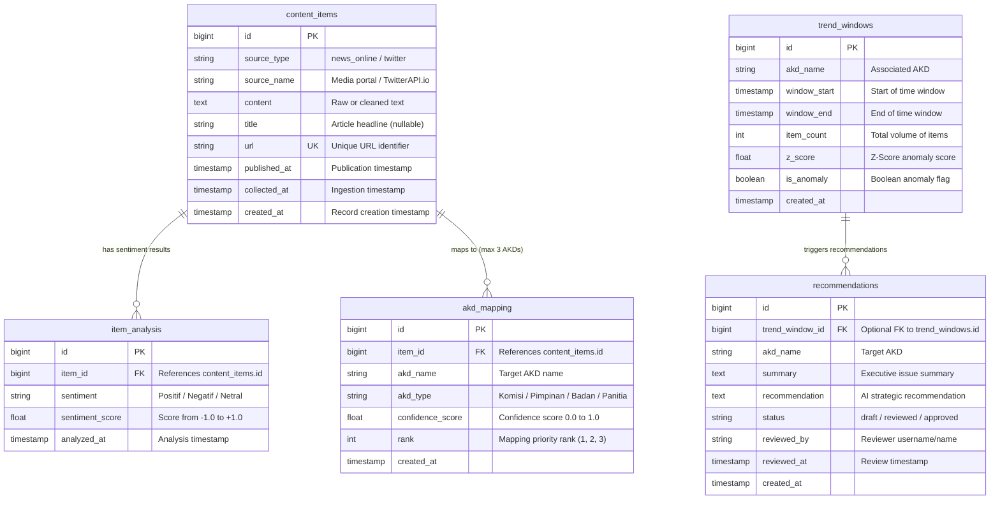

# Database Architecture & PostgreSQL Schema Documentation

## Overview

The **DPR Agentic AI** platform uses a PostgreSQL 15 relational database managed via AsyncSQLAlchemy 2.0 ORM and Alembic schema migrations.

---

## Entity Relationship Diagram (ERD)



---

## Table Schema Details

### 1. `content_items` Table
Stores raw collected news articles and Twitter posts.
- `id` (INTEGER, Primary Key)
- `source_type` (VARCHAR(50), NOT NULL, Index): Content origin (`news_online`, `twitter`).
- `source_name` (VARCHAR(200)): Media outlet name or API provider name.
- `content` (TEXT, NOT NULL): Full article body or tweet text.
- `title` (VARCHAR(500)): Article headline (nullable for social media posts).
- `url` (VARCHAR(1000), UNIQUE): Canonical source URL.
- `published_at` (TIMESTAMPTZ): Article publication timestamp.
- `collected_at` (TIMESTAMPTZ): Ingestion timestamp.
- `created_at` (TIMESTAMPTZ): Record creation timestamp.

### 2. `item_analysis` Table
Stores sentiment analysis results per content item.
- `id` (INTEGER, Primary Key)
- `item_id` (INTEGER, FK $\rightarrow$ `content_items.id`, NOT NULL): Parent content item.
- `sentiment` (VARCHAR(20), NOT NULL, Index): Classification label (`Positif`, `Negatif`, `Netral`).
- `sentiment_score` (FLOAT, NOT NULL): Sentiment score (-1.0 to 1.0).
- `analyzed_at` (TIMESTAMPTZ): Timestamp of AI analysis execution.

### 3. `akd_mapping` Table
Stores multi-label AKD classifications (max 3 AKDs per content item).
- `id` (INTEGER, Primary Key)
- `item_id` (INTEGER, FK $\rightarrow$ `content_items.id`, NOT NULL): Parent content item.
- `akd_name` (VARCHAR(50), NOT NULL, Index): Official AKD name (e.g. *Komisi III, Baleg*).
- `akd_type` (VARCHAR(50)): AKD category (*Komisi, Pimpinan, Badan, Panitia*).
- `confidence_score` (FLOAT, NOT NULL): Classification confidence (0.0 to 1.0).
- `rank` (INTEGER, NOT NULL): Mapping priority (1, 2, or 3).
- *Constraint*: `UniqueConstraint("item_id", "akd_name")` prevents duplicate AKD assignments per item.

### 4. `trend_windows` Table
Stores aggregated volume metrics and Z-score anomaly detection per AKD time window.
- `id` (INTEGER, Primary Key)
- `akd_name` (VARCHAR(50), NOT NULL)
- `window_start` / `window_end` (TIMESTAMPTZ, NOT NULL): Time interval boundaries.
- `item_count` (INTEGER): Total volume count.
- `z_score` (FLOAT): Statistical z-score measuring deviation from baseline volume.
- `is_anomaly` (BOOLEAN, Index): True if z_score exceeds anomaly threshold (> 2.0).
- `created_at` (TIMESTAMPTZ)

### 5. `recommendations` Table
Stores AI-generated strategic recommendations and human review status for Faction leadership.
- `id` (INTEGER, Primary Key)
- `akd_name` (VARCHAR(50), NOT NULL): Target AKD.
- `summary` (TEXT, NOT NULL): Narrative summary of public discourse.
- `recommendation` (TEXT, NOT NULL): Strategic action or response advice.
- `status` (VARCHAR(20), Index): Review workflow status (`draft`, `reviewed`, `approved`).
- `reviewed_by` (VARCHAR(100)): Reviewer name/ID.
- `reviewed_at` (TIMESTAMPTZ): Review timestamp.
- `trend_window_id` (INTEGER, FK $\rightarrow$ `trend_windows.id`, Nullable): Linked anomaly event.

---

## Alembic Database Migrations

Database schema migrations are managed via Alembic:

```bash
# Apply pending database migrations
uv run alembic upgrade head

# Generate a new migration revision (after ORM model changes)
uv run alembic revision --autogenerate -m "add_new_column_name"

# Rollback last applied migration
uv run alembic downgrade -1
```
