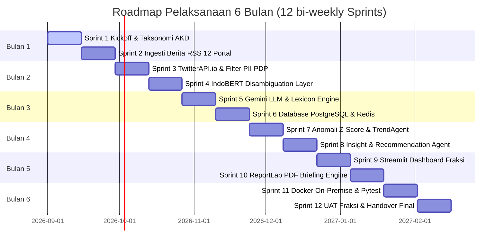

# 📅 JADWAL PELAKSANAAN PROYEK HARI-DEMI-HARI (DAY-TO-DAY TIMELINE)
## Agentic AI Klasifikasi AKD & Analisis Sentimen DPR RI (Periode 6 Bulan / 120 Hari Kerja)

---

## 📑 RINGKASAN STRUKTUR TIM & SPRINT 

* **Metodologi**: Agile Scrum (12 Bi-Weekly Sprints / 120 Hari Kerja).
* **Target Stakeholder**: Fraksi Partai Politik di DPR RI (Pimpinan Fraksi, Tim Ahli Fraksi, Pokja Komisi I–XIII).
* **Tim Teknis**:
  * **Informatika 1 (Inf 1)**: Technical Lead, Backend API & Infrastructure Lead
  * **Informatika 2 (Inf 2)**: AI/LLM Specialist & NLP Engineer Lead
  * **Sistem Informasi 1 (SI 1)**: Database Architect & Executive Dashboard Lead
  * **Sistem Informasi 2 (SI 2)**: System Analyst, Technical Writer & QA Lead

---

## 🚀 ROADMAP BI-WEEKLY SPRINT (SPRINT 1 s.d. SPRINT 12)

---

## 📋 DETIL RINCIAN HARI-DEMI-HARI (HARI 1 S.D. HARI 120)

### 🔹 BULAN 1: INSIASI, INFRASTRUKTUR & INGESTI BERITA RSS (HARI 1 – 20)

#### **Sprint 1: Kickoff, Setup Repo `uv` & Taksonomi 24 AKD (Hari 1 – 10)**
* **Hari 1–2**: Kickoff meeting bersama Pimpinan & Tim Ahli Fraksi untuk mengunci ruang lingkup pemantauan 24 AKD DPR RI.
* **Hari 3–4**: Setup lingkungan kerja Python 3.11, manajemen dependensi `uv`, struktur repositori Git, dan docker baseline (Inf 1).
* **Hari 5–6**: Penyusunan taksonomi master 24 AKD DPR RI Periode 2024–2029 pada `kamus/akd_master.json` (SI 2 & Inf 2).
* **Hari 7–8**: Pembuatan skema Pydantic `ContentItem`, `AnalysisResult`, dan `AKDMapping` (Inf 1).
* **Hari 9–10**: Review Sprint 1, setup CI/CD pipeline Pytest, dan dokumentasi awal (SI 2).

#### **Sprint 2: Ingesti Berita RSS Media Online Tier-1 (Hari 11 – 20)**
* **Hari 11–12**: Development `NewsCollectionAgent` untuk menangani parser RSS 12 portal berita nasional (Detik, Antara, Tempo, dll) (Inf 1).
* **Hari 13–14**: Pembangunan engine normalisasi judul berita dan deduplikasi *in-memory* berbasis URL Hash (Inf 1).
* **Hari 15–16**: Pengujian ketahanan ingesti RSS berita terhadap network timeout (10s limit) (SI 2).
* **Hari 17–18**: Partisi penyimpanan harian artikel JSON under `data/news/news_YYYY-MM-DD.json` (SI 1).
* **Hari 19–20**: Review Sprint 2 & penulisan unit test ingesti berita (100% passing) (Inf 1 & SI 2).

---

### 🔹 BULAN 2: INGESTI TWITTER REST API & MODEL INDOBERT (HARI 21 – 40)

#### **Sprint 3: TwitterAPI.io REST API & Filter Privasi PII PDP (Hari 21 – 30)**
* **Hari 21–22**: Integrasi `TwitterAPI.io` REST Advanced Search Client (`https://api.twitterapi.io/twitter/tweet/advanced_search`) (Inf 1).
* **Hari 23–24**: Penyusunan 4-layer query Boolean terstruktur untuk 24 AKD dengan filter `lang:id` dan `-filter:retweets` (Inf 2).
* **Hari 25–26**: Pembangunan **PII Redaction Engine** (redaksi otomatis nomor telepon `[PHONE_REDACTED]` dan email `[EMAIL_REDACTED]`) sesuai UU PDP No. 27/2022 (SI 2 & Inf 1).
* **Hari 27–28**: Partisi penyimpanan tweet JSON under `data/tweets/tweets_YYYY-MM-DD.json` (SI 1).
* **Hari 29–30**: Review Sprint 3 & audit kepatuhan UU PDP/UU ITE (SI 2).

#### **Sprint 4: Tier 1 RegEx Candidate Extractor & Tier 2 IndoBERT Disambiguation (Hari 31 – 40)**
* **Hari 31–32**: Pembangunan **Tier 1 Fast RegEx Matcher** untuk deteksi eksplisit sebutan AKD (latensi 0ms, $0 cost) (Inf 2).
* **Hari 33–35**: Integrasi **Tier 2 IndoBERT Disambiguation Layer (`indobert-base-p1`)** untuk pebobotan konteks kalimat dan memisahkan AKD Utama (Rank 1) vs Sekunder (Rank 2 & 3) (Inf 2).
* **Hari 36–37**: Pengujian akurasi disambiguasi artikel multi-AKD (Inf 2 & SI 2).
* **Hari 38–40**: Review Sprint 4 & integrasi modul klasifikasi lokal (Inf 2).

---

### 🔹 BULAN 3: GEMINI LLM, DATABASE POSTGRESQL & REDIS (HARI 41 – 60)

#### **Sprint 5: Tier 3 Gemini LLM Zero-Shot & Tier 4 Lexicon Fallback (Hari 41 – 50)**
* **Hari 41–43**: Integrasi **Tier 3 Gemini LLM Zero-Shot AI (`gemini-flash-latest`)** via `gemini_client.py` untuk berita implisit (Inf 2).
* **Hari 44–46**: Development **Tier 4 Multi-Factor Weighted Lexicon Engine** sebagai sistem cadangan lokal jika API bermasalah (Inf 2).
* **Hari 47–48**: Integrasi engine penilaian sentimen Positif, Negatif, Netral (-1.0 s.d. +1.0) (Inf 2).
* **Hari 49–50**: Review Sprint 5 & pengujian 4-tier router fallback resilience (SI 2).

#### **Sprint 6: Skema Database PostgreSQL 15 & Redis Caching Layer (Hari 51 – 60)**
* **Hari 51–53**: Perancangan skema relasional PostgreSQL 15 (`content_items`, `item_analysis`, `akd_mapping`, `trend_windows`, `recommendations`) (SI 1).
* **Hari 54–55**: Pembuatan skrip migrasi basis data via Alembic (`uv run alembic upgrade head`) (SI 1).
* **Hari 56–57**: Implementasi Redis 7 caching layer untuk mempercepat pencarian query dasbor (< 100ms) (Inf 1).
* **Hari 58–60**: Review Sprint 6 & pengujian beban transaksi basis data (SI 1 & Inf 1).

---

### 🔹 BULAN 4: ANOMALI Z-SCORE & REKOMENDASI AI FRAKSI (HARI 61 – 80)

#### **Sprint 7: Development `TrendAgent` & Z-Score Anomaly Detector (Hari 61 – 70)**
* **Hari 61–64**: Formulasi algoritma statistik simpangan baku *Z-score anomaly detection* untuk pelacakan volume isu per jendela waktu (Inf 2 & SI 1).
* **Hari 65–67**: Pembangunan mekanisme penandaan flag anomali lonjakan isu negatif (`is_anomaly = true` jika Z-Score > 2.0) (Inf 2).
* **Hari 68–70**: Review Sprint 7 & unit testing agen tren (SI 2 & Inf 2).

#### **Sprint 8: Development `InsightAgent` & `RecommendationAgent` (Hari 71 – 80)**
* **Hari 71–74**: Perancangan prompt engineering `InsightAgent` untuk menghasilkan ringkasan naratif isu publik bagi Pimpinan Fraksi (Inf 2).
* **Hari 75–77**: Development `RecommendationAgent` untuk menyusun draf poin jawaban media dan rekomendasi Pokja Komisi Fraksi (Inf 2).
* **Hari 78–80**: Review Sprint 8 & pengujian relevansi narasi AI (SI 2 & Inf 2).

---

### 🔹 BULAN 5: DASBOR EKSEKUTIF & GENERATOR PDF BRIEFING (HARI 81 – 100)

#### **Sprint 9: Development Streamlit Executive Dashboard UI (Hari 81 – 90)**
* **Hari 81–84**: Pembuatan antarmuka visual Streamlit Executive Dashboard (ringkasan sentimen nasional, filter 24 AKD, visualisasi tren) (SI 1).
* **Hari 85–87**: Pengintegrasian komponen rekomendasi interaktif dan status verifikasi manusia (*draft, reviewed, approved*) (SI 1).
* **Hari 88–90**: Review Sprint 9 & pengujian UI/UX responsif (SI 1 & SI 2).

#### **Sprint 10: Generator ReportLab PDF Executive Briefing (Hari 91 – 100)**
* **Hari 91–94**: Pemrograman generator PDF otomatis `ReportLab` layout 3 halaman khusus Rapat Pimpinan Fraksi (SI 1).
* **Hari 95–97**: Penyesuaian skema tata letak PDF, tabel anomali, dan poin rekomendasi Jubir Fraksi (SI 1 & SI 2).
* **Hari 98–100**: Review Sprint 10 & uji pengunduhan PDF instan (SI 1 & SI 2).

---

### 🔹 BULAN 6: DEPLOYMENT ON-PREMISE, QA & UAT FRAKSI (HARI 101 – 120)

#### **Sprint 11: Deployment On-Premise Docker & Regression Testing (Hari 101 – 110)**
* **Hari 101–104**: Pembuatan konfigurasi `docker-compose.yml` untuk penggelaran On-Premise di server internal Fraksi (Inf 1).
* **Hari 105–107**: Eksekusi pengujian menyeluruh Pytest suite (**101/101 tests passed**) (SI 2).
* **Hari 108–110**: Review Sprint 11 & pengujian keamanan server lokal (Inf 1 & SI 2).

#### **Sprint 12: User Acceptance Testing (UAT) & Serah Terima Handover (Hari 111 – 120)**
* **Hari 111–114**: Pelaksanaan User Acceptance Testing (UAT) bersama Pimpinan Fraksi & Tim Ahli Fraksi (Seluruh Tim).
* **Hari 115–117**: Pelatihan pengguna (*User Training*) & penyusunan User Manual / System Administration Guide (SI 2).
* **Hari 118–120**: Sign-off Lembar Persetujuan Formal & Penyerahan Seluruh Final Deliverables (Seluruh Tim).
