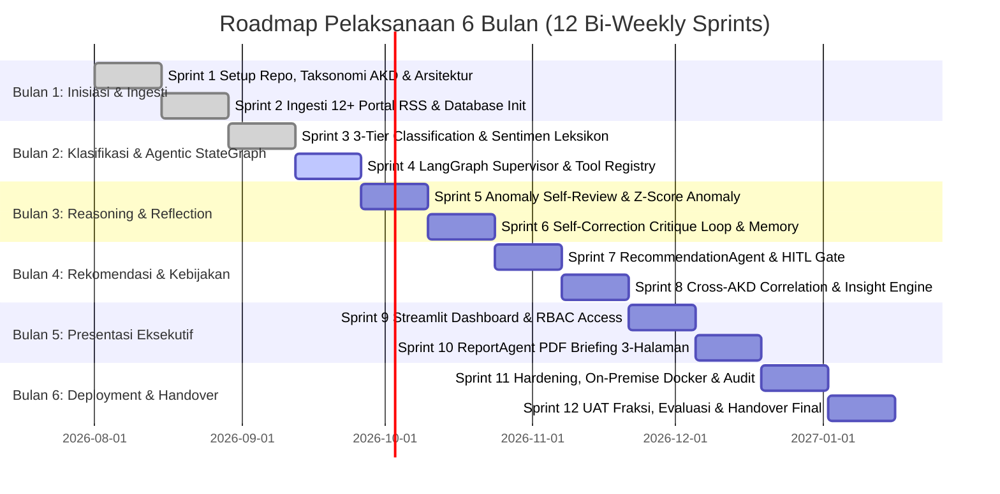

# 📅 JADWAL PELAKSANAAN PROYEK HARI-DEMI-HARI (DAY-TO-DAY TIMELINE)
## Proyek DPR Agentic AI — Monitoring AKD & Analisis Sentimen DPR RI 2024–2029

> **Status Sistem**: 100% Media Berita Nasional (Bebas Twitter/X)  
> **Arsitektur**: Genuine Agentic AI (LangGraph `StateGraph`, Multi-Agent Swarm, Self-Correction Loops, Human-in-the-Loop)  
> **Sprint Aktif Saat Ini**: **Sprint 4 (Bulan 2 — Fondasi Agentic)**  
> **Data Live Teranalisis**: 3.552+ artikel (1–24 Agustus 2026) | 77/77 Unit Tests Passing ✅  

---

## 📑 RINGKASAN STRUKTUR TIM & SPRINT 

* **Metodologi**: Agile Scrum (12 Bi-Weekly Sprints / 120 Hari Kerja).
* **Target Stakeholder**: Fraksi Partai Politik & Pimpinan DPR RI (Pimpinan Fraksi, Tim Ahli Fraksi, Pokja Komisi I–XIII).
* **Pembagian Peran Tim Teknis**:
  * **Informatika 1 (Inf 1)**: Technical Lead, Backend API, Infrastructure & Docker Deployment
  * **Informatika 2 (Inf 2)**: AI/LLM Specialist, LangGraph Architect & NLP Engineer
  * **Sistem Informasi 1 (SI 1)**: Database Architect, Sentiment Scoring & Executive Dashboard Lead
  * **Sistem Informasi 2 (SI 2)**: System Analyst, Technical Writer, Privacy & QA Lead

---

## 🚀 ROADMAP BI-WEEKLY SPRINT (SPRINT 1 s.d. SPRINT 12)

---

## 📋 DETIL RINCIAN HARI-DEMI-HARI (HARI 1 S.D. HARI 120)

---

### 🔹 BULAN 1: INISIASI, TAKSONOMI AKD & INGESTI BERITA RSS (HARI 1 – 20)

#### **Sprint 1: Setup Repo `uv`, Taksonomi 24 AKD & Skema Data (Hari 1 – 10) ✅**
* **Hari 1–2**: Kickoff meeting bersama Pimpinan & Tim Ahli Fraksi untuk mengunci ruang lingkup pemantauan 24 AKD DPR RI.
* **Hari 3–4**: Setup lingkungan kerja Python 3.11, manajemen dependensi `uv`, struktur repositori Git, dan docker baseline (Inf 1).
* **Hari 5–6**: Penyusunan taksonomi master 24 AKD DPR RI Periode 2024–2029 pada `kamus/akd_master.json` (SI 2 & Inf 2).
* **Hari 7–8**: Pembuatan skema Pydantic `ContentItem`, `AnalysisResult`, dan `AKDMapping` (Inf 1).
* **Hari 9–10**: Review Sprint 1, setup CI/CD pipeline Pytest, dan perumusan standar mutu (SI 2).

#### **Sprint 2: Ingesti Berita RSS 12+ Portal Media Nasional & Database Setup (Hari 11 – 20) ✅**
* **Hari 11–12**: Development `NewsCollectionAgent` untuk menangani parser RSS 12 portal berita nasional (Detik, Antara, Tempo, CNN, Republika, dll.) (Inf 1).
* **Hari 13–14**: Pembangunan engine normalisasi judul dan deduplikasi *in-memory* berbasis URL Hash (Inf 1).
* **Hari 15–16**: Pengujian ketahanan ingesti RSS berita terhadap network timeout dan error isolation (SI 2).
* **Hari 17–18**: Perancangan skema relasional PostgreSQL 16 (`content_items`, `item_analysis`, `akd_mapping`, `trend_windows`, `recommendations`) & partisi data harian JSON (SI 1).
* **Hari 19–20**: Implementasi Redis 7 cache layer dan eksekusi migrasi database via Alembic (Inf 1 & SI 1).

---

### 🔹 BULAN 2: 3-TIER HYBRID CLASSIFICATION & LANGGRAPH SUPERVISOR (HARI 21 – 40)

#### **Sprint 3: 3-Tier Classification Engine & Sentiment Scoring (Hari 21 – 30) ✅**
* **Hari 21–22**: Pembangunan **Tier 1 Fast Regex Matcher** untuk deteksi eksplisit sebutan AKD (latensi 0ms, $0 cost) (Inf 2).
* **Hari 23–25**: Integrasi **Tier 2 Gemini LLM Zero-Shot AI (`gemini-3.6-flash`)** via Google GenAI SDK modern untuk berita implisit (Inf 2).
* **Hari 26–27**: Development **Tier 3 Offline Weighted Lexicon Engine** sebagai sistem cadangan lokal jika API down/rate-limited (Inf 2).
* **Hari 28–29**: Pembangunan kamus leksikon sentimen Indonesia (140+ kata) & formula kontinu `[-1.0, +1.0]` (SI 1).
* **Hari 30**: Review Sprint 3 & validasi 77 passing unit tests (SI 2).

#### **Sprint 4: LangGraph Supervisor StateGraph & Dynamic Tool Registry (Hari 31 – 40) ✅**
* **Hari 31–32**: Transformasi `src/agents/supervisor.py` menjadi **LangGraph StateGraph Dinamis** dengan skema `AgentState` terpadu & self-correction reflection loop (Inf 2).
* **Hari 33–34**: Pembangunan **Dynamic Tool Registry** (`src/agents/tools.py`) dengan dekorator `@tool` (`fetch_rss_tool`, `classify_akd_tool`, `analyze_sentiment_tool`, `calculate_zscore_tool`, `lookup_akd_metadata_tool`) (Inf 2).
* **Hari 35–36**: Pembangunan **DPR Policy Relevance & Noise Filter** di `NewsCollectionAgent` & `AnalysisAgent` untuk membuang konten tips, resep, horoskop, rumor gadget, dan trivia (Inf 1 & Inf 2).
* **Hari 37–38**: Pembangunan **Dead/Broken Feed Health Monitor (A3)** pada `NewsCollectionAgent` untuk memantau kesehatan 40+ RSS feed secara real-time & auto-skip (Inf 1).
* **Hari 39–40**: Integrasi REST API endpoint `POST /agents/run`, `GET /agents/health/feeds`, dan validasi 100 passing unit tests (SI 2).

---

### 🔹 BULAN 3: REASONING, ANOMALY PERSISTENCE & ACTIVE MEMORY (HARI 41 – 60)

#### **Sprint 5: Hybrid Sentiment-Weighted Z-Score & Ground Truth Benchmark (Hari 41 – 50) ✅**
* **Hari 41–43**: Transformasi algoritma kalkulasi tren dari Pure Volume Z-Score menjadi **Sentiment-Weighted Augmented Z-Score ($Z_{\text{weighted}} \ge 2.0$)** dengan *Damping Smoothing* ($k=1.5$) untuk mendeteksi krisis kebijakan berbobot sentimen negatif pada `TrendAgent` (Inf 2 & SI 1).
* **Hari 44–46**: Penguatan simpul **Anomaly Policy Reasoner & Self-Review (C3)** pada LangGraph Supervisor: AI (Gemini) melakukan audit kontekstual apakah lonjakan $Z_{\text{weighted}}$ merupakan isu regulasi DPR riil atau sekadar *noise* viral lokal (Inf 2).
* **Hari 47–48**: Kurasi dataset **Ground Truth 100 Sampel Terverifikasi Manual** (`data/benchmark/ground_truth_100.json`) dan pembangunan modul evaluasi otomatis akurasi & Macro F1 (`src/utils/benchmark_evaluator.py`) (SI 2).
* **Hari 49–50**: Persistensi hasil anomali Z-score ke tabel PostgreSQL `trend_windows`, review Sprint 5, dan pengujian unit test TDD (SI 1 & SI 2).

#### **Sprint 6: RecommendationAgent, Critique Loop & Contextual Memory (Hari 51 – 60) ⏳ [NEXT SPRINT]**

* **Hari 51–53**: Implementasi `RecommendationAgent` untuk merumuskan draf aksi kebijakan fraksi (RDP, pernyataan pers, kunjungan kerja) (Inf 2).
* **Hari 54–56**: Pembangunan **Self-Correction Critique Loop**: simpul `CritiqueValidator` yang menguji risiko politik dan kesesuaian UU MD3, dengan mekanisme *looping revisi* otomatis jika skor $< 0.75$ (Inf 2).
* **Hari 57–58**: Integrasi **Active Contextual Memory** (PostgreSQL memory) untuk memperkaya analisis dengan riwayat isu 30 hari terakhir (Inf 1 & SI 1).
* **Hari 59–60**: Review Sprint 6 & audit ketahanan alur refleksi mandiri (SI 2).

---

### 🔹 BULAN 4: KORELASI LINTAS-AKD & WORKFLOW HUMAN-IN-THE-LOOP (HARI 61 – 80)

#### **Sprint 7: Human-in-the-Loop (HITL) Gate & Approval Workflow (Hari 61 – 70)**
* **Hari 61–63**: Implementasi status state machine rekomendasi: $\text{draft} \rightarrow \text{reviewed} \rightarrow \text{published}$ (SI 1 & Inf 1).
* **Hari 64–66**: Pembangunan endpoint REST API `PATCH /recommendations/{id}/status` dengan pencatatan `reviewed_by` dan `reviewed_at` (Inf 1).
* **Hari 67–68**: Antarmuka review interaktif di dasbor bagi Tenaga Ahli untuk menyunting dan menyetujui rekomendasi sebelum rilis (SI 1).
* **Hari 69–70**: Review Sprint 7 & pengujian keamanan alur otorisasi approval (SI 2).

#### **Sprint 8: Cross-AKD Correlation Detection & Narrative Insight Synthesis (Hari 71 – 80)**
* **Hari 71–73**: Pembangunan logika **Cross-AKD Correlation (C2)** pada `InsightAgent` untuk mendeteksi efek domino isu antar-komisi (misal: Komisi XII Energi $\leftrightarrow$ Komisi VII Industri) (Inf 2).
* **Hari 74–76**: Pembangunan engine sintesis narasi eksekutif berbasis LLM untuk ringkasan cepat 1-paragraf Rapat Pimpinan (Inf 2).
* **Hari 77–78**: Pembuatan modul evaluasi metrik akurasi multi-label (SI 2).
* **Hari 79–80**: Review Sprint 8 & pengujian konsistensi narasi isu lintas sektor (SI 2 & Inf 2).

---

### 🔹 BULAN 5: EXECUTIVE DASHBOARD STREAMLIT & REPORTLAB PDF (HARI 81 – 100)

#### **Sprint 9: Streamlit Executive Dashboard & Role-Based Access Control (Hari 81 – 90)**
* **Hari 81–83**: Penyempurnaan UI/UX Dasbor Streamlit berstandar DPR RI (Dark/Light mode, responsive grid, KPI cards) (SI 1).
* **Hari 84–86**: Implementasi **Role-Based Access Control (RBAC)** (Pimpinan, Tenaga Ahli, Humas, Admin) via JWT auth (Inf 1 & SI 1).
* **Hari 87–88**: Pembangunan fitur **Personalized AKD Digest (E1)** — tampilan workspace terfilter per komisi penugasan staf (SI 1).
* **Hari 89–90**: Review Sprint 9 & usability testing dasbor bersama tim analis (SI 2).

#### **Sprint 10: ReportLab PDF Executive Briefing 3-Halaman (Hari 91 – 100)**
* **Hari 91–93**: Perancangan template PDF resmi 3-halaman (Hal 1: Ringkasan Eksekutif, Hal 2: Analisis 24 AKD, Hal 3: Rekomendasi Aksi) (SI 1).
* **Hari 94–96**: Pembangunan `ReportAgent` (`src/agents/report.py`) untuk kompilasi data otomatis ke file PDF berkualitas tinggi (SI 1 & Inf 2).
* **Hari 97–98**: Integrasi tombol "📄 Download Briefing PDF" di dasbor Streamlit (SI 1).
* **Hari 99–100**: Review Sprint 10 & pengujian kualitas rendering dokumen PDF (SI 2).

---

### 🔹 BULAN 6: HARDENING, UAT FRAKSI & HANDOVER FINAL (HARI 101 – 120)

#### **Sprint 11: Security Hardening, On-Premise Docker & Audit UU PDP (Hari 101 – 110)**
* **Hari 101–103**: Konfigurasi `docker-compose.prod.yml` dengan isolasi jaringan container, Redis auth, dan PostgreSQL tuning (Inf 1).
* **Hari 104–105**: Audit kepatuhan privasi data sesuai UU PDP No. 27/2022 & verifikasi redaksi PII (SI 2).
* **Hari 106–107**: Penulisan stress test & load testing (100 concurrent requests, target latency < 150ms) (Inf 1 & SI 2).
* **Hari 108–110**: Finalisasi dokumentasi teknis, API docs, dan dokumen panduan operasional (SI 2).

#### **Sprint 12: User Acceptance Testing (UAT) Fraksi & Handover Final (Hari 111 – 120)**
* **Hari 111–114**: Pelaksanaan **User Acceptance Testing (UAT)** bersama Tenaga Ahli & Pimpinan Fraksi DPR RI (SI 2 & Inf 1).
* **Hari 115–116**: Perbaikan minor berdasarkan feedback pengguna (*bug fixing & UX polish*) (Seluruh Tim).
* **Hari 117–118**: Sesi pelatihan operasional (*Training & Knowledge Transfer*) untuk staf fraksi (SI 2 & Inf 1).
* **Hari 119–120**: **Handover Final Sistem**, penandatanganan Berita Acara Serah Terima (BAST), dan penutupan proyek resmi (Seluruh Tim).

---

## 📊 Matriks RACI Tanggung Jawab Tim

| Deliverable Utama Proyek | Inf 1 (Tech Lead) | Inf 2 (AI/LLM) | SI 1 (Data & UI) | SI 2 (Analyst/QA) |
|---|:---:|:---:|:---:|:---:|
| **Infrastruktur Repo `uv` & Docker** | **A / R** | C | C | I |
| **Ingesti Berita RSS & Deduplikasi** | **A / R** | C | C | R |
| **LangGraph Supervisor & StateGraph** | C | **A / R** | C | I |
| **3-Tier Classification Engine** | I | **A / R** | C | R |
| **Leksikon Sentimen & Scoring** | I | R | **A / R** | R |
| **Z-Score Anomaly & Anomaly Critique** | I | **A / R** | R | I |
| **RecommendationAgent & Critique Loop** | I | **A / R** | C | R |
| **Database PostgreSQL & Redis Caching** | R | I | **A / R** | I |
| **Streamlit Executive Dashboard** | R | I | **A / R** | C |
| **ReportLab PDF Executive Briefing** | I | C | **A / R** | R |
| **Dokumentasi Teknis & Tata Kelola PDP** | I | I | I | **A / R** |
| **Pytest Suite & Penjaminan Mutu (QA)** | R | R | R | **A / R** |
| **User Acceptance Testing (UAT) Fraksi** | R | R | R | **A / R** |

> **A** = Accountable (Penanggung jawab) | **R** = Responsible (Pelaksana) | **C** = Consulted (Konsultan) | **I** = Informed (Penerima Laporan)
