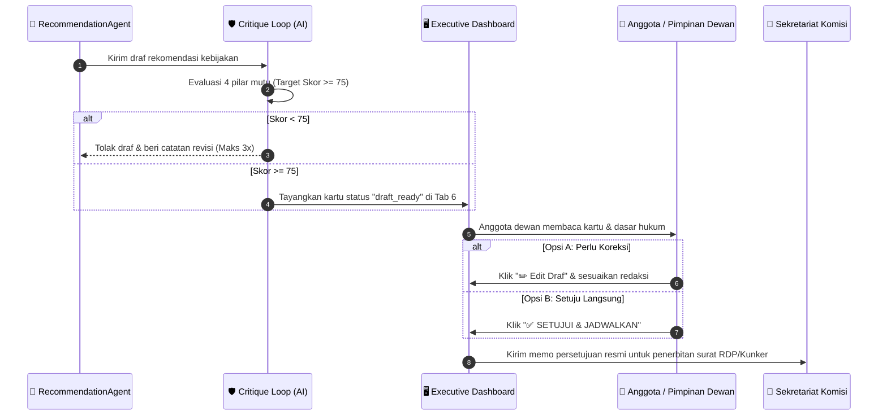

# 🎨 PANDUAN UI/UX DESIGN DASHBOARD — Figma Prototype & Streamlit Specifications
## Proyek DPR Agentic AI — Monitoring AKD & Rekomendasi Kebijakan Parlemen 2024–2029

> **Platform Target**: Streamlit Web Dashboard (`dashboard/app.py`) & Prototipe Desain Figma  
> **Status Proyek**: **Sprint 6** (Bulan 3) — RecommendationAgent, Critique Loop & Contextual Memory  
> **Ruang Lingkup Data**: 100% Media Berita Nasional Tier-1 (Bebas Twitter/X) | 24 AKD Resmi DPR RI  
> **Model Sentimen**: IndoBERT Fine-Tuned (Akurasi 90.00%, Macro F1 0.8997, INT8 Quantized)  
> **Target Pengguna**: Pimpinan DPR RI, Pimpinan Fraksi, Tenaga Ahli (TA) Fraksi, dan Sekretariat Komisi I–XIII  

---

## 📑 DAFTAR ISI

1. [Struktur Navigasi & Arsitektur 6 Tab](#1-struktur-navigasi--arsitektur-6-tab)
2. [Sidebar Filter & Gatekeeper Kebijakan](#2-sidebar-filter--gatekeeper-kebijakan)
3. [Header & Baris 5 KPI Metrics](#3-header--baris-5-kpi-metrics)
4. [Tab 1: 📊 Ringkasan Umum (Overview)](#4-tab-1--ringkasan-umum-overview)
5. [Tab 2: 🏛️ Breakdown 24 AKD DPR RI](#5-tab-2-️-breakdown-24-akd-dpr-ri)
6. [Tab 3: 📈 Analisis Sentimen IndoBERT](#6-tab-3--analisis-sentimen-indobert)
7. [Tab 4: 🗑️ Berita Non-AKD / Noise Terfilter](#7-tab-4-️-berita-non-akd--noise-terfilter)
8. [Tab 5: 📋 Data Mentah & Pencarian Artikel](#8-tab-5--data-mentah--pencarian-artikel)
9. [Tab 6: 🏛️ Rekomendasi Aksi Parlemen (AI-Generated) 🌟](#9-tab-6-️-rekomendasi-aksi-parlemen-ai-generated-)
10. [Design Tokens (Warna Parlemen, Tipografi, Komponen UI)](#10-design-tokens-warna-parlemen-tipografi-komponen-ui)
11. [Referensi Resmi: 24 AKD Master DPR RI 2024–2029](#11-referensi-resmi-24-akd-master-dpr-ri-20242029)
12. [Alur Workflow Human-in-the-Loop (HITL)](#12-alur-workflow-human-in-the-loop-hitl)

---

## 1. Struktur Navigasi & Arsitektur 6 Tab

Dashboard DPR Agentic AI menggunakan struktur **Single-Page Tabbed Layout** berbasis Streamlit (`dashboard/app.py`), memberikan performa cepat tanpa reload halaman berat:

```text
┌─────────────────────────────────────────────────────────────────────────────────────────────────┐
│ 🏛️ DPR RI AGENTIC AI — SISTEM MONITORING AKD & REKOMENDASI KEBIJAKAN 2024–2029               │
│ Tanggal Update: Real-time | Sumber: 17+ Portal Berita Nasional | Model: IndoBERT Fine-Tuned    │
├───────────────────┬─────────────────────────────────────────────────────────────────────────────┤
│ 🎛️ SIDEBAR FILTER │ 📊 BARIS 5 KARTU KPI UTAMA:                                                 │
│                   │ [📰 Total Tampil] [🏛️ 24 AKD] [😊 Positif] [😠 Negatif] [😐 Netral]         │
│ • Filter Lingkup  ├─────────────────────────────────────────────────────────────────────────────┤
│   - Hanya AKD 🏛️ │ 📑 6 TAB MENU UTAMA:                                                        │
│   - Semua Berita  │ 1. 📊 Ringkasan Umum (Overview)                                             │
│   - Berita Non-AKD│ 2. 🏛️ Breakdown 24 AKD DPR RI                                               │
│ • Filter Tanggal  │ 3. 📈 Analisis Sentimen IndoBERT (Model Card & Akurasi 90%)                 │
│   (1–31 Agt 2026) │ 4. 🗑️ Berita Non-AKD / Noise Terfilter (Saringan Kuliner/Gosip)             │
│ • Filter Sentimen │ 5. 📋 Data Mentah & Pencarian Artikel                                       │
│ • Dropdown 24 AKD │ 6. 🏛️ Rekomendasi Aksi Parlemen (AI-Generated) 🌟 [SPRINT 6 BARU]           │
└───────────────────┴─────────────────────────────────────────────────────────────────────────────┘
```

---

## 2. Sidebar Filter & Gatekeeper Kebijakan

Sidebar di sebelah kiri layar berfungsi sebagai pusat kendali data yang dilihat pengguna:

### 2.1 Filter Lingkup Berita (Radio Selector)
* `🏛️ Hanya Berita Terklasifikasi AKD (24 AKD Resmi)` *(Default)*:  
  Hanya menampilkan berita yang memiliki relevansi kebijakan langsung dengan 24 komisi dan badan DPR RI.
* `🌐 Semua Berita`:  
  Menampilkan seluruh dataset mentah termasuk berita hiburan/olahraga.
* `🗑️ Hanya Berita Non-AKD / Noise Terfilter`:  
  Area audit untuk memeriksa artikel yang dibuang oleh filter gatekeeper.

### 2.2 Filter Tanggal & Waktu
* Pilihan cepat: *"Semua Tanggal"* atau tanggal pasti per hari (contoh: `2026-08-20`).
* Data master mencakup 31 partisi harian penuh bulan Agustus 2026 (4.636 artikel).

### 2.3 Filter Sentimen & 24 AKD
* **Sentimen**: Multiselect / Selectbox (`Semua`, `Positif`, `Negatif`, `Netral`).
* **AKD**: Dropdown dinamis 24 AKD DPR RI Periode 2024–2029 (Komisi I s.d. XIII + Badan-Badan).

---

## 3. Header & Baris 5 KPI Metrics

Di bagian atas layar dashboard, tersaji 5 kartu metrik eksekutif yang langsung menghitung ulang secara real-time saat filter sidebar diubah:

| Kartu KPI | Ikon | Label | Nilai Dinamis | Keterangan Desain |
|:---:|:---:|---|---|---|
| **Card 1** | 📰 | Total Tampil | `4,636 Artikel` | Angka besar 32px Bold, warna teks slate. |
| **Card 2** | 🏛️ | AKD Terjangkau | `24 AKD` | Indikator keterwakilan komisi parlemen. |
| **Card 3** | 😊 | Positif (IndoBERT) | `1,248 Artikel` | Warna hijau Emerald (`#22c55e`). |
| **Card 4** | 😠 | Negatif (IndoBERT) | `1,684 Artikel` | Warna merah Crimson (`#ef4444`). |
| **Card 5** | 😐 | Netral (IndoBERT) | `1,704 Artikel` | Warna abu-abu Slate (`#94a3b8`). |

---

## 4. Tab 1: 📊 Ringkasan Umum (Overview)

Tab pertama menyajikan gambaran makro situasi pemberitaan nasional:

### 4.1 Donut Chart Proporsi Sentimen Publik (Plotly)
* **Visual**: Donut chart lubang tengah 45% (*hole=0.45*).
* **Palet Warna**:
  - Positif: `#22c55e` (Hijau Emerald)
  - Negatif: `#ef4444` (Merah Bahaya)
  - Netral: `#94a3b8` (Abu-abu Slate)
* **Interaktivitas**: Hover tooltip menampilkan jumlah pasti artikel dan persentase proporsi.

### 4.2 Bar Chart Top 10 AKD Paling Disorot Media
* **Visual**: Horizontal bar chart peringkat 10 komisi/badan dengan volume pemberitaan tertinggi.
* **Warna**: Skala gradasi Teal (`Teal`).
* **Tujuan**: Memberikan sinyal awal komisi mana yang sedang menjadi episentrum perhatian publik.

### 4.3 Grafik Tren Harian (1–31 Agustus 2026)
* **Visual**: Stacked Bar Chart harian 31 tanggal berturut-turut.
* **Informasi**: Naik-turunnya volume harian yang dipecah berdasarkan komposisi sentimen positif, negatif, dan netral.

---

## 5. Tab 2: 🏛️ Breakdown 24 AKD DPR RI

Tab khusus untuk melihat kondisi seluruh 24 portofolio AKD DPR RI:
* **Horizontal Bar Stacked Chart**: Setiap batang mewakili 1 AKD, terbagi menjadi 3 warna segmen (hijau, merah, abu-abu).
* **Urutan**: Diurutkan dari komisi dengan total sentimen negatif tertinggi (misal: Komisi III Hukum, Komisi XII Energi, Komisi IV Pangan).
* **Tabel Metrik AKD**: Rincian angka volume, persentase negatif, dan skor Z-Score anomali harian.

---

## 6. Tab 3: 📈 Analisis Sentimen IndoBERT

Tab teknis transparansi AI (*Explainable AI*) bagi analis dan tim penjamin mutu:
* **Model Card Info**:
  - Base Architecture: `indobenchmark/indobert-base-p1` (124.7 Juta Parameter)
  - Evaluasi Uji: Akurasi **90.00%**, Macro F1 **0.8997**, Negative Recall **100.00%**.
  - Format Deployment: PyTorch INT8 Quantized (Ukuran hemat 230 MB, latensi < 15ms).
* **Formula Skor Kontinu**:
  $$\text{Score} = P(\text{Positif}) - P(\text{Negatif}) \in [-1.0, +1.0]$$
* **Kalibrasi Margin Batas Keputusan**:
  Menampilkan penjelasan ambang batas $\Delta_{\text{margin}} = P(\text{Positif}) - P(\text{Netral}) \ge 0.12$ untuk mengeliminasi bias bahasa formal protokoler DPR.

---

## 7. Tab 4: 🗑️ Berita Non-AKD / Noise Terfilter

Tab transparansi penyaringan gatekeeper kebijakan:
* **Tujuan**: Membuktikan bahwa sistem tidak memasukkan berita sampah/hiburan ke dalam portofolio komisi dewan.
* **Kategori yang Disaring**:
  - Resep makanan & kuliner daerah.
  - Tips kecantikan, diet, dan ramalan zodiak.
  - Berita transfer pemain sepak bola & olahraga non-kebijakan.
  - Gosip perceraian selebriti & rumor gadget.
* **Daftar Sampel Terfilter**: Tabel 20 artikel non-kebijakan terbaru yang dibuang dengan alasan filternya.

---

## 8. Tab 5: 📋 Data Mentah & Pencarian Artikel

Tab eksplorasi artikel live untuk staf analis:
* **Search Bar Interaktif**: Pencarian instan kata kunci pada judul berita.
* **Filter Portal Berita**: Pilihan portal (Detik, Antara, Tempo, CNN Indonesia, CNBC, Republika, Kompas, dll.).
* **Tabel Data Interaktif (`st.dataframe`)**:
  - Kolom: Tanggal, Portal Media, Judul Artikel, Sentimen, Skor Sentimen, AKD Terpeta, dan Link URL asli ke portal berita.

---

## 9. Tab 6: 🏛️ Rekomendasi Aksi Parlemen (AI-Generated) 🌟

Ini adalah **fitur unggulan terbaru di Sprint 6** yang mengubah sistem dari alat analisis pasif menjadi asisten pengambil keputusan aktif.

### 9.1 Wireframe & Komponen Visual Kartu Rekomendasi

```text
┌────────────────────────────────────────────────────────────────────────────────────────┐
│ 🔴 TINGKAT URGENSI : TINGGI (Krisis Isu Negatif Terdeteksi)                            │
│ 🏛️ AKD PENANGGUNG  : Komisi XII (Energi, Sumber Daya Mineral & Lingkungan Hidup)       │
│ 📌 BENTUK TINDAKAN : Rapat Dengar Pendapat (RDP)                                       │
│ ⚖️ DASAR WEWENANG  : Pasal 72 ayat (1) huruf b UU No. 17/2014 (UU MD3)                 │
│ 🛡️ STATUS AUDIT AI : Skor 88/100 (LULUS AUDIT MUTU & KEPATUHAN HUKUM)                  │
├────────────────────────────────────────────────────────────────────────────────────────┤
│ 📋 LATAR BELAKANG & REKAM JEJAK 30 HARI:                                               │
│ "Berdasarkan memori 30 hari terakhir, Komisi XII memuat 68 berita dengan sentimen       │
│  82% Negatif. Terjadi lonjakan krisis kelangkaan gas elpiji 3 kg melon di berbagai      │
│  daerah dengan harga tembus Rp35.000 dan antrean mengular di pangkalan."               │
│                                                                                        │
│ 🏢 MITRA KERJA YANG WAJIB DIPANGGIL:                                                   │
│  1. Direktur Utama PT Pertamina Patra Niaga                                            │
│  2. Direktur Jenderal Minyak dan Gas Bumi (Dirjen Migas) Kementerian ESDM              │
│  3. Kepala Badan Pengatur Hilir Minyak dan Gas Bumi (BPH Migas)                        │
│                                                                                        │
│ ✍️ 3 LANGKAH TINDAKAN KONKRET DEWAN:                                                   │
│  1. Menggelar RDP darurat pada hari Selasa pekan depan pukul 10.00 WIB di Senayan.     │
│  2. Meminta Pertamina membuka data alokasi kuota sub-penyalur dan pangkalan daerah.   │
│  3. Mendesak Ditjen Migas & BPH Migas mencabut izin pangkalan yang terbukti curang.    │
├────────────────────────────────────────────────────────────────────────────────────────┤
│ ⚙️ PANEL PERSETUJUAN DEWAN (HUMAN-IN-THE-LOOP):                                        │
│  [ ✏️ Edit Draf Teks ]      [ 📄 Unduh Lembar Memo PDF ]      [ ✅ SETUJUI & JADWALKAN ] │
└────────────────────────────────────────────────────────────────────────────────────────┘
```

### 9.2 Spesifikasi Badge & Label Kartu

1. **Badge Tingkat Urgensi**:
   - 🔴 **Tinggi (`#ef4444`)**: Isu anomali krisis publik dengan sentimen negatif $> 60\%$ atau lonjakan $Z_{\text{weighted}} \ge 2.0$.
   - 🟡 **Sedang (`#f59e0b`)**: Isu penting yang sedang berkembang dalam 7 hari terakhir.
   - 🟢 **Rutin (`#10b981`)**: Pemantauan program kerja rutin berkala komisi.
2. **Badge Bentuk Aksi Parlemen**:
   - **RDP**: Rapat Dengar Pendapat dengan Dirjen kementerian atau Dirut BUMN.
   - **Raker**: Rapat Kerja dengan Menteri Kabinet.
   - **RDPU**: Rapat Dengar Pendapat Umum dengan asosiasi warga/LSM/pakar.
   - **Kunker**: Sidak Kunjungan Kerja Lapangan ke lokasi bencana/masalah.
   - **Panja**: Pembentukan Panitia Kerja Investigasi isu sistemik berkepanjangan.
   - **Rilis Pers**: Pernyataan sikap resmi fraksi dalam waktu $< 24$ jam.
3. **Badge Skor Audit Mutu AI**:
   - Menampilkan nilai evaluasi mandiri (*Critique Loop*): skor minimal **$\ge 75/100$** agar draf dinyatakan layak tayang.
4. **Dasar Hukum Wewenang UU MD3**:
   - Setiap draf wajib mencantumkan nomor pasal wewenang dari UU No. 17 Tahun 2014 jo UU No. 13 Tahun 2019.

---

## 10. Design Tokens (Warna Parlemen, Tipografi, Komponen UI)

### 10.1 Palet Warna Utama (Parliamentary Palette)

| Nama Token | Hex Code | Tipe Penggunaan |
|---|:---:|---|
| **DPR Forest Green** | `#1B4D3E` | Warna identitas utama DPR RI, header, tombol primer. |
| **DPR Gold Accent** | `#D4AF37` | Aksen lambang Garuda, penanda status kehormatan dewan. |
| **Positive Emerald** | `#22c55e` | Sentimen positif, tombol approval berhasil. |
| **Negative Crimson** | `#ef4444` | Sentimen negatif, badge urgensi krisis, anomali lonjakan. |
| **Neutral Slate** | `#94a3b8` | Sentimen netral, border sekunder, teks caption. |
| **Deep Dark Background**| `#0F172A` | Latar belakang mode gelap (*Dark Mode Slate*). |
| **Card Surface Light** | `#F8FAFC` | Kontainer kartu mode terang (*Clean White Grey*). |

### 10.2 Tipografi
* **Font Family**: Inter, Roboto, atau System Sans-Serif.
* **Heading 1**: 28px – 32px Bold (Judul Dasbor).
* **Heading 2**: 20px – 24px SemiBold (Judul Tab & Kartu).
* **Body Text**: 14px Regular (Uraian narasi berita).
* **Badge Text**: 12px Bold Uppercase (Status urgensi & bentuk tindakan).
* **Legal Caption**: 11px Italic (Rujukan pasal UU MD3).

---

## 11. Referensi Resmi: 24 AKD Master DPR RI 2024–2029

Gunakan taksonomi master 24 AKD resmi ini dalam komponen dropdown Figma dan Streamlit:

### 13 Komisi Parlemen (Portofolio Resmi 2024–2029)
1. **Komisi I**: Pertahanan, Hubungan Luar Negeri, Informatika, Siber, Intelijen.
2. **Komisi II**: Pemerintahan Dalam Negeri, Otonomi Daerah, ASN, Pemilu, IKN.
3. **Komisi III**: Penegakan Hukum, Kepolisian, Kejaksaan, KPK, Peradilan, HAM.
4. **Komisi IV**: Pertanian, Pangan, Kehutanan, Kelautan & Perikanan.
5. **Komisi V**: Infrastruktur, Transportasi, Perumahan Rakyat, BMKG, Basarnas.
6. **Komisi VI**: Perdagangan, BUMN, Koperasi, UMKM, Investasi, Standardisasi.
7. **Komisi VII**: Industri Manufaktur, Ekonomi Kreatif, Pariwisata, Seni Budaya.
8. **Komisi VIII**: Agama, Penyelenggaraan Haji, Sosial, Kebencanaan, Pemberdayaan Perempuan & Anak.
9. **Komisi IX**: Kesehatan, Ketenagakerjaan, BPJS Kesehatan & Ketenagakerjaan, Kependudukan.
10. **Komisi X**: Pendidikan Dasar/Tinggi, Riset, Olahraga, Perpustakaan Nasional.
11. **Komisi XI**: Keuangan Negara, Perbankan, APBN, Pajak, Bea Cukai, BI, OJK, LPS.
12. **Komisi XII**: Energi Baru Terbarukan (EBT), Migas, Ketenagalistrikan, Tambang, Lingkungan Hidup.
13. **Komisi XIII**: Reformasi Regulasi, Hak Asasi Manusia, Imigrasi, Pemasyarakatan.

### Pimpinan & 10 Badan/Panitia Parlemen
14. **Pimpinan DPR RI**: Ketua DPR RI (Puan Maharani) & 4 Wakil Ketua DPR RI.
15. **Baleg**: Badan Legislasi.
16. **Banggar**: Badan Anggaran.
17. **BAKN**: Badan Akuntabilitas Keuangan Negara.
18. **BKSAP**: Badan Kerja Sama Antar-Parlemen.
19. **BURT**: Badan Urusan Rumah Tangga.
20. **MKD**: Mahkamah Kehormatan Dewan.
21. **Bamus**: Badan Musyawarah.
22. **BAM**: Badan Aspirasi Masyarakat *(Baru Periode 2024–2029)*.
23. **BPKPH**: Badan Penyelenggara Keuangan Haji.
24. **Pansus**: Panitia Khusus DPR RI.

---

## 12. Alur Workflow Human-in-the-Loop (HITL)

Sistem menjamin anggota dewan memiliki kontrol penuh atas rekomendasi yang dikeluarkan:



---
*Panduan Desain Resmi UI/UX Dashboard DPR Agentic AI — Parlemen Indonesia 2024–2029*
