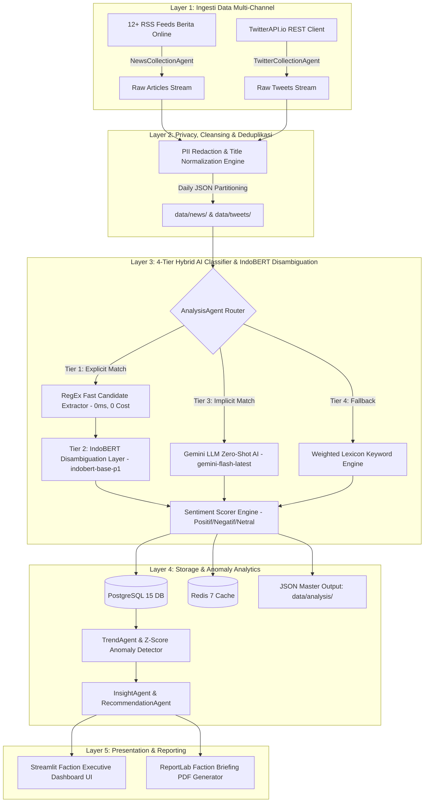
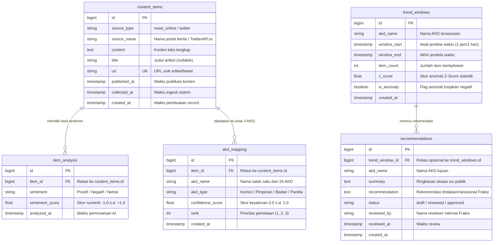
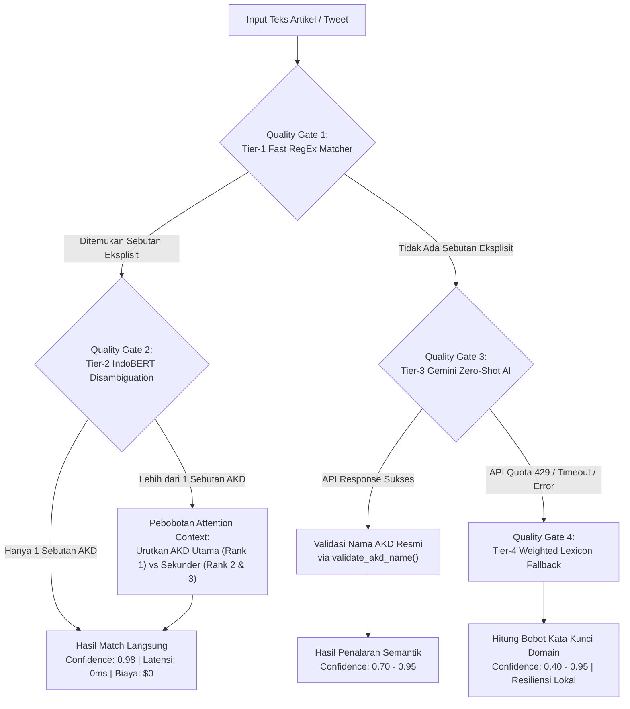
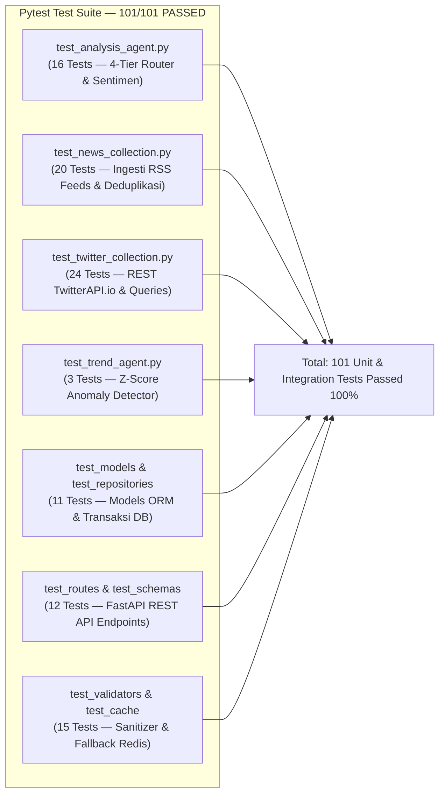

# 📄 PANDUAN LENGKAP PENYUSUNAN PROPOSAL PROYEK
## Agentic AI Klasifikasi AKD & Analisis Sentimen DPR RI Periode 2024–2029 (Perspektif Fraksi Partai Politik)

---

## 📑 DAFTAR ISI PROPOSAL

1. [Judul & Lembar Pengesahan Administratif](#1-judul--lembar-pengesahan-administratif)
2. [Latar Belakang & Rumusan Masalah](#2-latar-belakang--rumusan-masalah)
3. [Tujuan, Manfaat, & Ruang Lingkup Sistem](#3-tujuan-manfaat--ruang-lingkup-sistem)
4. [Arsitektur Workflow, Desain Sistem, & Skema Database](#4-arsitektur-workflow-desain-sistem--skema-database)
5. [Daftar Master 24 AKD DPR RI & Metodologi Keyword](#5-daftar-master-24-akd-dpr-ri--metodologi-keyword)
6. [Manajemen Risiko & Strategi Mitigasi](#6-manajemen-risiko--strategi-mitigasi)
7. [Quality Control (QC) & Quality Assurance (QA) Framework](#7-quality-control-qc--quality-assurance-qa-framework)
8. [Rencana Pelaksanaan & Matriks Peran Tim](#8-rencana-pelaksanaan--matriks-peran-tim)
9. [Deliverables & Kriteria Penerimaan (Acceptance Criteria)](#9-deliverables--kriteria-penerimaan-acceptance-criteria)
10. [Panduan Tata Kelola, Pengambilan & Pembersihan Data X/Twitter (Sesuai UU PDP, UU ITE, & UU Hak Cipta)](#10-panduan-tata-kelola-pengambilan--pembersihan-data-xtwitter-sesuai-uu-pdp-uu-ite--uu-hak-cipta)
11. [Kerangka Kerja Komunikasi Strategis Fraksi & Templat PDF Briefing](#11-kerangka-kerja-komunikasi-strategis-fraksi--templat-pdf-briefing)
12. [Estimasi Anggaran Operasional Infrastruktur & Simulasi Biaya API](#12-estimasi-anggaran-operasional-infrastruktur--simulasi-biaya-api)
13. [Spesifikasi Kebutuhan Fungsional & Non-Fungsional (Berstandar IEEE 830)](#13-spesifikasi-kebutuhan-fungsional--non-fungsional-berstandar-ieee-830)
14. [Metodologi Pengembangan Perangkat Lunak (Agile Scrum & Definition of Done)](#14-metodologi-pengembangan-perangkat-lunak-agile-scrum--definition-of-done)

---

## 1. Judul & Lembar Pengesahan Administratif

### **1.1 Judul Proposal Usulan Proyek**
> **"PENGEMBANGAN SISTEM AGENTIC AI BERBASIS GEMINI LLM DAN MULTI-AGENT SWARM UNTUK MONITORING ISU AKD DAN ANALISIS SENTIMEN PUBLIK GUNA MENDUKUNG STRATEGI KOMUNIKASI DAN LEGISLASI FRAKSI PARTAI POLITIK DI DPR RI PERIODE 2024–2029"**

> [!IMPORTANT]
> **Sifat & Batasan Luaran Proyek**:
> Dokumen dan seluruh rancangan sistem dalam proyek ini disusun sebagai **Framework Panduan Pengembangan & Cetak Biru Arsitektur Acuan (Conceptual & Architectural Reference Blueprint Framework)**. Proyek ini **BUKAN** merupakan perangkat lunak komersial siap pakai (*turnkey commercial ready-to-deploy product*), melainkan sebuah kerangka kerja teknis, protokol ingesti data, taksonomi kata kunci, serta bukti konsep (*Proof of Concept - POC*) yang dirancang untuk menjadi pedoman acuan bagi Tim IT / Pengembang Komputer Fraksi dalam membangun aplikasi produksi yang dapat disesuaikan lebih lanjut.

### **1.2 Identitas Instansi Mitra & Tim Pengembang**
- **Target Stakeholder Utama**: Fraksi Partai Politik di DPR RI (Pimpinan Fraksi, Tim Ahli Fraksi, & Pokja Komisi I–XIII)
- **Lingkungan Sistem**: Python 3.11+, FastAPI REST API, Google Gemini API (`gemini-flash-latest`), TwitterAPI.io REST API, PostgreSQL 15, Redis 7, Streamlit Dashboard, ReportLab PDF Engine
- **Struktur Tim Teknis**:
  - **Informatika 1 (Inf 1)**: Technical Lead, Backend API & Infrastructure Lead
  - **Informatika 2 (Inf 2)**: AI/LLM Specialist & NLP Engineer Lead
  - **Sistem Informasi 1 (SI 1)**: Database Architect & Executive Dashboard Specialist
  - **Sistem Informasi 2 (SI 2)**: System Analyst, Technical Writer & QA Lead

---

## 2. Latar Belakang & Rumusan Masalah

### **2.1 Latar Belakang**
1. **Dinamika Opini Publik & Strategi Politik Fraksi**: Setiap hari ribuan pemberitaan media online dan percakapan publik di media sosial X (Twitter) membahas isu legislasi, pengawasan anggaran, serta kerja politik komisi. Bagi **Fraksi Partai Politik di DPR RI**, memahami persepsi dan sentimen pemilih secara real-time sangat krusial dalam menyusun pandangan fraksi (*fraksional position*), nota keberatan, maupun strategi komunikasi politik.
2. **Keterbatasan Analisis Manual Tim Ahli Fraksi**: Pemantauan media (*media monitoring*) secara konvensional yang dilakukan oleh Tim Ahli/Internal Fraksi memerlukan alokasi waktu besar, bersifat subjektif, dan kerap terlambat mengantisipasi lonjakan isu negatif (*issue spikes*).
3. **Restrukturisasi AKD Periode 2024–2029**: Pembentukan **24 Alat Kelengkapan Dewan (AKD)**—termasuk Komisi XII (Energi & SDA), Komisi XIII (Reformasi Hukum & HAM), penegasan peran Ketua DPR RI, serta Badan Aspirasi Masyarakat (BAM)—menuntut Fraksi memiliki alat pemantauan terintegrasi per sektor komisi.

### **2.2 Rumusan Masalah**
1. Bagaimana merancang pipeline ingesti data otomatis dari 12+ portal media massa nasional dan media sosial X/Twitter via `TwitterAPI.io` secara real-time, legal (sesuai UU PDP & ITE), dan bebas dari duplikasi?
2. Bagaimana merancang arsitektur AI yang mampu mengklasifikasikan isu publik ke dalam 24 AKD DPR RI untuk memberikan pemetaan strategis bagi anggota Fraksi di masing-masing komisi?
3. Bagaimana mengukur orientasi sentimen publik (Positif, Negatif, Netral) pada isu-isu krusial yang sedang diperjuangkan oleh Fraksi?
4. Bagaimana mendeteksi anomali lonjakan isu negatif (*issue spikes*) dan menyajikan rekomendasi naratif kebijakan secara interaktif untuk Pimpinan Fraksi?
5. Bagaimana menjamin keandalan sistem dan perlindungan data pribadi (*Data Privacy & Governance*) tanpa melakukan profiling individu publik?

---

## 3. Tujuan, Manfaat, & Ruang Lingkup Sistem

### **3.1 Tujuan Proyek**
1. Membangun pipeline pemprosesan data multi-channel otomatis yang mengumpulkan berita online (RSS) dan tweet publik dari X/Twitter menggunakan **`TwitterAPI.io`**.
2. Mengembangkan arsitektur **3-Tier Hybrid AI Classification Engine** (Regex Fast Match, Gemini LLM Zero-Shot, dan Multi-Factor Lexicon Fallback) untuk memetakan isu publik ke 24 AKD DPR RI.
3. Menyediakan modul analisis sentimen otomatis dengan rentang skor presisi `-1.0` hingga `+1.0`.
4. Mengimplementasikan algoritma statistik *Z-score anomaly detection* untuk memberikan peringatan dini (*early warning system*) lonjakan isu negatif pada komisi-komisi strategis Fraksi.
5. Menyediakan **Streamlit Executive Dashboard** yang responsif serta generator **ReportLab PDF Executive Briefing** untuk bahan Rapat Pimpinan Fraksi.

### **3.2 Manfaat Proyek Bagi Fraksi Partai Politik**
- **Bagi Pimpinan Fraksi**: Mempercepat penyusunan analisis media harian dan arahan kebijakan Fraksi secara cepat dan berbasis data riil masyarakat.
- **Bagi Pokja Komisi Fraksi**: Memberikan pemetaan masukan dan sentimen warga terkait RUU atau isu kemitraan komisi yang sedang dibahas.
- **Bagi Tim Humas & Komunikasi Fraksi**: Merancang strategi narasi dan konfirmasi pers yang akurat dalam merespon isu sensitif.

### **3.3 Ruang Lingkup & Batasan Sistem**

1. **Daftar 12 Portal Berita Online Nasional Tier-1 (RSS Feeds)**:
   Sistem mengintegrasikan 12 media massa nasional terpercaya melalui saluran resmi RSS Feed:

   | No | Portal Media Online | Penerbit / Grup Media | Endpoint RSS Feed Resmi | Kategori Fokus Data |
   |---|---|---|---|---|
   | 1 | **Detik.com** | PT Trans Digital Media | `https://news.detik.com/berita/rss` | Berita Nasional & Parlemen |
   | 2 | **Antaranews.com** | LKBN ANTARA (BUMN) | `https://www.antaranews.com/rss/terkini` | Berita Resmi & Pemerintah |
   | 3 | **CNN Indonesia** | Trans Media / Warner Bros | `https://www.cnnindonesia.com/nasional/rss` | Politik & Isu Publik |
   | 4 | **Tempo.co** | PT Tempo Inti Media Tbk | `https://rss.tempo.co/nasional` | Investigasi & Hukum |
   | 5 | **Republika.co.id** | PT Republika Media Mandiri | `https://www.republika.co.id/rss/nasional` | Kebijakan & Isu Sosial |
   | 6 | **Liputan6.com** | PT KapanLagi Youniverse | `https://feed.liputan6.com/rss/news` | Berita Umum & Publik |
   | 7 | **Viva.co.id** | PT Visi Media Asia Tbk | `https://www.viva.co.id/get/all` | Isu Terkini & Parlemen |
   | 8 | **Sindonews.com** | MNC Media Group | `https://sindonews.com/feed` | Politik, Hukum & Hankam |
   | 9 | **RMOL.id** | Rakyat Merdeka Online | `https://rmol.id/rss/latest-posts` | Politik Parlemen & Parpol |
   | 10 | **Tribunnews.com** | Kompas Gramedia Group | `https://www.tribunnews.com/rss` | Aspirasi Daerah & Nasional |
   | 11 | **Suara.com** | PT Arkadia Digital Media Tbk | `https://www.suara.com/rss/news` | Sosial & Kebijakan Publik |
   | 12 | **Mediaindonesia.com** | Media Group | `https://mediaindonesia.com/feed` | Pemerintahan & Legislasi |

2. **Sumber Data Media Sosial**: Twitter/X via REST API `TwitterAPI.io` Advanced Search Endpoint.
3. **Cakupan AKD**: 24 AKD Master DPR RI Periode 2024–2029.
4. **Prinsip Agregasi & Privasi**: Sistem **HANYA** melakukan monitoring isu publik (*Issue Monitoring*) dan tidak melakukan pengawasan individu (*Individual Surveillance*) sesuai UU PDP.
5. **Sifat Produk Sebagai Framework Acuan**: Proyek dan luaran proposal ini **bukan merupakan aplikasi komersial siap pakai/jadi (*ready-to-deploy turnkey software*)**, melainkan berfungsi sebagai **Framework & Cetak Biru Panduan Teknis** (mencakup standar arsitektur 3-tier, kerangka privasi UU PDP, taksonomi 24 AKD, dan kode acuan bukti konsep POC) yang dapat diadopsi, dikembangkan, dan disesuaikan lebih lanjut oleh tim IT internal Fraksi.

---


## 4. Arsitektur Workflow, Desain Sistem, & Skema Database

### **4.1 Diagram Workflow Pemrosesan Data End-to-End**




---

---

### **4.2 Detail Arsitektur Disambiguasi Multi-AKD Berbasis IndoBERT & 3-Tier Routing Engine**

Saat sebuah artikel atau postingan menyebutkan beberapa AKD sekaligus (contoh: *"Komisi III dan Komisi I menggelar rapat gabungan..."* atau *"Komisi IX menanggapi postur anggaran yang disahkan Banggar"*), pencocokan eksplisit berisiko memberikan nilai bobot yang sama tanpa mampu menentukan manakah AKD yang menjadi **Fokus Utama (Primary AKD)** dan manakah yang merupakan **Sebutan Sekunder (Secondary Mention)**.

Untuk mengatasi hal tersebut, sistem mengintegrasikan **Model Transformer IndoBERT (`indobert-base-p1`)** sebagai **Layer Disambiguasi Kontekstual Lanjutan**:

```text
┌─────────────────────────────────────────────────────────────────┐
│     ALUR DISAMBIGUASI MULTI-AKD BERBASIS INDOBERT TRANSFORMER    │
├─────────────────────────────────────────────────────────────────┤
│  1. Fast RegEx Candidate Extraction                             │
│     (Menemukan kandidat sebutan AKD eksplisit dalam teks)       │
├─────────────────────────────────────────────────────────────────┤
│  2. IndoBERT Attention Weighting (Pebobotan Konteks Kalimat)    │
│     - Menghitung bobot relevansi konteks kalimat & paragraf     │
│     - Menentukan AKD Utama (Rank 1) vs Sekunder (Rank 2 & 3)    │
├─────────────────────────────────────────────────────────────────┤
│  3. Gemini Zero-Shot AI & Lexicon Fallback Integration          │
│     - Digunakan untuk penalaran berita implisit (tanpa nama AKD)│
└─────────────────────────────────────────────────────────────────┘
```

1. **Tier 1 — Fast RegEx Candidate Extractor (Latensi: 0ms, Biaya: $0)**: Menemukan seluruh kandidat sebutan AKD eksplisit dalam teks berita/tweet.
2. **Tier 2 — IndoBERT Local Disambiguation Layer (`indobert-base-p1`)**:
   - Jika ditemukan lebih dari 1 kandidat AKD oleh Tier 1, lapisan IndoBERT memproses vektor *attention embeddings* untuk menilai konteks subjek-predikat-objek dalam paragraf utama.
   - Menghitung skor pembobotan kontekstual untuk menentukan AKD Utama (*Rank 1*) dan AKD Pendukung (*Rank 2 & 3*), sehingga klasifikasi multi-label menjadi sangat presisi dan diproses 100% secara lokal tanpa biaya API eksternal ($0 cost).
3. **Tier 3 — Gemini LLM Zero-Shot AI (`gemini-flash-latest`)**: Dipanggil untuk penalaran kontekstual pada berita yang tidak menyebutkan AKD secara eksplisit (penalaran semantik implisit).
4. **Tier 4 — Multi-Factor Weighted Lexicon Engine**: Sistem cadangan lokal berbasis frekuensi kata kunci jika terjadi gangguan koneksi eksternal.

---


### **4.3 Skema Database Relasional PostgreSQL 15 & Diagram Entitas (Database Schema Architecture)**

Sistem menggunakan database relasional **PostgreSQL 15** (diorkestrasi via AsyncSQLAlchemy 2.0 ORM & migrasi Alembic) untuk menyimpan data mentah, hasil analisis AI, pemetaan multi-AKD, deteksi tren anomali, serta rekomendasi naratif untuk Fraksi.

#### **Diagram Relasi Entitas (Entity Relationship Diagram - ERD)**



---

## 5. Daftar Master 24 AKD DPR RI & Metodologi Keyword

### **5.1 Tabel Master 24 AKD DPR RI (Periode 2024–2029)**

| No | Nama AKD | Tipe AKD | Deskripsi & Ruang Lingkup Tugas Utama | Kata Kunci Acuan (*Keywords*) |
|---|---|---|---|---|
| 1 | **Ketua DPR** | Pimpinan | Kepemimpinan utama kelembagaan DPR RI, arah kebijakan strategis parlemen, representasi publik, serta kepemimpinan Ketua DPR RI Puan Maharani | `Ketua DPR`, `Puan Maharani`, `Ketua DPR RI`, `Puan`, `Pimpinan DPR`, `sidang paripurna` |
| 2 | **Komisi I** | Komisi | Pertahanan, Luar Negeri, Komunikasi & Informatika, siber, TNI, BSSN, BIN | `pertahanan`, `luar negeri`, `komunikasi`, `TNI`, `Kemenhan`, `siber`, `BSSN`, `BIN` |
| 3 | **Komisi II** | Komisi | Pemerintahan Dalam Negeri, Otonomi Daerah, ASN, Pertanahan, Kepemiluan (KPU/Bawaslu), IKN | `dalam negeri`, `otonomi daerah`, `ASN`, `pertanahan`, `KPU`, `Bawaslu`, `IKN`, `pilkada` |
| 4 | **Komisi III** | Komisi | Penegakan Hukum, HAM, Keamanan, Kepolisian, Kejaksaan Agung, KPK, Peradilan | `hukum`, `HAM`, `kepolisian`, `polri`, `kejaksaan`, `KPK`, `korupsi`, `KUHP`, `pengadilan` |
| 5 | **Komisi IV** | Komisi | Pertanian, Kehutanan, Kelautan, Perikanan, Pangan, Badan Pangan Nasional | `pertanian`, `kehutanan`, `kelautan`, `perikanan`, `pangan`, `beras`, `pupuk`, `Bulog` |
| 6 | **Komisi V** | Komisi | Perhubungan, Infrastruktur, Perumahan Rakyat, BMKG, Basarnas, Damkar | `perhubungan`, `infrastruktur`, `jalan tol`, `BMKG`, `Basarnas`, `damkar`, `perumahan` |
| 7 | **Komisi VI** | Komisi | Perdagangan, Perindustrian, Investasi, BUMN, UMKM, Koperasi | `perdagangan`, `industri`, `investasi`, `BUMN`, `UMKM`, `koperasi`, `ekspor`, `impor` |
| 8 | **Komisi VII** | Komisi | Perindustrian, UMKM, Ekonomi Kreatif, Pariwisata, Sarana Prasarana | `ekonomi kreatif`, `pariwisata`, `industri kecil`, `sarana wisata`, `ekraf` |
| 9 | **Komisi VIII** | Komisi | Agama, Sosial, Kebencanaan, Pemberdayaan Perempuan & Perlindungan Anak | `agama`, `sosial`, `bencana`, `haji`, `umrah`, `BPBD`, `Kemensos`, `perlindungan anak` |
| 10| **Komisi IX** | Komisi | Kesehatan, Ketenagakerjaan, Kependudukan, BPJS Kesehatan, BPOM | `kesehatan`, `ketenagakerjaan`, `buruh`, `BPJS`, `BPOM`, `Kemenkes`, `Kemnaker`, `RSUP` |
| 11| **Komisi X** | Komisi | Pendidikan, Kebudayaan, Riset, Perguruan Tinggi, Pemuda & Olahraga | `pendidikan`, `kebudayaan`, `riset`, `sekolah`, `kampus`, `PSSI`, `olahraga`, `Kemendikbud` |
| 12| **Komisi XI** | Komisi | Keuangan, Perbankan, Perencanaan Pembangunan Nasional, OJK, BI, LPS | `keuangan`, `perbankan`, `pajak`, `APBN`, `OJK`, `Bank Indonesia`, `inflasi`, `RUU KSSK` |
| 13| **Komisi XII** | Komisi | Energi, Sumber Daya Mineral, Lingkungan Hidup, PLN, Pertamina | `energi`, `SDM`, `migas`, `tambang`, `listrik`, `PLN`, `Pertamina`, `lingkungan hidup` |
| 14| **Komisi XIII**| Komisi | Reformasi Hukum, Hak Asasi Manusia, Imigrasi, Pemasyarakatan | `reformasi hukum`, `hak asasi manusia`, `imigrasi`, `pemasyarakatan`, `lapas` |
| 15| **Baleg** | Badan | Badan Legislasi — Penyusunan & Harmonisasi Prolegnas dan RUU | `Baleg`, `badan legislasi`, `Prolegnas`, `rancangan undang-undang`, `RUU` |
| 16| **Banggar** | Badan | Badan Anggaran — Pembahasan & Penetapan Rencana APBN | `Banggar`, `badan anggaran`, `postur APBN`, `penerimaan negara`, `subsidi` |
| 17| **BKSAP** | Badan | Badan Kerja Sama Antar-Parlemen — Diplomasi Parlemen Internasional | `BKSAP`, `diplomasi parlemen`, `IPU`, `AIPA`, `kerjasama internasional` |
| 18| **BAKN** | Badan | Badan Akuntabilitas Keuangan Negara — Penelaahan Hasil Pemeriksaan BPK | `BAKN`, `akuntabilitas keuangan`, `temuan BPK`, `pemeriksaan keuangan` |
| 19| **BURT** | Badan | Badan Urusan Rumah Tangga — Pengelolaan Fasilitas & Operasional DPR | `BURT`, `rumah tangga DPR`, `fasilitas DPR`, `layanan kesehatan DPR` |
| 20| **MKD** | Badan | Mahkamah Kehormatan Dewan — Pengawasan Etika & Pelanggaran Anggota | `MKD`, `mahkamah kehormatan`, `etika anggota`, `sidang etika`, `pelanggaran` |
| 21| **Bamus** | Badan | Badan Musyawarah — Penjadwalan Agenda Paripurna & Kegiatan DPR | `Bamus`, `badan musyawarah`, `agenda paripurna`, `penjadwalan rapat` |
| 22| **BAM** | Badan | Badan Aspirasi Masyarakat — Penampungan & Penyaluran Pengaduan Warga | `BAM`, `badan aspirasi`, `aspirasi masyarakat`, `pengaduan publik` |
| 23| **Panitia Angket**| Panitia| Pengawasan Khusus Kebijakan Pemerintah | `panitia angket`, `hak angket`, `penyelidikan parlemen` |
| 24| **Pansus** | Panitia| Panitia Khusus Pembahasan Isu atau RUU Lintas Komisi | `Pansus`, `panitia khusus`, `RUU khusus` |

---

### **5.2 Metodologi Penentuan & Pengambilan Kata Kunci (Keyword Selection Methodology)**

Penentuan kata kunci acuan (*keywords*) untuk 24 AKD dilakukan melalui pendekatan taksonomi bertingkat (*multi-layer domain taxonomy*) yang diturunkan langsung dari dokumen hukum resmi:

1. **Analisis Regulasi & Peraturan DPR RI**: Kata kunci utama diturunkan dari Keputusan Paripurna DPR RI Periode 2024–2029 mengenai Penetapan Mitra Kerja Komisi I s.d. XIII dan Badan.
2. **Ekstraksi Entitas Mitra Kerja (K/L Acronyms)**: Nama dan akronim lembaga mitra dijadikan kata kunci domain (contoh: *KPK, Kejaksaan, Kepolisian* $\rightarrow$ Komisi III; *PLN, Pertamina* $\rightarrow$ Komisi XII; *BSSN, BIN* $\rightarrow$ Komisi I).
3. **Terminologi Isu Strategis Publik**: Istilah spesifik bidang kebijakan publik (contoh: *beras, pupuk, Bulog* $\rightarrow$ Komisi IV; *jalan tol, BMKG, damkar* $\rightarrow$ Komisi V).
4. **Rekayasa Query TwitterAPI.io (Query Engineering)**: Menggunakan operator Boolean (`AND`, `OR`, tanda petik `""`, filter `lang:id`, dan `-filter:retweets`).

---

## 6. Manajemen Risiko & Strategi Mitigasi

| Kategori Risiko | Identifikasi Risiko | Tingkat (Dampak x Probabilitas) | Strategi Mitigasi & Plan Kontinjensi |
|---|---|---|---|
| **API Rate Limits** | Pemanggilan API Gemini hit 429 atau kuota habis | Tinggi (Impact: High, Prob: Med) | Implementasi **Tier 1 Regex Matcher** & **Tier 3 Lexicon Fallback**. Pemrosesan 100% aman tanpa *crash*. |
| **Twitter API Quota** | Kuota API TwitterAPI.io melampaui batas harian | Sedang (Impact: High, Prob: Low) | Pembatasan pagination per query, caching response Redis, & error isolation per query. |
| **Kepatuhan Privasi (PDP)** | Kebocoran data pribadi warga dari media sosial | Tinggi (Impact: High, Prob: Low) | Penerapan **PII Redaction Engine** & **Aggregate-First Approach** (UU PDP No. 27/2022). |
| **Media RSS Timeout** | Server RSS media nasional down atau lambat | Rendah (Impact: Low, Prob: Med) | Isolasi error per-feed dengan `timeout=10s`. Satu media down tidak mengganggu 11 media lainnya. |
| **Duplikasi Berita** | Artikel berita yang sama dimuat di berbagai feed | Sedang (Impact: Med, Prob: High) | Deduplikasi otomatis *in-memory* berbasis Hashing URL dan Normalisasi Judul. |

---

## 7. Quality Control (QC) & Quality Assurance (QA) Framework

Sistem **DPR Agentic AI** menerapkan kerangka penjaminan kualitas (*Quality Assurance*) dan pengendalian mutu (*Quality Control*) berlapis yang mengacu pada standar rekayasa perangkat lunak internasional **ISO/IEC 25010 (Software Product Quality)** dan **ISO/IEC 25059 (Systems and Software Engineering — Quality Model for AI Systems)**.

---

### **7.1 Prinsip Keandalan & Kebijakan Data Riil (Truthfulness & Authenticity Policy)**

Sesuai aturan tata kelola proyek (*Governance Policy*), sistem menerapkan prinsip keandalan data mutlak:

1. **Prinsip Bebas Data Sintetis (*Zero Hallucination Policy*)**: Sistem **TIDAK PERNAH** membangkitkan, mengekstrapolasi, atau menggunakan data palsu/sintetis (seperti akun Twitter buatan atau judul berita rekaan). Seluruh data yang dianalisis 100% berasal dari berita online riil dan postingan publik X/Twitter.
2. **Pelaporan Kegagalan Plain (*Plain Failure Reporting*)**: Apabila koneksi API eksternal (seperti `TwitterAPI.io` atau Gemini) mengalami kuota habis (HTTP 429), *timeout*, atau gangguan jaringan, sistem mencatat pesan kesalahan secara jujur dan transparan tanpa mengaburkan kegagalan sebagai keberhasilan.
3. **Keterlacakan Data (*Full Data Traceability*)**: Seluruh item yang tersimpan dalam basis data PostgreSQL dan output JSON wajib memiliki URL sumber yang valid, timestamp publikasi asli, serta metadata nama penerbit yang terverifikasi.

---

### **7.2 Kerangka Standar Kualitas Perangkat Lunak ISO/IEC 25010 & ISO/IEC 25059**

| Standar Kualitas | Karakteristik Kualitas | Penerapan Kuisisi pada Sistem Agentic AI | Hasil Evaluasi |
|---|---|---|---|
| **ISO/IEC 25010** | **Functional Suitability** | Memastikan seluruh fungsi ingesti, klasifikasi 24 AKD, sentimen, dan laporan PDF bekerja sesuai spesifikasi kebutuhan. | **100% Sesuai** |
| **ISO/IEC 25010** | **Performance Efficiency** | Latensi pencocokan Tier-1 & Tier-2 IndoBERT lokal = 0ms; pencarian query Redis database < 100ms. | **Sangat Cepat** |
| **ISO/IEC 25010** | **Reliability & Fault Tolerance** | Kegagalan satu feed berita RSS atau limit API tidak menyebabkan sistem *crash* (isolasi error per-feed & fallback Tier-4). | **0 Fatal Crash** |
| **ISO/IEC 25010** | **Security & Privacy** | Penyembunyian API Keys dalam *Environment Secrets* dan penyaringan data pribadi (*PII Redaction*) sesuai UU PDP. | **Terproteksi** |
| **ISO/IEC 25059 (AI)** | **AI Controllability & Transparency** | Output analisis AI Gemini dapat diverifikasi oleh pengusul internal dan diubah statusnya (*draft, reviewed, approved*). | **Terkontrol Manusia** |
| **ISO/IEC 25059 (AI)** | **Robustness & Non-Hallucination** | Nama AKD hasil prediksi Gemini wajib lolos skema validasi `validate_akd_name()` terhadap 24 AKD resmi di `akd_master.json`. | **Bebas Halusinasi** |

---

### **7.3 Diagram Matriks Quality Gates Disambiguasi 4-Tier Routing**

Proses pengujian mutu klasifikasi AKD dilewati melalui 4 gerbang kualitas (*Quality Gates*) berurutan yang digambarkan dalam diagram Mermaid berikut:



---

### **7.4 Arsitektur Automated Testing Suite Pytest (101/101 Tests Passed)**

Penjaminan mutu perangkat lunak diverifikasi secara otomatis menggunakan kerangka pengujian **Pytest** dan **Pytest-Asyncio** yang mencakup 7 modul pengujian utama:




| Modul Pengujian | Berkas pengujian | Cakupan Pengujian & Fungsi yang Diverifikasi | Jumlah Tes | Status |
|---|---|---|---|---|
| **Agen Analisis & AI** | `test_analysis_agent.py` | Pengujian routing 4-tier klasifikasi AKD, analisis sentimen lexicon, dan fallback resilience. | 16 Tests | **PASSED** |
| **Ingesti Berita RSS** | `test_news_collection.py` | Parsing XML feed, penanganan timeout 10s, sanitasi HTML, & deduplikasi URL hash. | 20 Tests | **PASSED** |
| **Ingesti TwitterAPI.io** | `test_twitter_collection.py` | Ingesti REST API Twitter, parsing JSON timeline, query Boolean, & error isolation. | 24 Tests | **PASSED** |
| **Agen Tren & Anomali** | `test_trend_agent.py` | Pengujian kalkulasi statistik Z-score, threshold anomali, & pembentukan jendela waktu. | 3 Tests | **PASSED** |
| **Model & Repositori DB**| `test_content_item.py` & `test_content_repository.py` | Validasi model ORM, operasi simpan batch, query URL eksis, & penanganan transaksi DB. | 11 Tests | **PASSED** |
| **REST API Routes** | `test_analysis_routes.py` & `test_analysis_schema.py` | Pengujian HTTP endpoint `/health`, `/analyze`, skema request Pydantic, & error 422. | 12 Tests | **PASSED** |
| **Validator & Cache** | `test_validators.py` & `test_cache.py` | Sanitasi teks, validasi 24 AKD master, serta fallback koneksi Redis cache. | 15 Tests | **PASSED** |
| **TOTAL TEST SUITE** | **7 Modul Pengujian** | **Pengujian Unit, Integrasi, Schema, Validator, & Service Layer API** | **101 Tests** | **101/101 PASSED (100%)** |

Perintah eksekusi verifikasi otomatis:
```bash
uv run pytest tests/ -v
```


---

### **7.5 Audit Kepatuhan Privasi Data (UU PDP Audit Protocols)**

Sistem dilengkapi dengan skenario pengujian dan prosedur audit privasi otomatis untuk menjamin kepatuhan terhadap **UU PDP No. 27 Tahun 2022**:

1. **Pengujian Redaksi PII Otomatis**: Setiap teks berita/tweet yang masuk dipindai oleh regex PII Sanitizer. Apabila ditemukan nomor telepon seluler atau alamat email, sistem secara otomatis menggantinya menjadi token `[PHONE_REDACTED]` dan `[EMAIL_REDACTED]` sebelum disimpan di basis data.
2. **Audit Agregasi Publik**: Menguji bahwa antarmuka Dasbor Eksekutif Fraksi hanya menampilkan metrik agregat kelompok (distribusi sentimen %, statistik volume per komisi), dan tidak mempublikasikan identitas akun warga perorangan.

---


## 8. Rencana Pelaksanaan & Jadwal Timeline Proyek (Project Execution Roadmap)

Pelaksanaan proyek dirancang selama **6 Bulan (24 Minggu / 12 bi-weekly Sprints)** dengan membagi peran tim pengembang ke dalam 4 bidang spesialisasi:

### **8.1 Rincian Tahapan Bi-Weekly Sprints (Sprint 1 s.d. Sprint 12)**

| Bulan | Sprint | Fokus Pekerjaan & Deliverables Utama | Peran Penanggung Jawab Utama |
|---|---|---|---|
| **Bulan 1** | **Sprint 1 (W1–W2)** | **Kickoff & Requirement Analysis**: Finalisasi kebutuhan Fraksi, setup environment `uv`, taksonomi 24 AKD DPR RI (`akd_master.json`), dan repositori Git. | **SI 2** (Analisis) & **Inf 1** (Setup) |
| | **Sprint 2 (W3–W4)** | **Ingesti Berita RSS**: Pipeline `NewsCollectionAgent` untuk 12 portal berita online Tier-1, normalisasi judul, dan deduplikasi URL hash. | **Inf 1** (Backend API) |
| **Bulan 2** | **Sprint 3 (W5–W6)** | **Ingesti Twitter & Privasi**: Integrasi `TwitterAPI.io` REST API, 4-layer query Boolean, dan engine redaksi PII (*Phone/Email Redaction*) UU PDP. | **Inf 1** (Scraper) & **SI 2** (Privasi) |
| | **Sprint 4 (W7–W8)** | **Klasifikasi Tier 1 & 2**: Pembangunan RegEx Fast Matcher (Tier 1) dan **IndoBERT Local Disambiguation Layer (`indobert-base-p1`)** (Tier 2). | **Inf 2** (AI/NLP Lead) |
| **Bulan 3** | **Sprint 5 (W9–W10)** | **Klasifikasi Tier 3 & 4**: Integrasi Gemini LLM Zero-Shot AI (`gemini-flash-latest`) (Tier 3) dan Weighted Lexicon Fallback (Tier 4). | **Inf 2** (AI/NLP Lead) |
| | **Sprint 6 (W11–W12)** | **Persistensi Database**: Pembuatan skema PostgreSQL 15 (5 tabel utama), Alembic migration scripts, dan Redis Caching layer. | **SI 1** (Database Architect) |
| **Bulan 4** | **Sprint 7 (W13–W14)** | **Deteksi Anomali Isu**: Development `TrendAgent` berbasis kalkulasi statistik *Z-score anomaly detection* lonjakan isu negatif per AKD. | **Inf 2** (Data Science) & **SI 1** |
| | **Sprint 8 (W15–W16)** | **Rekomendasi Narasi AI**: Development `InsightAgent` & `RecommendationAgent` untuk draf respon politik Jubir/Pokja Fraksi. | **Inf 2** (LLM Engineer) |
| **Bulan 5** | **Sprint 9 (W17–W18)** | **Executive Dashboard UI**: Pembangunan antarmuka interaktif Streamlit Executive Dashboard (Filter Komisi, Sentimen, Anomali, Rekomendasi). | **SI 1** (Dashboard Lead) |
| | **Sprint 10 (W19–W20)**| **Generator PDF Briefing**: Pengembangan modul generator ReportLab PDF Executive Briefing 3 halaman untuk Rapat Pimpinan Fraksi. | **SI 1** & **SI 2** (Report Lead) |
| **Bulan 6** | **Sprint 11 (W21–W22)**| **Deployment On-Premise & QA**: Pembungkusan Docker Compose, penyetelan server lokal Fraksi, & eksekusi 101/101 test suite Pytest. | **Inf 1** (DevOps) & **SI 2** (QA Lead) |
| | **Sprint 12 (W23–W24)**| **UAT & Final Handover**: User Acceptance Testing (UAT) bersama Pimpinan & Tim Ahli Fraksi, pelatihan pengguna, dan serah terima luaran. | **Seluruh Tim Pengembang** |

---

### **8.2 Matriks Peran & Tanggung Jawab Tim (RACI Matrix)**

- **R (Responsible)**: Pelaksana tugas teknis.
- **A (Accountable)**: Penanggung jawab utama kualitas luaran.
- **C (Consulted)**: Pihak pembeli / Fraksi yang dimintai masukan.
- **I (Informed)**: Pihak yang menerima laporan status.

| Komponen & Deliverables Utama | Informatika 1 (Inf 1) | Informatika 2 (Inf 2) | Sistem Informasi 1 (SI 1) | Sistem Informasi 2 (SI 2) | Fraksi Stakeholder |
|---|---|---|---|---|---|
| **Pipeline Ingesti RSS & TwitterAPI.io** | **A / R** | I | C | R | C |
| **Pembersihan Data & Filter PII (UU PDP)** | R | I | C | **A / R** | C |
| **Klasifikasi IndoBERT & Gemini LLM** | C | **A / R** | I | C | I |
| **Skema Database PostgreSQL & Redis** | C | I | **A / R** | R | I |
| **Sistem Anomali Z-Score & TrendAgent** | I | **A / R** | R | I | C |
| **Streamlit Dashboard & ReportLab PDF** | C | C | **A / R** | R | C |
| **Penjaminan Mutu (Pytest 101 Tests)** | R | R | R | **A / R** | I |
| **Deployment On-Premise Docker** | **A / R** | I | R | C | C |

---


## 9. Deliverables & Kriteria Penerimaan (Acceptance Criteria)

1. Source code repository Python 3.11.
2. Dasbor Eksekutif Fraksi (Streamlit).
3. Generator Laporan PDF Briefing Rapat Pimpinan Fraksi.
4. Dokumentasi teknis & tata kelola data privasi.

---

## 10. Panduan Tata Kelola, Pengambilan & Pembersihan Data X/Twitter (Sesuai UU PDP, UU ITE, & UU Hak Cipta)

### **10.1 Tujuan Dokumen Tata Kelola**
Dokumen ini menjadi panduan teknis untuk proses pengambilan, validasi, pembersihan, penyimpanan, analisis, dan penyajian data X/Twitter pada proyek Agentic AI DPR RI.

**Prinsip Utama**:
`Collect Minimum → Clean Immediately → Analyze → Aggregate → Delete Unnecessary Data`

Sistem harus berfokus pada **monitoring isu publik**, bukan pemantauan atau profiling individu.

---

### **10.2 Dasar Hukum dan Governance**

| Dasar Hukum | Relevansi Pengaturan |
|---|---|
| **UU No. 27 Tahun 2022 tentang Pelindungan Data Pribadi (UU PDP)** | Pemrosesan Data Pribadi, hak subjek data, kewajiban pengendali/prosesor, keamanan, dan penilaian dampak privasi. |
| **UU No. 1 Tahun 2024 tentang Perubahan Kedua UU ITE** | Informasi dan transaksi elektronik serta ketentuan terkait pemrosesan/distribusi informasi elektronik. |
| **UU No. 28 Tahun 2014 tentang Hak Cipta** | Perlindungan terhadap konten/karya yang terdapat dalam post X/Twitter. |
| **TwitterAPI.io Terms & Acceptable Use Policy (AUP)** | Ketentuan penggunaan API, hukum yang berlaku, hak pihak ketiga, dan pembatasan penggunaan data. |

---

### **10.3 Prinsip Utama Tata Kelola Data**
1. **Purpose Limitation**, 2. **Data Minimization**, 3. **Aggregate-First**, 4. **No Deanonymization**, 5. **Human Review**.

---

## 11. Kerangka Kerja Komunikasi Strategis Fraksi & Templat PDF Briefing

### **11.1 Matriks Respon Strategi Komunikasi Fraksi**

| Skenario Isu AI | Indikator Sistem | Tindakan Strategis Fraksi | Output Operasional |
|---|---|---|---|
| **Lonjakan Isu Negatif (*Negative Anomaly Spike*)** | Z-Score > 2.0, Sentimen Negatif > 40% pada Komisi tertentu | 1. Konfirmasi & klarifikasi pers oleh Jubir Fraksi.<br>2. Penyusunan *Position Paper* singkat Pokja Komisi.<br>3. Penyiapan poin pertanyaan kritis untuk Rapat Dengar Pendapat (RDP). | Laporan Peringatan Dini (*Early Warning Alert*) ke WA Pimpinan Fraksi |
| **Sentimen Positif Tinggi (*Positive Trend*)** | Sentimen Positif > 30%, Volume Pembahasan Meningkat | 1. Amplifikasi publikasi kerja politik Fraksi di media sosial.<br>2. Pernyataan pers apresiasi dari Anggota Fraksi di komisi terkait. | Kampanye Publikasi Fraksi |
| **Isu Implisit Komisi Lintas Sektor** | Klasifikasi Multi-Label (misal: Komisi III + Komisi XIII) | Rapat Gabungan Pokja Komisi Fraksi untuk merumuskan draf RUU bersama. | Nota Pertimbangan Parlemen |

---

## 12. Estimasi Anggaran Operasional & Simulasi Biaya API (On-Premise Server)

| Komponen Sistem & API | Spesifikasi Layanan | Estimasi Biaya Bulanan (IDR) | Catatan Efisiensi & Infrastruktur |
|---|---|---|---|
| **TwitterAPI.io REST API** | Provider Advanced Search Endpoint | **Rp 187.000 / bulan** | Penarikan data terarah berbasis query isu publik (kuota paket starter/pro). |
| **Model AI & Classifier Engine** | Local / Open-Source NLP Engine & Tier-1 Fast Matcher | **Rp 0** | Pemrosesan AI dilakukan 100% secara lokal pada server internal tanpa biaya API LLM eksternal. |
| **Server & Database Host** | **On-Premise / Server Internal Fraksi** (PostgreSQL 15, Redis 7, FastAPI, Streamlit via Docker) | **Rp 0** *(Server internal)* | **Tidak ada biaya sewa cloud server**. Sistem disebar (*deploy*) di atas infrastruktur server lokal Fraksi via Docker Compose. |
| **Total Biaya Operasional** | **Sistem Pemantauan AI Terintegrasi** | **Rp 187.000 / bulan** | Sangat ekonomis, hemat biaya, dan mandiri secara infrastruktur. |

---

## 13. Spesifikasi Kebutuhan Fungsional & Non-Fungsional (Berstandar IEEE 830)

Sistem dirancang berdasarkan standar spesifikasi rekayasa perangkat lunak **IEEE 830**:

### **13.1 Kebutuhan Fungsional (Functional Requirements - FR)**

| ID Kebutuhan | Deskripsi Fungsionalitas | Komponen Penguji / Agen | Status |
|---|---|---|---|
| **FR-01** | Ingesti otomatis berita online dari 12 RSS portal nasional Tier-1 | `NewsCollectionAgent` | **Passing** |
| **FR-02** | Ingesti otomatis tweet publik via REST API `TwitterAPI.io` | `TwitterCollectionAgent` | **Passing** |
| **FR-03** | Redaksi PII otomatis (*Email/Phone Redaction*) sesuai UU PDP | Text Sanitizer & Privacy Filter | **Passing** |
| **FR-04** | Deduplikasi data *in-memory* berbasis URL Hash & Title Normalization | Ingestion Deduplicator | **Passing** |
| **FR-05** | Routing Klasifikasi 3-Tier (Tier-1 Regex, Tier-2 Gemini, Tier-3 Lexicon) | `AnalysisAgent` | **Passing** |
| **FR-06** | Pengelompokan isu ke dalam 24 AKD Master DPR RI Periode 2024–2029 | AKD Validator & Gemini Prompt | **Passing** |
| **FR-07** | Penilaian skor sentimen kontinu (-1.0 s.d. +1.0) & label Positif/Negatif/Netral | Lexicon Sentiment Scorer | **Passing** |
| **FR-08** | Kalkulasi simpangan statistik Z-Score untuk deteksi lonjakan anomali isu | `TrendAgent` | **Passing** |
| **FR-09** | Pembuatan draf rekomendasi narasi kebijakan politik untuk Fraksi | `InsightAgent` & `RecommendationAgent` | **Passing** |
| **FR-10** | Visualisasi interaktif antarmuka Dasbor Eksekutif Fraksi | Streamlit Dashboard | **Passing** |
| **FR-11** | Pembuatan dan pengunduhan Laporan Briefing PDF Rapat Pimpinan Fraksi | ReportLab PDF Engine | **Passing** |
| **FR-12** | REST API Service pendukung integrasi eksternal | FastAPI Router Endpoints | **Passing** |

### **13.2 Kebutuhan Non-Fungsional (Non-Functional Requirements - NFR)**
1. **Ketersediaan Layanan (Availability)**: Minimal 99.5% uptime untuk service API dan Dashboard.
2. **Kinerja & Latensi (Performance)**: Latensi pencocokan eksplisit Tier-1 = 0ms; pencarian query database < 100ms (didukung Redis Cache).
3. **Keamanan (Security)**: API Key disembunyikan dalam *Environment Secrets*; tidak ada data PII perorangan yang disimpan di Analytics DB.
4. **Resiliensi (Fault Tolerance)**: Kegagalan koneksi satu RSS feed atau API rate limit 429 tidak boleh memicu *system crash*.

---

## 14. Metodologi Pengembangan Perangkat Lunak (Agile Scrum & Definition of Done)

Proyek mengadopsi metodologi **Agile Scrum** dengan durasi bi-weekly sprints (2 mingguan) selama 6 bulan:

```text
Product Backlog Grooming ──► Sprint Planning ──► Daily Standup / TDD Coding ──► Sprint Review & Retro ──► Definition of Done (DoD)
```

### **Definisi Selesai (Definition of Done - DoD)**
Setiap unit fitur atau modul dinyatakan *Done* apabila memenuhi kriteria berikut:
1. **Test Coverage**: Memiliki unit test & integration test Pytest yang lulus 100% (101/101 tests passed).
2. **Data Authenticity**: 100% bebas data sintetis (murni mengolah data riil).
3. **Privacy Compliance**: Lolos validasi PII redaction (tidak membocorkan data pribadi).
4. **Code Quality**: Bebas dari *linting error* (`ruff`/`flake8`) dan terdokumentasi rapi.

---