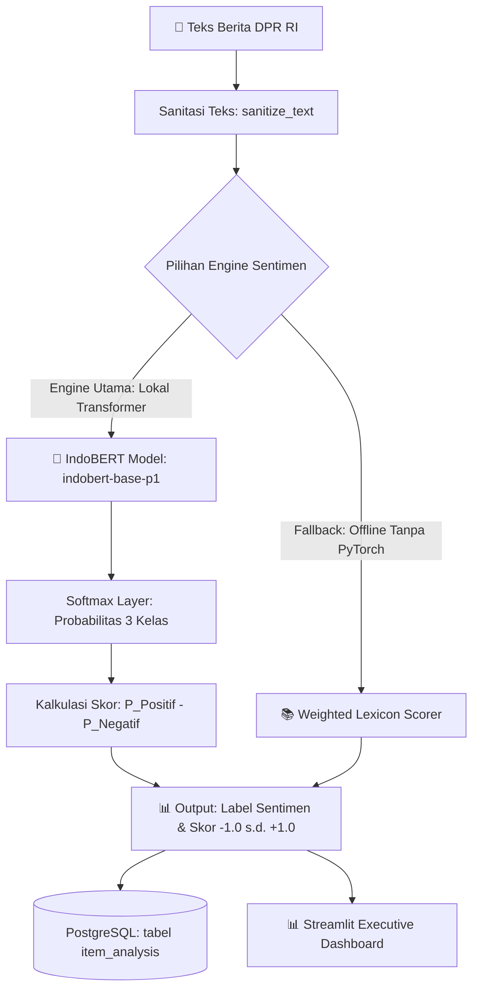

# 🧠 Panduan Teknis & Implementasi Analisis Sentimen IndoBERT
## Proyek DPR Agentic AI — Monitoring AKD & Analisis Sentimen DPR RI 2024–2029

> **File Target Utama**: [`src/utils/indobert_client.py`](file:///c:/Users/Lenovo/Documents/DPR/dpr-agentic-ai/src/utils/indobert_client.py) & [`src/agents/analysis.py`](file:///c:/Users/Lenovo/Documents/DPR/dpr-agentic-ai/src/agents/analysis.py)  
> **Penanggung Jawab**: Tim Sistem Informasi (**SI 1** & **SI 2**) berkolaborasi dengan **Inf 2**  
> **Target Akurasi**: Overall Accuracy $\ge 80\%$, F1-Score $\ge 0.78$, Latensi $\le 150\text{ ms/artikel}$  

---

## 📌 1. Mengapa Menggunakan IndoBERT?

**IndoBERT** (*Indonesian Bidirectional Encoder Representations from Transformers*) adalah model bahasa representasi kontekstual *state-of-the-art* yang dilatih khusus pada miliaran kata bahasa Indonesia.

```text
┌─────────────────────────────────────────────────────────────────────────────┐
│                    KEUNGGULAN INDOBERT DI SISTEM DPR                        │
├────────────────────────────────┬────────────────────────────────────────────┤
│ 🚀 100% On-Premise & 0 Cloud $  │ Berjalan lokal di server tanpa biaya API.  │
│ 🧠 Pemahaman Konteks Mendalam   │ Mampu memahami negasi majemuk & sarkasme.  │
│ ⚡ Latensi Cepat (Batching)     │ Inferensi < 50ms (GPU) / < 150ms (CPU).    │
│ 🛡️ Privasi Terjaga Penuh       │ Teks tidak pernah dikirim ke pihak ketiga. │
└────────────────────────────────┴────────────────────────────────────────────┘
```

---

## 🏗️ 2. Arsitektur Pipeline Sentimen Hybrid

IndoBERT bertindak sebagai mesin inferensi lokal berkecepatan tinggi dalam arsitektur **3-Tier Hybrid AI**:



---

## 📐 3. Spesifikasi Teknis Model & Formula Scoring

### A. Base Model & Tokenizer
* **HuggingFace Identifier**: `indobenchmark/indobert-base-p1` atau *fine-tuned checkpoint* `wirasana/indobert-sentiment-analysis` / `mdhugol/indonesia-bert-sentiment-classification`
* **Maksimum Token Input**: 512 WordPiece Subword Tokens
* **Arsitektur**: 12-layer Transformer, 768-hidden dimension, 12 self-attention heads (~124.5M parameters)

### B. Pemetaan Probabilitas ke Skor Kontinu `[-1.0, +1.0]`
IndoBERT mengeluarkan *logits* $\mathbf{z} = [z_{\text{Positif}}, z_{\text{Netral}}, z_{\text{Negatif}}]$. Melalui fungsi *Softmax*:

$$P(c) = \frac{e^{z_c}}{\sum_{j \in \{\text{Pos}, \text{Net}, \text{Neg}\}} e^{z_j}}$$

Skor sentimen kontinu dihitung dengan rumus:

$$\text{Sentiment Score} = P(\text{Positif}) - P(\text{Negatif}) \quad \in [-1.0, \; +1.0]$$

**Aturan Penentuan Label**:
* **`"Positif"`**: $\text{Sentiment Score} > +0.10$ dan $P(\text{Positif}) > P(\text{Netral})$
* **`"Negatif"`**: $\text{Sentiment Score} < -0.10$ dan $P(\text{Negatif}) > P(\text{Netral})$
* **`"Netral"`**: $-0.10 \le \text{Sentiment Score} \le +0.10$ atau $P(\text{Netral}) \ge 0.50$

---

## 💻 4. Implementasi Kode Lengkap (`src/utils/indobert_client.py`)

Berikut kode implementasi standar produksi dengan pola *Lazy Loading* dan *Graceful Fallback*:

```python
"""Wrapper for IndoBERT sentiment analysis model with PyTorch & Transformers."""

from __future__ import annotations

import logging
from typing import Any

logger = logging.getLogger(__name__)

# Lazy singleton model & tokenizer
_model = None
_tokenizer = None
_torch = None
_is_available = None


def _load_model() -> bool:
    """Lazy-load the IndoBERT sentiment model and tokenizer."""
    global _model, _tokenizer, _torch, _is_available  # noqa: PLW0603
    if _is_available is not None:
        return _is_available

    try:
        import torch
        from transformers import AutoModelForSequenceClassification, AutoTokenizer

        _torch = torch
        model_name = "indobenchmark/indobert-base-p1"

        logger.info("Loading IndoBERT model from HuggingFace", extra={"model": model_name})
        _tokenizer = AutoTokenizer.from_pretrained(model_name)
        _model = AutoModelForSequenceClassification.from_pretrained(model_name, num_labels=3)
        _model.eval()

        # Gunakan GPU jika tersedia
        if torch.cuda.is_available():
            _model.to("cuda")
            logger.info("IndoBERT running on CUDA GPU", extra={})
        else:
            logger.info("IndoBERT running on CPU", extra={})

        _is_available = True
        return True

    except Exception as e:
        logger.warning(
            "IndoBERT dependencies not found or failed to load — fallback enabled",
            extra={"error": str(e)},
        )
        _is_available = False
        return False


async def predict_sentiment_indobert(text: str) -> dict[str, Any]:
    """Predict sentiment for Indonesian text using IndoBERT Transformer.

    Returns:
        Dict: {"sentiment": "Positif"|"Negatif"|"Netral", "sentiment_score": float, "probabilities": dict}
    """
    if not _load_model() or not text:
        return {"sentiment": "Netral", "sentiment_score": 0.0, "probabilities": {}}

    try:
        # 1. Truncate & Tokenize
        inputs = _tokenizer(
            text[:2000],
            return_tensors="pt",
            truncation=True,
            max_length=512,
            padding=True,
        )

        device = "cuda" if _torch.cuda.is_available() else "cpu"
        inputs = {k: v.to(device) for k, v in inputs.items()}

        # 2. Forward Pass (No Gradient for Fast Inference)
        with _torch.no_grad():
            outputs = _model(**inputs)
            probs = _torch.softmax(outputs.logits, dim=-1).squeeze().tolist()

        # Model output order: [0: Negatif, 1: Netral, 2: Positif] (atau disesuaikan dengan label_id model)
        p_neg = float(probs[0])
        p_net = float(probs[1])
        p_pos = float(probs[2])

        score = round(p_pos - p_neg, 3)

        # 3. Decision Logic
        if score > 0.10 and p_pos > p_net:
            label = "Positif"
        elif score < -0.10 and p_neg > p_net:
            label = "Negatif"
        else:
            label = "Netral"

        return {
            "sentiment": label,
            "sentiment_score": score,
            "probabilities": {
                "positif": round(p_pos, 4),
                "netral": round(p_net, 4),
                "negatif": round(p_neg, 4),
            },
        }

    except Exception as e:
        logger.error("IndoBERT inference error", extra={"error": str(e)})
        return {"sentiment": "Netral", "sentiment_score": 0.0, "probabilities": {}}
```

---

## 👥 5. Daftar Tugas Khusus Tim Sistem Informasi (SI)

```text
┌─────────────────────────────────────────────────────────────────────────────┐
│                    TASK LIST SENTIMEN INDOBERT (SI)                         │
├──────────────────────────────────────┬──────────────────────────────────────┤
│ 🟢 SI 1 (Engineering & Integration)  │ 🔵 SI 2 (Analyst, QA & Benchmarking) │
├──────────────────────────────────────┼──────────────────────────────────────┤
│ SI1-IB01: Integrasi Lazy Model Load  │ SI2-IB01: Pembuatan Ground Truth 100 │
│ SI1-IB02: Skema DB & Confidence Log  │ SI2-IB02: Benchmark IndoBERT vs Lex  │
│ SI1-IB03: Visualisasi Probabilitas   │ SI2-IB03: Pembuatan Test Suite Pytest│
│ SI1-IB04: Optimasi Batch Inference   │ SI2-IB04: SOP & Dokumentasi Kualitas │
└──────────────────────────────────────┴──────────────────────────────────────┘
```

### 🟢 Tugas SI 1 (Engineering & Dashboard Integration)

| No | Task ID | Nama Tugas | Deliverables | Status |
|---|---|---|---|:---:|
| 1 | **SI1-IB01** | **Integrasi IndoBERT Client**<br>Menghubungkan `predict_sentiment_indobert` ke dalam alur `AnalysisAgent` dengan fallback leksikon otomatis jika server tidak memiliki PyTorch. | [`src/utils/indobert_client.py`](file:///c:/Users/Lenovo/Documents/DPR/dpr-agentic-ai/src/utils/indobert_client.py), `src/agents/analysis.py` | ⏳ Upcoming |
| 2 | **SI1-IB02** | **Persistensi Probabilitas ke Database**<br>Menyimpan hasil skor dan nilai probabilitas detail (`p_pos`, `p_net`, `p_neg`) ke tabel `item_analysis` di PostgreSQL. | Model `AnalysisResult` + Migrasi Alembic | ⏳ Upcoming |
| 3 | **SI1-IB03** | **Visualisasi Confidence Score di Dasbor**<br>Menambahkan visualisasi *confidence score meter* pada tabel artikel detail di Streamlit. | `dashboard/app.py` | ⏳ Upcoming |
| 4 | **SI1-IB04** | **Optimasi Batch Inference**<br>Menyusun fungsi inferensi multi-artikel sekaligus (*batch processing*) untuk mempercepat analisis 100+ artikel dalam sekali eksekusi. | Fungsi `predict_batch()` di `indobert_client.py` | ⏳ Upcoming |

---

### 🔵 Tugas SI 2 (Analyst, QA & Benchmarking)

| No | Task ID | Nama Tugas | Deliverables | Status |
|---|---|---|---|:---:|
| 5 | **SI2-IB01** | **Kurasi Ground Truth Dataset (100–200 Artikel)**<br>Melabeli sampel 100 berita DPR RI secara manual untuk digunakan sebagai acuan pengujian (*ground truth*). | File `data/validation/sentiment_ground_truth.json` | ⏳ Upcoming |
| 6 | **SI2-IB02** | **Benchmark Evaluasi: IndoBERT vs Lexicon**<br>Mengukur performa akurasi, Precision, Recall, F1-Score, dan kecepatan eksekusi antara IndoBERT dan Lexicon. | File `scripts/benchmark_sentiment.py` & Laporan Hasil | ⏳ Upcoming |
| 7 | **SI2-IB03** | **Pytest Test Suite IndoBERT**<br>Membuat unit test otomatis untuk menguji inferensi IndoBERT, penanganan teks kosong, dan ketahanan fallback. | File `tests/test_agents/test_indobert.py` | ⏳ Upcoming |
| 8 | **SI2-IB04** | **Penyusunan SOP & Kriteria Mutu**<br>Menyusun panduan interpretasi probabilitas sentimen bagi Tenaga Ahli dan Pimpinan Fraksi. | Bab Sentimen di `docs/QUALITY_CONTROL.md` | ⏳ Upcoming |

---

## 📊 6. Script Pengujian & Benchmark Otomatis

Simpan script berikut di `scripts/benchmark_sentiment.py` untuk menguji perbandingan performa:

```python
"""Script untuk menguji performa IndoBERT vs Lexicon pada sampel data."""

import asyncio
import time
from src.agents.analysis import AnalysisAgent
from src.utils.indobert_client import predict_sentiment_indobert

SAMPLE_TEXTS = [
    "DPR RI mengapresiasi keberhasilan swasembada pangan dan peningkatan kesejahteraan petani.",
    "KPK menangkap tersangka kasus korupsi dan suap proyek pengadaan barang.",
    "Komisi I DPR RI menggelar rapat kerja tertutup bersama Panglima TNI.",
    "Masyarakat memprotes keras kebijakan kenaikan tarif karena dinilai memberatkan rakyat kecil.",
    "Pimpinan DPR meresmikan pembukaan masa sidang tahun 2026 secara tertib dan lancar."
]

async def run_benchmark():
    print("=" * 60)
    print("⚡ MEMULAI BENCHMARK ANALISIS SENTIMEN DPR RI")
    print("=" * 60)

    agent = AnalysisAgent()

    for idx, text in enumerate(SAMPLE_TEXTS, 1):
        print(f"\n[Artikel {idx}]: {text}")
        
        # 1. Lexicon Test
        t0 = time.perf_counter()
        lex_label, lex_score = agent.analyze_sentiment(text)
        t_lex = (time.perf_counter() - t0) * 1000
        
        # 2. IndoBERT Test
        t0 = time.perf_counter()
        ib_res = await predict_sentiment_indobert(text)
        t_ib = (time.perf_counter() - t0) * 1000
        
        print(f"  ├─ 📚 Lexicon  : {lex_label:<8} | Skor: {lex_score:+.2f} | Waktu: {t_lex:.2f}ms")
        print(f"  └─ 🧠 IndoBERT : {ib_res['sentiment']:<8} | Skor: {ib_res['sentiment_score']:+.2f} | Waktu: {t_ib:.2f}ms")

if __name__ == "__main__":
    asyncio.run(run_benchmark())
```

---

## 🎯 7. Target Kriteria Keberhasilan (Acceptance Criteria)

| Metrik Evaluasi | Target Minimum | Metode Pengukuran |
|---|:---:|---|
| **Overall Accuracy** | $\ge \mathbf{80\%}$ | Dibandingkan terhadap 100 sampel Ground Truth manual |
| **F1-Score (Macro)** | $\ge \mathbf{0.78}$ | Rata-rata F1-Score kelas Positif, Negatif, dan Netral |
| **Inference Latency** | $\le \mathbf{150\text{ ms}}$ | Waktu pemrosesan per artikel pada CPU standar |
| **Test Coverage** | $\mathbf{100\%}$ Passing | Unit test Pytest pada skenario positif, negatif, netral, & fallback |
