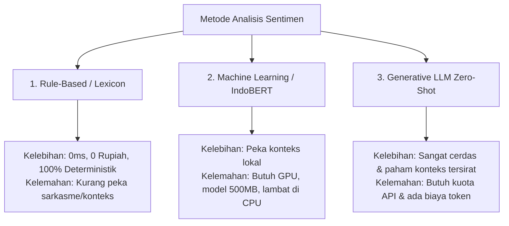
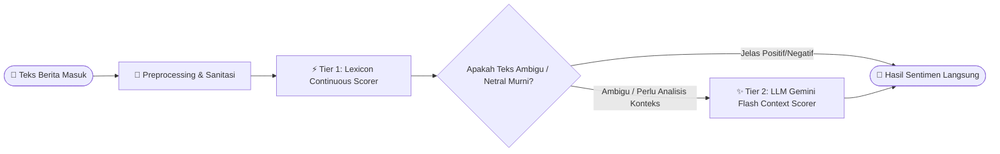

# 📘 Panduan Lengkap Membangun Mesin Analisis Sentimen Politik Bahasa Indonesia (Dari Nol / From Scratch)

Dokumen ini adalah panduan teknis komprehensif langkah demi langkah untuk membangun mesin **Analisis Sentimen Bahasa Indonesia** yang andal, hemat biaya, dan tahan terhadap karakteristik bahasa politik nasional.

---

## 📑 Daftar Isi
1. [Pengantar & Tantangan Sentimen Bahasa Indonesia](#1-pengantar--tantangan-sentimen-bahasa-indonesia)
2. [3 Pendekatan dalam Analisis Sentimen NLP](#2-3-pendekatan-dalam-analisis-sentimen-nlp)
3. [Arsitektur Hybrid Multi-Tier DPR RI](#3-arsitektur-hybrid-multi-tier-dpr-ri)
4. [Langkah 1: Text Preprocessing & Sanitasi Teks](#4-langkah-1-text-preprocessing--sanitasi-teks)
5. [Langkah 2: Penyusunan Leksikon Berbobot & Afiksasi](#5-langkah-2-penyusunan-leksikon-berbobot--afiksasi)
6. [Langkah 3: Rumus Matematis Scoring Kontinu [-1.0, +1.0]](#6-langkah-3-rumus-matematis-scoring-kontinu--10-10)
7. [Langkah 4: Integrasi LLM (Gemini) untuk Konteks Implisit](#7-langkah-4-integrasi-llm-gemini-untuk-konteks-implisit)
8. [Langkah 5: Kode Implementasi Penuh (Self-Contained)](#8-langkah-5-kode-implementasi-penuh-self-contained)
9. [Langkah 6: Pengujian Unit Test (TDD)](#9-langkah-6-pengujian-unit-test-tdd)

---

## 1. Pengantar & Tantangan Sentimen Bahasa Indonesia

Dalam domain kebijakan publik dan politik DPR RI, analisis sentimen jauh lebih rumit daripada sekadar analisis ulasan produk *e-commerce*. Tantangan khususnya meliputi:

1. **Afiksasi Morfologis Kompleks**: Kata dasar `rugi` bisa berubah menjadi `merugikan`, `dirugikan`, `kerugian`, `terugi`. Mesin harus mengenali kata dasar tanpa selalu membutuhkan library berat.
2. **Konteks Lembaga vs Bencana**: Kata *"gempa bumi tewaskan 10 orang"* bernada **Negatif secara situasi**, tetapi jika artikelnya adalah *"Pemerintah dan DPR salurkan bansos Rp 50 M untuk korban gempa"*, fokus aksi lembaganya bernada **Positif/Solutif**.
3. **Eufemisme Politik**: Istilah halus seperti *"penyesuaian tarif"* (sebenarnya kenaikan harga) atau *"optimalisasi anggaran"* (pengurangan subsidi) memerlukan pemahaman semantik mendalam.

---

## 2. 3 Pendekatan dalam Analisis Sentimen NLP



---

## 3. Arsitektur Hybrid Multi-Tier DPR RI

Sistem ini menggabungkan keunggulan **Lexicon Rule-Based** (untuk kecepatan & kehematan) dan **LLM Gemini** (untuk ketajaman konteks):



---

## 4. Langkah 1: Text Preprocessing & Sanitasi Teks

Sebelum dihitung, teks mentah dari feed RSS harus dibersihkan dari tag HTML, URL, karakter aneh, dan dinormalisasi menjadi huruf kecil (*case folding*).

```python
import re
import html

def sanitize_text(text: str) -> str:
    """Membersihkan teks dari tag HTML, entitas web, dan whitespace berlebih."""
    if not text:
        return ""
    # 1. Decode HTML entities (misal: &amp; -> &)
    text = html.unescape(text)
    # 2. Hapus tag HTML (<p>, <script>, dll)
    text = re.sub(r"<[^>]+>", " ", text)
    # 3. Hapus URL web
    text = re.sub(r"https?://\S+|www\.\S+", " ", text)
    # 4. Hapus karakter non-alfanumerik berlebih kecuali tanda baca standar
    text = re.sub(r"[^\w\s\.,\-]", " ", text)
    # 5. Normalisasi spasi
    return " ".join(text.split()).strip()
```

---

## 5. Langkah 2: Penyusunan Leksikon Berbobot & Afiksasi

Kita menyusun daftar kata positif dan negatif acuan politik Indonesia, dilengkapi aturan deteksi akar kata (*stem prefix/suffix*):

```python
POSITIVE_WORDS = {
    "setuju", "sepakat", "dukung", "apresiasi", "sukses", "berhasil",
    "prestasi", "efektif", "optimal", "positif", "puji", "sambut",
    "bagus", "baik", "unggul", "maju", "tumbuh", "meningkat", "pulih",
    "transparan", "akuntabel", "solid", "sinergi", "kolaborasi", "sejahtera",
    "bantuan", "solutif", "responsif", "terobosan", "inovasi", "aman"
}

NEGATIVE_WORDS = {
    "tolak", "kritik", "kecewa", "gagal", "buruk", "rugi", "korupsi",
    "suap", "pungli", "gratifikasi", "skandal", "polemik", "kontroversi",
    "protes", "demo", "ricuh", "bentrok", "ancam", "bahaya", "lambat",
    "cacat", "pelanggaran", "ilegal", "kejahatan", "bencana", "banjir",
    "longsor", "gempa", "kebakaran", "tewas", "kritis", "darurat", "krisis"
}

POSITIVE_ROOTS = {"sukses", "berhasil", "dukung", "apresiasi", "sejahtera", "tumbuh", "pulih"}
NEGATIVE_ROOTS = {"korupsi", "bencana", "banjir", "maling", "rugi", "rusak", "cacat", "kecewa"}
```

---

## 6. Langkah 3: Rumus Matematis Scoring Kontinu `[-1.0, +1.0]`

Alih-alih hanya menghasilkan label kaku, kita menghitung skor desimal kontinu:

$$\text{Raw Score} = \frac{\text{Pos Count} - \text{Neg Count}}{\text{Total Sentiment Words}}$$

### Aturan Batas Ambang (*Threshold*):
* **Skor $\ge +0.15$** $\rightarrow$ **Label: "Positif"**
* **Skor $\le -0.15$** $\rightarrow$ **Label: "Negatif"**
* **$-0.15 < \text{Skor} < +0.15$** $\rightarrow$ **Label: "Netral"**

---

## 7. Langkah 4: Integrasi LLM (Gemini) untuk Konteks Implisit

Jika sebuah artikel tidak memuat kata emosional eksplisit namun secara substantif memuat kritik kebijakan, kita meminta Gemini mengevaluasi sentimennya:

```python
PROMPT_SENTIMEN = """
Analisis sentimen teks berita politik berikut terhadap kinerja pemerintah/DPR.
Kembalikan format JSON:
{
  "sentiment": "Positif" | "Negatif" | "Netral",
  "score": float antara -1.0 sampai 1.0,
  "reason": "Alasan singkat"
}
"""
```

---

## 8. Langkah 5: Kode Implementasi Penuh (*Self-Contained*)

Berikut adalah modul lengkap yang dapat langsung Anda jalankan secara mandiri:

```python
# -*- coding: utf-8 -*-
"""Sentiment Analysis Engine for Indonesian Political News."""

import re
import html
from typing import Tuple

class IndonesianSentimentAnalyzer:
    def __init__(self):
        self.pos_words = POSITIVE_WORDS
        self.neg_words = NEGATIVE_WORDS

    def analyze(self, text: str) -> Tuple[str, float]:
        cleaned = sanitize_text(text).lower()
        if not cleaned:
            return "Netral", 0.0

        words = re.findall(r"\b\w+\b", cleaned)
        if not words:
            return "Netral", 0.0

        pos_count = 0
        for w in words:
            if w in self.pos_words:
                pos_count += 1
            elif any(w.startswith(root) or w.endswith(root) for root in POSITIVE_ROOTS if len(w) >= 5):
                pos_count += 1

        neg_count = 0
        for w in words:
            if w in self.neg_words:
                neg_count += 1
            elif any(w.startswith(root) or w.endswith(root) for root in NEGATIVE_ROOTS if len(w) >= 4):
                neg_count += 1

        total = pos_count + neg_count
        if total == 0:
            return "Netral", 0.0

        score = round((pos_count - neg_count) / total, 2)
        if score >= 0.15:
            return "Positif", score
        elif score <= -0.15:
            return "Negatif", score
        else:
            return "Netral", score
```

---

## 9. Langkah 6: Pengujian Unit Test (TDD)

```python
def test_sentiment_scenarios():
    analyzer = IndonesianSentimentAnalyzer()
    
    # Uji Kalimat Positif
    label, score = analyzer.analyze("DPR dan Menkeu sepakat tingkatkan anggaran pendidikan secara transparan")
    assert label == "Positif"
    assert score > 0.15

    # Uji Kalimat Negatif
    label, score = analyzer.analyze("Masyarakat protes dan kecewa atas dugaan korupsi proyek infrastruktur")
    assert label == "Negatif"
    assert score < -0.15

    # Uji Kalimat Netral
    label, score = analyzer.analyze("Rapat koordinasi dilaksanakan di Gedung Nusantara II Senayan Jakarta")
    assert label == "Netral"
    assert score == 0.0
```
