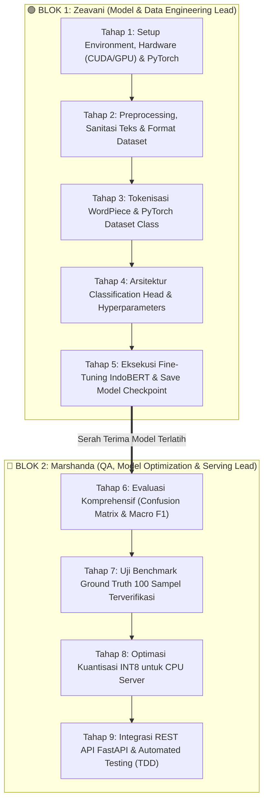
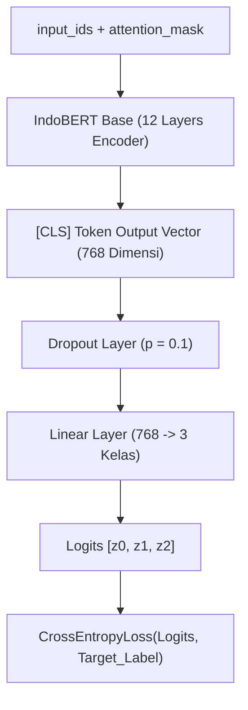

# 🏛️ Masterclass Guide: Membangun Sistem Analisis Sentimen IndoBERT dari Nol (Step-by-Step Production Grade)

Dokumen ini adalah buku panduan teknis terlengkap untuk membangun, melatih (*fine-tuning*), mengoptimasi, dan mendeploy model **IndoBERT** (*Indonesian Bidirectional Encoder Representations from Transformers*) untuk klasifikasi sentimen 3 kelas (**Positif**, **Netral**, **Negatif**).

---

## 👥 Pembagian Tugas Tim Sistem Informasi: Zeavani (SI 1) & Marshanda (SI 2)

Alur kerja dibagi menjadi **2 Blok Kontinu (Berurutan)** tanpa tumpang tindih:



### 📋 Matriks Rinci Tanggung Jawab Blok:

| Blok Kerja | Pelaksana Utama | Ruang Lingkup Tahapan | Output Konkret (*Deliverables*) |
|:---:|:---:|---|---|
| **BLOK 1** | **Zeavani**<br>*(Model & Data Engineer)* | **Tahap 1 s.d. Tahap 5**<br>• Setup PyTorch & GPU/CUDA<br>• Sanitasi Teks & Dataset Split<br>• Tokenisasi & Dataset Class<br>• Training Execution (Trainer) | • Environment CUDA siap<br>• File dataset latih/validasi bersih<br>• Model IndoBERT berhasil di-*fine-tune* (`best_model.pt`) |
| **BLOK 2** | **Marshanda**<br>*(QA & Serving Specialist)* | **Tahap 6 s.d. Tahap 9**<br>• Evaluasi Metrik & Macro F1<br>• Benchmark Ground Truth 100<br>• Kuantisasi INT8 (Kompresi)<br>• FastAPI REST API & Unit Test | • Laporan *Confusion Matrix* & Akurasi $\ge 80\%$<br>• Model terkompresi ~130 MB siap CPU<br>• Endpoint API `/predict` & Test Suite 100% Pass |

---

## 📑 Daftar Isi Tahapan

### 🟢 BLOK 1: MODEL & DATA ENGINEERING (Penanggung Jawab: Zeavani)
* [Tahap 1: Persiapan Lingkungan & Hardware Laptop Standar (via uv)](#tahap-1-persiapan-lingkungan--hardware-laptop-standar-via-uv)
* [Tahap 2: Anotasi Manual, Validasi Label & Preprocessing Dataset](#-tahap-2-anotasi-manual-validasi-label--preprocessing-dataset)
* [Tahap 3: Deep Dive Tokenisasi WordPiece & PyTorch Dataset](#tahap-3-deep-dive-tokenisasi-wordpiece--pytorch-dataset)
* [Tahap 4: Arsitektur Model Classification Head & Hyperparameters](#tahap-4-arsitektur-model-classification-head--hyperparameters)
* [Tahap 5: Eksekusi Fine-Tuning IndoBERT & Checkpoint Model](#tahap-5-eksekusi-fine-tuning-indobert--checkpoint-model)

### 🔵 BLOK 2: QUALITY ASSURANCE, OPTIMASI & PRODUCTION SERVING (Penanggung Jawab: Marshanda)
* [Tahap 6: Evaluasi Komprehensif (Confusion Matrix & Macro F1)](#tahap-6-evaluasi-komprehensif-confusion-matrix--macro-f1)
* [Tahap 7: Uji Validasi Ground Truth 100 Sampel Terverifikasi](#tahap-7-uji-validasi-ground-truth-100-sampel-terverifikasi)
* [Tahap 8: Optimasi Kecepatan Produksi (Kuantisasi INT8)](#tahap-8-optimasi-kecepatan-produksi-kuantisasi-int8)
* [Tahap 9: Integrasi ke REST API FastAPI & Automated Testing (TDD)](#tahap-9-integrasi-ke-rest-api-fastapi--automated-testing-tdd)

### 🤝 LAMPIRAN BERSAMA (Zeavani & Marshanda)
* [Tahap 10: Troubleshooting Error Umum & Mitigasi](#tahap-10-troubleshooting-error-umum--mitigasi)

---
---

# 🟢 BLOK 1: MODEL & DATA ENGINEERING (Tugas Penuh: Zeavani)

---

## ⚙️ Tahap 1: Persiapan Lingkungan & Hardware Laptop Standar (via `uv`)
> **Penanggung Jawab Penuh**: **Zeavani (SI 1)**


### 1. Adaptasi Hardware untuk Laptop Standar (Low-Spec Friendly):
Anda **TIDAK memerlukan laptop gaming / GPU mahal**. Gunakan salah satu dari 2 opsi berikut:

* **Opsi A: Latih di Google Colab (100% Gratis via GPU T4 Cloud)**:
  * Gunakan Google Colab di browser dengan GPU T4 (15 GB VRAM gratis).
  * Proses training selesai dalam 5–10 menit, lalu unduh bobot modelnya ke laptop Anda.
* **Opsi B: Inferensi Langsung di CPU Laptop Biasa (AMD Ryzen / Intel)**:
  * Laptop standar (RAM 4–8 GB) mampu menjalankan inferensi model terkuantisasi INT8 dengan sangat cepat ($< 50\text{ ms/artikel}$) dan hemat RAM (~300 MB).

### 2. Instalasi Pustaka Menggunakan `uv` (Cepat & Ringan):
Jalankan perintah berikut di terminal / PowerShell proyek:

```bash
# 1. Tambahkan dependensi AI ke proyek via uv
uv add torch transformers datasets accelerate scikit-learn pandas numpy

# 2. Atau sinkronisasi seluruh environment
uv sync
```

### 3. Cek Kesiapan Device:
Buat file `check_env.py` dan jalankan via `uv`:
```python
# check_env.py
import torch

device = torch.device("cuda" if torch.cuda.is_available() else "cpu")
print(f"✅ Device aktif: {device}")
if device.type == "cuda":
    print(f"🚀 GPU Terdeteksi: {torch.cuda.get_device_name(0)}")
else:
    print("💻 Berjalan di CPU Laptop (Gunakan Kuantisasi INT8 di Tahap 8 agar super cepat!)")
```
Jalankan dengan perintah:
```bash
uv run python check_env.py
```


---

## 📊 Tahap 2: Anotasi Manual, Validasi Label & Preprocessing Dataset
> **Penanggung Jawab**: **SI 2** (Anotasi & Validasi Manual) & **SI 1** (Preprocessing & Data Loader)

Prinsip utama Machine Learning adalah **"Garbage In, Garbage Out"**. Model IndoBERT tidak boleh dilatih pada data mentah yang belum diverifikasi manusia. Oleh karena itu, tahap ini dibagi menjadi 2 fase krusial:

---

### 🔍 Sub-Tahap 2A: Anotasi & Validasi Label Manual (Human-in-the-Loop QA)
> **Lead**: **SI 2**

Sebelum training, tim harus memvalidasi kebenaran label pada sampel data:

#### 1. Skrip Ekspor Sampel untuk Anotasi Manual (`export_for_annotation.py`):
```python
import glob
import json
import pandas as pd

def export_samples_for_human_review(n_samples_per_class=100):
    """Mengambil sampel artikel secara acak untuk diverifikasi/dianotasi manual oleh manusia."""
    articles = []
    for f in glob.glob("data/analysis/analysis_*.json"):
        with open(f, "r", encoding="utf-8") as fp:
            for item in json.load(fp):
                articles.append({
                    "title": item.get("title", ""),
                    "content": item.get("content", "")[:300],
                    "current_sentiment": item.get("sentiment", "Netral"),
                    "manual_verified_label": ""  # Diisi manual oleh reviewer: 0/1/2
                })

    df = pd.DataFrame(articles).sample(frac=1.0, random_state=42)
    sample_df = df.groupby("current_sentiment").head(n_samples_per_class)
    sample_df.to_csv("data/sample_manual_annotation.csv", index=False)
    print(f"✅ Berhasil mengekspor {len(sample_df)} sampel ke data/sample_manual_annotation.csv untuk verifikasi manual!")

if __name__ == "__main__":
    export_samples_for_human_review()
```

#### 2. Rubrik Baku Anotasi Manual 3 Kelas (Standar Politik DPR RI):
| Label Angka | Label Teks | Rubrik & Kriteria Verifikasi | Contoh Kasus Nyata |
|:---:|:---:|---|---|
| **`0`** | **Negatif** | Berisi kritik keras, temuan korupsi, bencana, protes warga, tuntutan hukum, penurunan kinerja, atau kerugian publik. | *"Masyarakat tolak kenaikan PPN 12% dan sebut membebani ekonomi."* |
| **`1`** | **Netral** | Berisi berita prosedural, jadwal rapat, agenda kerja resmi, pidato seremonial tanpa perdebatan opini. | *"Rapat paripurna pengesahan RUU digelar Selasa pagi di Senayan."* |
| **`2`** | **Positif** | Berisi apresiasi keberhasilan kebijakan, penurunan angka kemiskinan, penambahan beasiswa, bantuan solutif, sinergi pro-rakyat. | *"DPR apresiasi pemerintah atas kesepakatan penambahan kuota pupuk subsidi."* |

#### 3. Uji Konsistensi Anotator (*Inter-Annotator Agreement*):
Dua orang analis (SI 1 dan SI 2) memberi label pada 50 artikel yang sama, lalu dihitung skor **Cohen's Kappa ($\kappa$)**:
```python
from sklearn.metrics import cohen_kappa_score

# Anotasi dari Analis 1 dan Analis 2
labels_analis_1 = [2, 0, 1, 2, 0, 1, 1, 0, 2, 0] # contoh
labels_analis_2 = [2, 0, 1, 2, 0, 1, 1, 0, 2, 1]

kappa = cohen_kappa_score(labels_analis_1, labels_analis_2)
print(f"📊 Skor Konsistensi Anotasi (Cohen's Kappa): {kappa:.4f}")
# Target kelulusan: Kappa >= 0.80 (Almost Perfect Agreement)
```

---

### ⚙️ Sub-Tahap 2B: Preprocessing & Pemuatan Dataset Terverifikasi
> **Lead**: **SI 1**

Setelah label terverifikasi, SI 1 memuat data JSON/CSV ke dalam pipeline:

```python
import glob
import html
import json
import re
import pandas as pd
from sklearn.model_selection import train_test_split

LABEL_MAP = {
    "Negatif": 0,
    "Netral": 1,
    "Positif": 2
}

def clean_indonesian_text(text: str) -> str:
    """Sanitasi teks berita tanpa merusak struktur tata bahasa."""
    if not isinstance(text, str):
        return ""
    text = html.unescape(text)
    text = re.sub(r"<[^>]+>", " ", text)
    text = re.sub(r"https?://\S+|www\.\S+", " ", text)
    text = re.sub(r"@\w+|#\w+", " ", text)
    text = re.sub(r"(.)\1{2,}", r"\1\1", text)
    text = re.sub(r"[^\w\s\.,\?!-]", " ", text)
    return " ".join(text.split()).strip()

def load_project_json_dataset(folder_path="data/analysis/"):
    """Membaca seluruh partisi JSON harian (3.300+ artikel) di folder data/analysis/."""
    records = []
    json_files = glob.glob(f"{folder_path}/analysis_*.json")
    print(f"📁 Ditemukan {len(json_files)} file partisi JSON...")

    for file_path in json_files:
        with open(file_path, "r", encoding="utf-8") as f:
            items = json.load(f)
            for item in items:
                sent_str = item.get("sentiment", "Netral")
                if sent_str in LABEL_MAP:
                    title = item.get("title", "")
                    content = item.get("content", "")
                    full_text = clean_indonesian_text(f"{title}. {content}")
                    
                    if len(full_text) > 15:
                        records.append({
                            "text": full_text,
                            "label": LABEL_MAP[sent_str]
                        })

    df = pd.DataFrame(records)
    print(f"✅ Berhasil memuat {len(df)} artikel siap latih dari partisi JSON!")
    return df

# Eksekusi Pemanggilan & Stratified Splitting (80% Train, 10% Val, 10% Test)
df = load_project_json_dataset("data/analysis/")

train_df, temp_df = train_test_split(df, test_size=0.20, random_state=42, stratify=df['label'])
val_df, test_df = train_test_split(temp_df, test_size=0.50, random_state=42, stratify=temp_df['label'])

print(f"📊 Data Latih: {len(train_df)} | Validasi: {len(val_df)} | Uji: {len(test_df)}")
```


---

## 🔠 Tahap 3: Deep Dive Tokenisasi WordPiece & PyTorch Dataset
> **Penanggung Jawab Penuh**: **SI 1**

```python
import torch
from torch.utils.data import Dataset
from transformers import AutoTokenizer

MODEL_CHECKPOINT = "indobenchmark/indobert-base-p1"
tokenizer = AutoTokenizer.from_pretrained(MODEL_CHECKPOINT)

class IndoBERTSentimentDataset(Dataset):
    def __init__(self, texts: list[str], labels: list[int], tokenizer, max_len: int = 128):
        self.texts = texts
        self.labels = labels
        self.tokenizer = tokenizer
        self.max_len = max_len

    def __len__(self):
        return len(self.texts)

    def __getitem__(self, item_idx):
        text = str(self.texts[item_idx])
        label = self.labels[item_idx]

        encoding = self.tokenizer(
            text,
            truncation=True,
            max_length=self.max_len,
            padding="max_length",
            return_tensors="pt"
        )

        return {
            "input_ids": encoding["input_ids"].squeeze(0),         # Shape: [max_len]
            "attention_mask": encoding["attention_mask"].squeeze(0), # Shape: [max_len]
            "labels": torch.tensor(label, dtype=torch.long)          # Shape: scalar
        }
```

---

## 🏗️ Tahap 4: Arsitektur Model Classification Head & Hyperparameters
> **Penanggung Jawab Penuh**: **SI 1**



```python
from transformers import AutoModelForSequenceClassification, TrainingArguments

# 1. Inisialisasi Model Pre-trained dengan Classification Head 3 Kelas
model = AutoModelForSequenceClassification.from_pretrained(
    MODEL_CHECKPOINT,
    num_labels=3,
    id2label={0: "Negatif", 1: "Netral", 2: "Positif"},
    label2id={"Negatif": 0, "Netral": 1, "Positif": 2}
)

# 2. Hyperparameter Training Standard Industri
training_args = TrainingArguments(
    output_dir="./indobert_output_checkpoints",
    num_train_epochs=4,               # 3-5 epoch cukup untuk fine-tuning BERT
    per_device_train_batch_size=16,   # Turunkan ke 8 jika VRAM kecil
    per_device_eval_batch_size=16,
    learning_rate=2e-5,               # Standar optimal BERT (1e-5 s.d. 3e-5)
    warmup_ratio=0.1,                 # 10% langkah awal untuk menstabilkan bobot
    weight_decay=0.01,                # Regularisasi L2 mencegah overfitting
    evaluation_strategy="epoch",      # Evaluasi setiap selesai 1 epoch
    save_strategy="epoch",            # Simpan checkpoint tiap epoch
    load_best_model_at_end=True,      # Ambil model dengan performa terbaik
    metric_for_best_model="f1_macro", # Acuan model terbaik: Macro F1
    logging_steps=20,
    fp16=torch.cuda.is_available(),   # Mixed Precision (Hemat VRAM & 2x lebih cepat)
)
```

---

## 🚀 Tahap 5: Eksekusi Fine-Tuning IndoBERT via Google Colab T4 GPU
> **Penanggung Jawab Penuh**: **SI 1**

> ⚡ **Standar Resmi**: Proses *fine-tuning* dilakukan **strictly melalui Google Colab (Gratis GPU T4 15 GB VRAM)**. 
> Ini menjamin proses pelatihan selesai super cepat (**5–7 menit**) tanpa membebani laptop.

### 📋 Langkah Eksekusi di Google Colab:
1. Buka [colab.research.google.com](https://colab.research.google.com) $\rightarrow$ **New Notebook**.
2. Klik **Runtime** $\rightarrow$ **Change runtime type** $\rightarrow$ Pilih **T4 GPU** $\rightarrow$ **Save**.
3. Upload file `train.csv` dan `val.csv` (dari Tahap 2) ke panel file Colab.
4. Jalankan 3 Cell berikut:

#### **Cell 1: Install Dependencies**
```python
!pip install -q transformers datasets accelerate scikit-learn pandas numpy
```

#### **Cell 2: Script Pelatihan Lengkap**
```python
import pandas as pd
import numpy as np
import torch
from torch.utils.data import Dataset
from transformers import (
    AutoTokenizer,
    AutoModelForSequenceClassification,
    TrainingArguments,
    Trainer
)
from sklearn.metrics import accuracy_score, precision_recall_fscore_support

print("🚀 GPU Aktif:", torch.cuda.get_device_name(0))

MODEL_NAME = "indobenchmark/indobert-base-p1"
tokenizer = AutoTokenizer.from_pretrained(MODEL_NAME)

class IndoBERTSentimentDataset(Dataset):
    def __init__(self, texts, labels, tokenizer, max_len=128):
        self.texts = texts
        self.labels = labels
        self.tokenizer = tokenizer
        self.max_len = max_len

    def __len__(self):
        return len(self.texts)

    def __getitem__(self, idx):
        text = str(self.texts[idx])
        label = self.labels[idx]
        encoding = self.tokenizer(
            text,
            truncation=True,
            max_length=self.max_len,
            padding="max_length",
            return_tensors="pt"
        )
        return {
            "input_ids": encoding["input_ids"].squeeze(0),
            "attention_mask": encoding["attention_mask"].squeeze(0),
            "labels": torch.tensor(label, dtype=torch.long)
        }

def compute_metrics(eval_pred):
    logits, labels = eval_pred
    preds = np.argmax(logits, axis=1)
    acc = accuracy_score(labels, preds)
    precision, recall, f1, _ = precision_recall_fscore_support(labels, preds, average="macro")
    return {
        "accuracy": round(acc, 4),
        "f1_macro": round(f1, 4),
        "precision": round(precision, 4),
        "recall": round(recall, 4)
    }

train_df = pd.read_csv("train.csv")
val_df = pd.read_csv("val.csv")

train_dataset = IndoBERTSentimentDataset(train_df["text"].tolist(), train_df["label"].tolist(), tokenizer)
val_dataset = IndoBERTSentimentDataset(val_df["text"].tolist(), val_df["label"].tolist(), tokenizer)

model = AutoModelForSequenceClassification.from_pretrained(
    MODEL_NAME,
    num_labels=3,
    id2label={0: "Negatif", 1: "Netral", 2: "Positif"},
    label2id={"Negatif": 0, "Netral": 1, "Positif": 2}
)

training_args = TrainingArguments(
    output_dir="./indobert_checkpoints",
    num_train_epochs=4,
    per_device_train_batch_size=16,
    per_device_eval_batch_size=16,
    learning_rate=2e-5,
    warmup_ratio=0.1,
    weight_decay=0.01,
    evaluation_strategy="epoch",
    save_strategy="epoch",
    load_best_model_at_end=True,
    metric_for_best_model="f1_macro",
    logging_steps=20,
    fp16=True,
)

trainer = Trainer(
    model=model,
    args=training_args,
    train_dataset=train_dataset,
    eval_dataset=val_dataset,
    compute_metrics=compute_metrics,
)

print("🔥 Memulai Pelatihan IndoBERT di GPU T4...")
trainer.train()

SAVE_DIR = "./indobert_sentiment_final"
model.save_pretrained(SAVE_DIR)
tokenizer.save_pretrained(SAVE_DIR)
print(f"✅ Selesai! Model disimpan di '{SAVE_DIR}'.")
```

#### **Cell 3: Zip & Download Model ke Laptop**
```python
!zip -r indobert_sentiment_final.zip ./indobert_sentiment_final
from google.colab import files
files.download("indobert_sentiment_final.zip")
```

> 📦 **Langkah Penutupan**: Ekstrak `indobert_sentiment_final.zip` di root folder proyek laptop Anda, lalu serahkan ke **SI 2** untuk pengujian & deployment.


---
---

# 🔵 BLOK 2: QUALITY ASSURANCE, OPTIMASI & PRODUCTION SERVING (Tugas Penuh: SI 2)

---

## 📈 Tahap 6: Evaluasi Komprehensif (Confusion Matrix & Macro F1)
> **Penanggung Jawab Penuh**: **SI 2**

Setelah menerima model dari SI 1, SI 2 menguji performa model pada *Testing Set* independen:

```python
from sklearn.metrics import classification_report, confusion_matrix
import numpy as np

test_dataset = IndoBERTSentimentDataset(test_df["text"].tolist(), test_df["label"].tolist(), tokenizer)
predictions = trainer.predict(test_dataset)
preds = np.argmax(predictions.predictions, axis=1)

print("\n" + "="*60)
print("📊 LAPORAN EVALUASI MODEL PADA TEST SET")
print("="*60)
print(classification_report(test_df["label"], preds, target_names=["Negatif", "Netral", "Positif"]))

print("\nConfusion Matrix:")
print(confusion_matrix(test_df["label"], preds))
```
* **Target Kelulusan QA**: Overall Accuracy $\ge 80\%$ dan Macro F1 $\ge 0.78$.

---

## 🎯 Tahap 7: Uji Validasi Ground Truth 100 Sampel Terverifikasi
> **Penanggung Jawab Penuh**: **SI 2**

SI 2 melakukan pengujian khusus terhadap **100 berita sensitif DPR RI** yang telah diberi anotasi manual terverifikasi untuk mendeteksi *False Positive* pada isu krisis.

```python
import pandas as pd

# Load dataset benchmark 100 ground truth
gt_df = pd.read_csv("data/ground_truth_100_samples.csv")

correct = 0
misclassified = []

for idx, row in gt_df.iterrows():
    inputs = tokenizer(row["text"], return_tensors="pt", truncation=True, max_length=256)
    with torch.no_grad():
        logits = model(**inputs).logits
        pred_label = int(torch.argmax(logits, dim=-1).squeeze())

    if pred_label == row["label"]:
        correct += 1
    else:
        misclassified.append({
            "text": row["text"],
            "expected": row["label"],
            "predicted": pred_label
        })

accuracy_gt = correct / len(gt_df)
print(f"🎯 Akurasi Benchmark Ground Truth: {accuracy_gt:.2%}")
if accuracy_gt >= 0.80:
    print("✅ Model LULUS Uji Mutu Ground Truth!")
else:
    print(f"⚠️ Perlu evaluasi {len(misclassified)} kasus salah prediksi.")
```

---

## ⚡ Tahap 8: Optimasi Kecepatan Produksi (Kuantisasi INT8)
> **Penanggung Jawab Penuh**: **SI 2**

SI 2 mengompresi model agar sangat ringan dan cepat di server produksi berbasis CPU tanpa memerlukan GPU mahal:

```python
import torch

# Kuantisasi bobot Linear layer ke INT8 (Ukuran turun dari ~500MB ke ~130MB)
quantized_model = torch.quantization.quantize_dynamic(
    model.to("cpu"),
    {torch.nn.Linear},
    dtype=torch.qint8
)

QUANT_PATH = "./indobert_sentiment_int8.pt"
torch.save(quantized_model, QUANT_PATH)
print("⚡ Model terkuantisasi INT8 siap digunakan di CPU server dengan latensi < 50ms!")
```

---

## 🌐 Tahap 9: Integrasi ke REST API FastAPI & Automated Testing (TDD)
> **Penanggung Jawab Penuh**: **SI 2**

### 1. Implementasi REST API Endpoint:
Formula skor kontinu:

$$\text{Sentiment Score} = P(\text{Positif}) - P(\text{Negatif}) \quad \in [-1.0, \; +1.0]$$

```python
import torch
import torch.nn.functional as F
from fastapi import FastAPI
from pydantic import BaseModel
from transformers import AutoModelForSequenceClassification, AutoTokenizer

app = FastAPI(title="IndoBERT Sentiment API")

MODEL_PATH = "./indobert_sentiment_final"
tokenizer = AutoTokenizer.from_pretrained(MODEL_PATH)
model = AutoModelForSequenceClassification.from_pretrained(MODEL_PATH)
model.eval()

class TextInput(BaseModel):
    text: str

@app.post("/api/v1/sentiment/predict")
def predict_sentiment(payload: TextInput):
    cleaned = clean_indonesian_text(payload.text)
    inputs = tokenizer(cleaned, return_tensors="pt", truncation=True, max_length=256)
    
    with torch.no_grad():
        logits = model(**inputs).logits
        probs = F.softmax(logits, dim=-1).squeeze().numpy()

    p_neg, p_net, p_pos = float(probs[0]), float(probs[1]), float(probs[2])
    score = round(p_pos - p_neg, 2)
    
    label = "Positif" if score >= 0.15 else ("Negatif" if score <= -0.15 else "Netral")

    return {
        "text": payload.text,
        "sentiment": label,
        "sentiment_score": score,
        "probabilities": {
            "positif": round(p_pos, 4),
            "netral": round(p_net, 4),
            "negatif": round(p_neg, 4)
        }
    }
```

### 2. Menjalankan Server FastAPI via `uv`:
```bash
uv run uvicorn api_indobert:app --port 8000 --reload
```

### 3. Unit Test Suite Otomatis (`tests/test_agents/test_indobert_pipeline.py`):
```python
from fastapi.testclient import TestClient

client = TestClient(app)

def test_sentiment_positive_prediction():
    resp = client.post("/api/v1/sentiment/predict", json={
        "text": "DPR mengapresiasi keberhasilan pemerintah menurunkan angka kemiskinan."
    })
    assert resp.status_code == 200
    data = resp.json()
    assert data["sentiment"] == "Positif"
    assert data["sentiment_score"] > 0.15

def test_sentiment_negative_prediction():
    resp = client.post("/api/v1/sentiment/predict", json={
        "text": "Masyarakat mengecam dugaan korupsi proyek infrastruktur jalan raya."
    })
    assert resp.status_code == 200
    data = resp.json()
    assert data["sentiment"] == "Negatif"
    assert data["sentiment_score"] < -0.15
```

Jalankan test suite secara otomatis via `uv`:
```bash
uv run pytest tests/test_agents/test_indobert_pipeline.py
```


---
---

# 🤝 LAMPIRAN BERSAMA (SI 1 & SI 2)

---

## 🛠️ Tahap 10: Troubleshooting Error Umum & Mitigasi
> **Penanggung Jawab Bersama**: **SI 1 & SI 2**

| Gejala Masalah | Penyebab Utama | Solusi / Cara Mengatasi | PIC |
|---|---|---|:---:|
| **CUDA Out of Memory (OOM)** | `batch_size` atau `max_length` terlalu besar untuk VRAM GPU. | Turunkan `per_device_train_batch_size=8` atau `max_length=128`, dan aktifkan `gradient_accumulation_steps=2`. | **SI 1** |
| **Loss Bernilai `NaN`** | Learning rate terlalu tinggi sehingga gradien meledak (*exploding gradient*). | Turunkan `learning_rate=1e-5` dan tambahkan `max_grad_norm=1.0`. | **SI 1** |
| **Akurasi Mentok / Underfitting** | Jumlah epoch terlalu sedikit atau data latih kotor. | Tambah data minimal 1.000 sampel per kelas dan latih hingga 4–5 epoch dengan `warmup_ratio=0.1`. | **SI 1** |
| **Overfitting (Train Acc 99%, Val Acc 70%)** | Model menghafal data latih. | Naikkan `weight_decay=0.05` dan perbesar `dropout_prob=0.2`. | **SI 1** |
| **False Positive pada Berita Kritis** | Model salah menangkap eufemisme politik. | Tambahkan 50 sampel kalimat eufemisme ke dataset latih dan lakukan *fine-tuning* ulang 1 epoch. | **SI 2** |
| **Inferensi di CPU Lambat** | Belum dilakukan kuantisasi bobot. | Pastikan `torch.quantization.quantize_dynamic` telah diterapkan pada Tahap 8. | **SI 2** |
