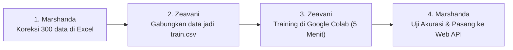

# 🏛️ Panduan Praktis Analisis Sentimen IndoBERT (Bahasa Sederhana)
## Untuk Tim Sistem Informasi: Zeavani (SI 1) & Marshanda (SI 2)
### Proyek DPR Agentic AI — Parlemen 2024–2029

Buku panduan ini ditulis dengan **bahasa yang sederhana, ringkas, dan langsung ke praktik**. Tidak perlu bingung dengan istilah teknis yang rumit, cukup ikuti langkah demi langkah di bawah ini.

---

## 💡 1. Pahami Alur Kerjanya dalam 1 Menit

### Mengapa Kita Perlu Melakukan Ini?
Model AI yang ada sekarang masih sering **salah menebak** (misal: berita *"KPK menggeledah rumah bupati"* malah dikira berita *"Netral"*). Oleh karena itu, kita melatih ulang model **IndoBERT** agar pintar membaca gaya bahasa berita politik DPR RI.

### Siapa Mengerjakan Apa?
* 🔵 **Marshanda (Penguji Mutu / QA Lead)**: 
  1. Memeriksa dan mengoreksi 300 judul berita di Excel (memberi label 0, 1, atau 2).
  2. Menguji apakah model buatan Zeavani sudah pintar atau belum (target akurasi minimal 80%).
  3. Memasang model ke server backend FastAPI.
* 🟢 **Zeavani (Pelatih Model / AI Engineer)**: 
  1. Menggabungkan data Excel dari Marshanda menjadi dataset siap latih.
  2. Melatih IndoBERT di **Google Colab** (komputer gratis Google yang ada GPU-nya, selesai cuma 5–7 menit).
  3. Mengunduh hasil model dan menyerahkannya kembali ke Marshanda.



---

## 🔵 2. BUKU TUGAS MARSHANDA (Langkah demi Langkah)

### 📝 Tugas 1: Membuat & Mengisi File Excel Koreksi (Hari 1–2)

1. Buka terminal proyek di laptop, lalu jalankan perintah ini untuk membuat file Excel:
   ```bash
   uv run python src/utils/export_for_manual_annotation.py
   ```
   *Perintah ini akan membuat file:* `data/annotation/sample_for_manual_verification.csv`.

2. Buka file CSV tersebut di **Microsoft Excel** atau **Google Sheets**.

3. Baca kolom `title` (Judul Berita) dan `content_preview` (Isi Berita), lalu isi kolom **`manual_verified_label`** dengan angka berikut:
   * Ketik **`0`** jika berita bernada **Negatif** (Korupsi, demo, bencana, kenaikan harga/pajak, keluhan warga, kritik keras).
   * Ketik **`1`** jika berita bernada **Netral** (Jadwal rapat, agenda sidang, data angka statistik resmi tanpa keributan).
   * Ketik **`2`** jika berita bernada **Positif** (Apresiasi keberhasilan, bantuan beasiswa/pupuk cair, penurunan kemiskinan).

   > 💡 **Contoh Pengisian**:
   > * *"KPK Geledah Kantor Bupati Terkait Suap Proyek"* $\rightarrow$ Isi: **`0`** (Negatif)
   > * *"Komisi I DPR Gelar Raker Terbuka Pukul 10.00 WIB"* $\rightarrow$ Isi: **`1`** (Netral)
   > * *"DPR dan Kemenkeu Sepakati Tambahan Beasiswa 2 Juta Siswa"* $\rightarrow$ Isi: **`2`** (Positif)

4. **Simpan (Save)** file CSV tersebut setelah selesai diisi.
5. **Kirim kabar ke Zeavani bahwa file sudah siap!**

---

### 🧪 Tugas 2: Menguji Kepintaran Model dari Zeavani (Hari 6)
*(Dikerjakan setelah Zeavani selesai melatih model di Google Colab dan menyerahkan foldernya)*

1. Pastikan folder `indobert_sentiment_final/` sudah ditaruh di folder proyek.
2. Jalankan skrip evaluasi:
   ```bash
   uv run python evaluate_model.py
   ```
3. Lihat hasilnya di layar terminal:
   * Jika **Accuracy $\ge 0.80$** (80%) dan **Macro F1 $\ge 0.78$**, maka **MODEL LULUS UJI!** 🎉

---

### ⚡ Tugas 3: Mengecilkan Ukuran Model & Menjalankan API (Hari 7)

1. Kecilkan ukuran file model dari 500 MB menjadi 130 MB agar laptop tidak berat:
   ```bash
   uv run python quantize_model.py
   ```
2. Jalankan server backend:
   ```bash
   uv run uvicorn src.main:app --port 8000 --reload
   ```
   * Sekarang sistem analisis sentimen IndoBERT sudah aktif dan bisa diakses di browser pada alamat: `http://localhost:8000/docs`.

---

## 🟢 3. BUKU TUGAS ZEAVANI (Langkah demi Langkah)

### 📂 Tugas 1: Mengolah Data Marshanda Menjadi Data Siap Latih (Hari 3)
*(Dikerjakan setelah Marshanda selesai mengisi file Excel di atas)*

1. Buka terminal di laptop, lalu jalankan perintah ini:
   ```bash
   uv run python src/utils/build_verified_dataset.py
   ```
   *Skrip ini otomatis merapikan data koreksi Marshanda dan menghasilkan 2 file siap latih:*
   * `data/train.csv` (Data untuk bahan belajar AI)
   * `data/val.csv` (Data untuk ujian AI selama belajar)

---

### 🚀 Tugas 2: Melatih Model di Google Colab (Hari 4–5)

> 💡 **Kenapa di Google Colab?** Karena Google menyediakan komputer gratis dengan GPU (VRAM 15 GB). Di laptop biasa butuh 2 jam dan bikin panas, tapi di Google Colab **hanya butuh 5–7 menit**.

#### Langkah-langkah di Google Colab:
1. Buka browser dan kunjungi: **[colab.research.google.com](https://colab.research.google.com)**.
2. Buka file [`notebooks/train_indobert_colab.ipynb`](file:///c:/Users/Lenovo/Documents/DPR/dpr-agentic-ai/notebooks/train_indobert_colab.ipynb) atau buat *Notebook Baru*.
3. **PENTING**: Aktifkan GPU gratisnya:
   * Klik menu atas: **Runtime** $\rightarrow$ **Change runtime type** (*Ubah jenis runtime*).
   * Pilih **T4 GPU** $\rightarrow$ Klik **Save**.
4. Di panel sebelah kiri Colab, klik ikon folder 📁, lalu **Upload** file `train.csv` dan `val.csv`.
5. Jalankan 3 kotak kode (*Cell*) berikut secara berurutan:

##### **Kotak 1: Pasang Program Pendukung (Klik Tombol Play ▶️)**
```python
!pip install -q transformers datasets accelerate scikit-learn pandas numpy
```

##### **Kotak 2: Jalankan Pelatihan AI (Klik Tombol Play ▶️)**
```python
import pandas as pd
import numpy as np
import torch
from torch.utils.data import Dataset
from transformers import AutoTokenizer, AutoModelForSequenceClassification, TrainingArguments, Trainer
from sklearn.metrics import accuracy_score, precision_recall_fscore_support

print("🚀 GPU Aktif:", torch.cuda.get_device_name(0))

MODEL_NAME = "indobenchmark/indobert-base-p1"
tokenizer = AutoTokenizer.from_pretrained(MODEL_NAME)

class IndoBERTSentimentDataset(Dataset):
    def __init__(self, texts, labels, tokenizer, max_len=128):
        self.texts = texts
        self.labels = labels
        self.tokenizer = tokenizer
        self.max_len = max_len

    def __len__(self):
        return len(self.texts)

    def __getitem__(self, idx):
        encoding = self.tokenizer(str(self.texts[idx]), truncation=True, max_length=self.max_len, padding="max_length", return_tensors="pt")
        return {
            "input_ids": encoding["input_ids"].squeeze(0),
            "attention_mask": encoding["attention_mask"].squeeze(0),
            "labels": torch.tensor(self.labels[idx], dtype=torch.long)
        }

def compute_metrics(eval_pred):
    logits, labels = eval_pred
    preds = np.argmax(logits, axis=1)
    acc = accuracy_score(labels, preds)
    precision, recall, f1, _ = precision_recall_fscore_support(labels, preds, average="macro")
    return {"accuracy": round(acc, 4), "f1_macro": round(f1, 4)}

# Muat data
train_df = pd.read_csv("train.csv")
val_df = pd.read_csv("val.csv")

train_dataset = IndoBERTSentimentDataset(train_df["text"].tolist(), train_df["label"].tolist(), tokenizer)
val_dataset = IndoBERTSentimentDataset(val_df["text"].tolist(), val_df["label"].tolist(), tokenizer)

model = AutoModelForSequenceClassification.from_pretrained(
    MODEL_NAME,
    num_labels=3,
    id2label={0: "Negatif", 1: "Netral", 2: "Positif"},
    label2id={"Negatif": 0, "Netral": 1, "Positif": 2}
)

training_args = TrainingArguments(
    output_dir="./indobert_checkpoints",
    num_train_epochs=4,
    per_device_train_batch_size=16,
    per_device_eval_batch_size=16,
    learning_rate=2e-5,
    evaluation_strategy="epoch",
    save_strategy="epoch",
    load_best_model_at_end=True,
    metric_for_best_model="f1_macro",
    fp16=True,
)

trainer = Trainer(
    model=model,
    args=training_args,
    train_dataset=train_dataset,
    eval_dataset=val_dataset,
    compute_metrics=compute_metrics,
)

print("🔥 Memulai Pelatihan IndoBERT di GPU Google...")
trainer.train()

SAVE_DIR = "./indobert_sentiment_final"
model.save_pretrained(SAVE_DIR)
tokenizer.save_pretrained(SAVE_DIR)
print(f"✅ Pelatihan Selesai! Model disimpan di '{SAVE_DIR}'.")
```

##### **Kotak 3: Download Hasil Model ke Laptop (Klik Tombol Play ▶️)**
```python
!zip -r indobert_sentiment_final.zip ./indobert_sentiment_final
from google.colab import files
files.download("indobert_sentiment_final.zip")
```

---

### 📦 Tugas 3: Menyerahkan Model ke Marshanda
1. Buka folder *Downloads* di laptop Anda, cari file `indobert_sentiment_final.zip`.
2. Pindahkan file tersebut ke folder proyek utama `dpr-agentic-ai/`, lalu **Extract Here** (Ekstrak di sini).
3. Pastikan sudah terbentuk folder bernama `indobert_sentiment_final/`.
4. **Beri tahu Marshanda bahwa model sudah siap diuji!**

---

## 🤝 4. Lembar Serah Terima Pekerjaan

| Urutan | Apa yang Diberikan? | Siapa yang Menyerahkan? | Kepada Siapa? |
|:---:|---|:---:|:---:|
| **1** | File `sample_for_manual_verification.csv` (Sudah terisi label 0, 1, 2) | **Marshanda** | **Zeavani** |
| **2** | File `train.csv` dan `val.csv` (Hasil olah data) | **Zeavani** | *Upload ke Colab* |
| **3** | Folder `indobert_sentiment_final/` (Model hasil latih Colab) | **Zeavani** | **Marshanda** |
| **4** | Laporan Akurasi $\ge 80\%$ & Server FastAPI Aktif | **Marshanda** | **Dosen / Tim DPR** |

---

## ❓ 5. Tanya Jawab Singkat (FAQ)

* **Tanya: Apakah laptop kami yang spesifikasinya standar akan ngelag/rusak?**  
  *Jawab:* Tidak sama sekali. Karena pelatihan yang berat dilakukan di komputasi awan Google Colab, laptop Anda hanya dipakai untuk membuka Excel dan menjalankan API ringan.

* **Tanya: Berapa lama waktu yang dibutuhkan untuk mengisi Excel?**  
  *Jawab:* 300 judul berita bisa diselesaikan dalam waktu sekitar 30–45 menit jika dikerjakan bersama-sama.

* **Tanya: Apa yang harus dilakukan jika hasil akurasi model di bawah 80%?**  
  *Jawab:* Cukup periksa kembali apakah ada label di file Excel yang salah isi, lalu jalankan `build_verified_dataset.py` dan latih ulang di Colab.
