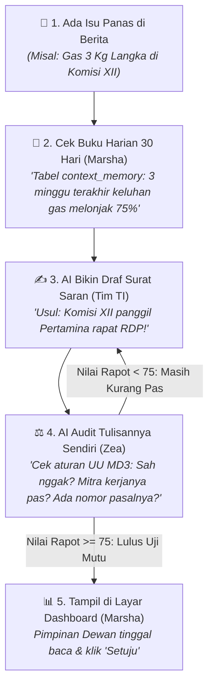
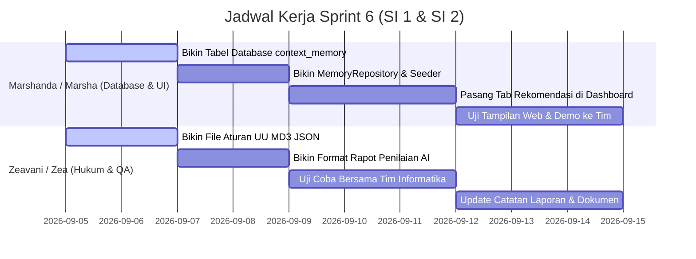

# 🏛️ Panduan Teknis & Praktis Sprint 6 — Tim Sistem Informasi (SI 1 & SI 2)
## Modul Rekomendasi Kebijakan DPR, Audit Mandiri (Critique Loop) & Memori Kontekstual 30 Hari
### Proyek DPR Agentic AI — Monitoring Parlemen 2024–2029

> **Dibuat Khusus Untuk**: **Marshanda (Marsha)** & **Zeavani (Zea)**  
> **Target Pengerjaan**: Sprint 6 (Hari 51 s.d. Hari 60 / 10 Hari Kerja)  
> **Status Sistem Terkini**: ✅ **102/102 Tests Passing (100%)** | Akurasi IndoBERT 90.00% | 4.636 Artikel Teranalisis  
> **Prinsip Panduan**: Sangat detail, praktis, ramah pemula, mudah dimengerti, dan langsung siap dipraktikkan!  

---

## 📑 DAFTAR ISI PANDUAN

1. [Pahami Alur Kerjanya dalam 2 Menit (Bahasa Sehari-hari)](#1-pahami-alur-kerjanya-dalam-2-menit-bahasa-sehari-hari)
2. [Pembagian Peran Baru: Marsha & Zea](#2-pembagian-peran-baru-marsha--zea)
3. [Buku Tugas Marshanda (Marsha) — Database & Web Dashboard](#3-buku-tugas-marshanda-marsha--database--web-dashboard)
   - [Tugas 1: Anatomi Lengkap Tabel Database `context_memory`](#tugas-1-anatomi-lengkap-tabel-database-context_memory)
   - [Tugas 2: Membangun Jembatan Data (`MemoryRepository`)](#tugas-2-membangun-jembatan-data-memoryrepository)
   - [Tugas 3: Skrip Pengisi Memori Otomatis dari 4.636 Berita Agustus](#tugas-3-skrip-pengisi-memori-otomatis-dari-4636-berita-agustus)
   - [Tugas 4: Implementasi Tampilan Tab Rekomendasi di Dashboard Web](#tugas-4-implementasi-tampilan-tab-rekomendasi-di-dashboard-web)
4. [Buku Tugas Zeavani (Zea) — Aturan Hukum Parlemen & Penjaminan Mutu (QA)](#4-buku-tugas-zeavani-zea--aturan-hukum-parlemen--penjaminan-mutu-qa)
   - [Tugas 1: Kamus Instrumen Wewenang DPR RI & 3 Rambu Merah Terlarang](#tugas-1-kamus-instrumen-wewenang-dpr-ri--3-rambu-merah-terlarang)
   - [Tugas 2: Format Nilai Rapot AI (Rubrik Penilaian 4 Pilar)](#tugas-2-format-nilai-rapot-ai-rubrik-penilaian-4-pilar)
   - [Tugas 3: Pengujian Mutu Otomatis (QA Testing)](#tugas-3-pengujian-mutu-otomatis-qa-testing)
5. [Jadwal Pelaksanaan Hari demi Hari (Hari 51 – 60)](#5-jadwal-pelaksanaan-hari-demi-hari-hari-51--60)
6. [Checklist "Kapan Tugas Dinyatakan Selesai?" (Definition of Done)](#6-checklist-kapan-tugas-dinyatakan-selesai-definition-of-done)
7. [FAQ — Tanya Jawab Praktis Saat Mengerjakan](#7-faq--tanya-jawab-praktis-saat-mengerjakan)

---

## ☕ 1. Pahami Alur Kerjanya dalam 2 Menit (Bahasa Sehari-hari)

### Mengapa Sprint 6 Ini Sangat Penting bagi Anggota DPR?
Pada Sprint 1 sampai 5 kemarin, sistem kita sudah sangat canggih:
- Mengumpulkan ribuan berita media nasional tiap hari (Detik, Antara, Kompas, Tempo, CNN, dll.).
- Memetakan berita secara otomatis ke 24 Alat Kelengkapan Dewan (AKD DPR RI).
- Membaca nada sentimen publik dengan model AI IndoBERT (akurasi 90%).
- Mendeteksi anomali: sistem bisa memberi tahu komisi mana yang sedang dihantam badai berita negatif ($Z_{\text{weighted}} \ge 2.0$).

Namun, jika sistem hanya berhenti di grafik dan angka persentase, Pimpinan Fraksi dan Anggota DPR pasti akan berkata:  
👉 **"Grafiknya bagus, sentimen negatifnya kelihatan. Tapi kami sebagai wakil rakyat harus berbuat apa hari ini? Apakah harus panggil menteri rapat? Sidak ke pasar? Atau bikin rilis pers?"**

Di Sprint 6 inilah kita membangun **"Asisten Staf Ahli Digital Parlemen"**:  
Sistem AI tidak cuma menampilkan data, tapi langsung menyodorkan **kartu usulan tindakan konkret**, memeriksa keabsahan hukumnya berdasarkan **UU MD3**, dan mengingat rekam jejak berita **30 hari terakhir**.



---

## 👥 2. Pembagian Peran Baru: Marsha & Zea

Agar pembagian kerja seimbang dan fokus pada keahlian masing-masing, berikut peran resmi di Sprint 6:

| Anggota Tim | Peran Resmi | Tanggung Jawab Utama di Sprint 6 |
|---|---|---|
| 🟢 **Marshanda (Marsha)** | **Database Architect & Executive Dashboard Specialist** | 1. Merancang tabel database buku harian 30 hari (`context_memory`).<br>2. Membuat `MemoryRepository` untuk membaca riwayat per komisi.<br>3. Menjalankan skrip seeder otomatis dari 4.636 berita bulan Agustus.<br>4. Membangun Tab Rekomendasi Parlemen interaktif di Dashboard Streamlit. |
| 🔵 **Zeavani (Zea)** | **System Analyst, Legal Rules & QA Lead** | 1. Menyusun kamus tindakan dewan & batas wewenang UU MD3 (`kamus/kebijakan_md3_rules.json`).<br>2. Merumuskan rubrik penilaian rapot AI 4 pilar mutu (ambang batas $\ge 75/100$).<br>3. Menulis dan mengeksekusi skenario uji coba otomatis (QA Testing) agar sistem 100% bebas error. |

---

## 🟢 3. BUKU TUGAS MARSHANDA (MARSHA) — DATABASE & WEB DASHBOARD

Marsha bertanggung jawab atas dua hal krusial:
1. **Ingatan Sistem**: Membuat database tidak pikun dan bisa mengingat riwayat isu 30 hari ke belakang.
2. **Wajah Sistem**: Membuat tampilan kartu rekomendasi yang rapi dan elegan di layar web Streamlit.

---

### 🗄️ Tugas 1: Anatomi Lengkap Tabel Database `context_memory`
📍 **File Target**: `src/models/context_memory.py`

#### 💡 Kenapa Tabel Ini Dibuat? (Penjelasan Bahasa Manusia)
Saat ini di database kita sudah ada tabel `content_items` yang menampung ribuan berita mentah.  
Jika setiap kali anggota dewan membuka dashboard AI harus membaca dan menghitung ulang ribuan artikel mentah dari nol, komputernya akan **sangat lelet (berat)** dan biaya token AI membengkak.

Maka, Marsha membuatkan satu tabel ringkasan yang berfungsi seperti **"Buku Harian / Diary Komisi"**:
* Tiap komisi hanya memiliki **1 baris ringkasan per hari**.
* Untuk membaca riwayat 30 hari Komisi XII, AI cukup membaca **30 baris data kecil** saja. Pencarian data selesai dalam waktu **kurang dari 10 milidetik**!

#### 📋 Kamus Data Kolom Tabel `context_memory`:

| Nama Kolom | Tipe Data | Wajib Diisi? | Keterangan & Contoh Isi |
|---|:---:|:---:|---|
| **`id`** | `INTEGER` | Ya *(PK)* | Nomor ID baris unik (1, 2, 3, dst.). |
| **`akd_name`** | `VARCHAR(50)` | Ya *(Index)* | Nama komisi / badan DPR RI (contoh: `"Komisi XII"`, `"Komisi IV"`). |
| **`record_date`** | `DATE` | Ya *(Index)* | Tanggal berita yang dirangkum (contoh: `2026-08-20`). |
| **`total_articles`** | `INTEGER` | Ya | Berapa total berita komisi itu di hari tersebut (contoh: `25`). |
| **`positive_count`** | `INTEGER` | Ya | Jumlah berita bersentimen positif hari itu (contoh: `3`). |
| **`negative_count`** | `INTEGER` | Ya | Jumlah berita bersentimen negatif hari itu (contoh: `18`). |
| **`neutral_count`** | `INTEGER` | Ya | Jumlah berita bersentimen netral hari itu (contoh: `4`). |
| **`avg_sentiment_score`** | `FLOAT` | Ya | Rata-rata skor sentimen dari `-1.0` s.d. `+1.0` (contoh: `-0.45`). |
| **`dominant_sentiment`** | `VARCHAR(20)` | Ya | Sentimen yang paling banyak muncul (`"Negatif"`, `"Positif"`, atau `"Netral"`). |
| **`top_issues_summary`** | `TEXT` | Tidak | Catatan 1-2 judul isu utama hari itu (contoh: *"Kelangkaan gas melon 3 kg di pangkalan"*). |
| **`is_anomaly_detected`** | `BOOLEAN` | Ya | Bernilai `True` jika di hari itu terjadi lonjakan krisis tidak wajar ($Z \ge 2.0$). |
| **`anomaly_zscore`** | `FLOAT` | Tidak | Angka skor lonjakan Z-Score hari itu (contoh: `2.45`). |
| **`created_at`** | `TIMESTAMPTZ` | Ya | Waktu data ini dicatat sistem. |

> 🔒 **Kunci Pengaman Database (Unique Constraint)**:  
> `UniqueConstraint("akd_name", "record_date")`  
> Artinya: database menolak jika ada pencatatan ganda untuk komisi yang sama di tanggal yang sama.

#### 📊 Mockup: Contoh Nyata Isi Baris Data di Database:

```text
id  | akd_name   | record_date | total | pos | neg | net | avg_score | dominant | top_issues_summary                  | is_anomaly
----+------------+-------------+-------+-----+-----+-----+-----------+----------+-------------------------------------+------------
101 | Komisi XII | 2026-08-18  | 12    | 2   | 8   | 2   | -0.35     | Negatif  | Kuota gas subsidi menipis di daerah | False
102 | Komisi XII | 2026-08-19  | 19    | 1   | 15  | 3   | -0.52     | Negatif  | Antrean tabung gas melon mengular   | True (Z=2.1)
103 | Komisi XII | 2026-08-20  | 25    | 2   | 20  | 3   | -0.65     | Negatif  | Harga gas 3 kg melonjak Rp35.000    | True (Z=2.8)
104 | Komisi IV  | 2026-08-20  | 14    | 11  | 1   | 2   | +0.48     | Positif  | Panen raya padi petani Sukoharjo    | False
```

#### 💻 Kode yang Harus Dibuat Marsha:
Buka folder `src/models/`, buat file baru bernama `context_memory.py`:

```python
"""Model Database Buku Harian (Memori 30 Hari) per Komisi DPR RI."""

from __future__ import annotations

from datetime import UTC, date, datetime

from sqlalchemy import Boolean, Date, DateTime, Float, Integer, String, Text, UniqueConstraint
from sqlalchemy.orm import Mapped, mapped_column

from src.database import Base


class ContextMemory(Base):
    """Menyimpan ringkasan harian per komisi biar AI punya ingatan jangka panjang 30 hari."""

    __tablename__ = "context_memory"
    __table_args__ = (
        UniqueConstraint("akd_name", "record_date", name="uq_context_memory_akd_date"),
    )

    id: Mapped[int] = mapped_column(Integer, primary_key=True)
    akd_name: Mapped[str] = mapped_column(String(50), nullable=False, index=True)
    record_date: Mapped[date] = mapped_column(Date, nullable=False, index=True)

    # Metrik Angka
    total_articles: Mapped[int] = mapped_column(Integer, default=0)
    positive_count: Mapped[int] = mapped_column(Integer, default=0)
    negative_count: Mapped[int] = mapped_column(Integer, default=0)
    neutral_count: Mapped[int] = mapped_column(Integer, default=0)
    avg_sentiment_score: Mapped[float] = mapped_column(Float, default=0.0)
    dominant_sentiment: Mapped[str] = mapped_column(String(20), default="Netral")

    # Catatan Isu Kualitatif & Anomali
    top_issues_summary: Mapped[str | None] = mapped_column(Text, nullable=True)
    is_anomaly_detected: Mapped[bool] = mapped_column(Boolean, default=False, index=True)
    anomaly_zscore: Mapped[float | None] = mapped_column(Float, nullable=True)

    created_at: Mapped[datetime] = mapped_column(
        DateTime(timezone=True), default=lambda: datetime.now(UTC)
    )

    def __repr__(self) -> str:
        return f"<ContextMemory(akd={self.akd_name}, date={self.record_date}, sentiment={self.dominant_sentiment})>"
```

Daftarkan juga di `src/models/__init__.py`:
```python
from src.models.context_memory import ContextMemory

__all__ = [
    ...,
    "ContextMemory",
]
```

---

### 🧠 Tugas 2: Membangun Jembatan Data (`MemoryRepository`)
📍 **File Target**: `src/repositories/memory_repository.py`

#### 💡 Penjelasan Bahasa Manusia:
File ini adalah "jembatan pintar" yang bertugas mengambil data 30 baris dari tabel `context_memory`, lalu merangkumnya menjadi **1 paragraf kalimat bahasa Indonesia** yang siap dimasukkan ke prompt AI `RecommendationAgent`.

#### 💻 Kode yang Dibuat Marsha:
Buat file `src/repositories/memory_repository.py`:

```python
"""Repository layer untuk membaca dan menyimpan memori kontekstual 30 hari."""

from __future__ import annotations

import logging
from datetime import date, timedelta
from typing import Any

from sqlalchemy import desc, select
from sqlalchemy.dialects.postgresql import insert
from sqlalchemy.orm import Session

from src.models.context_memory import ContextMemory

logger = logging.getLogger(__name__)


class MemoryRepository:
    """Mengelola pencatatan dan penarikan cerita riwayat isu 30 hari per AKD."""

    def __init__(self, session: Session) -> None:
        self.session = session

    def save_daily_summary(
        self,
        akd_name: str,
        record_date: date,
        total_articles: int,
        positive_count: int,
        negative_count: int,
        neutral_count: int,
        avg_sentiment_score: float,
        dominant_sentiment: str,
        top_issues_summary: str = "",
        is_anomaly: bool = False,
        anomaly_zscore: float | None = None,
    ) -> ContextMemory:
        """Menyimpan ringkasan harian. Jika tanggal sudah ada, otomatis di-update."""
        stmt = (
            insert(ContextMemory)
            .values(
                akd_name=akd_name,
                record_date=record_date,
                total_articles=total_articles,
                positive_count=positive_count,
                negative_count=negative_count,
                neutral_count=neutral_count,
                avg_sentiment_score=avg_sentiment_score,
                dominant_sentiment=dominant_sentiment,
                top_issues_summary=top_issues_summary,
                is_anomaly_detected=is_anomaly,
                anomaly_zscore=anomaly_zscore,
            )
            .on_conflict_do_update(
                constraint="uq_context_memory_akd_date",
                set_={
                    "total_articles": total_articles,
                    "positive_count": positive_count,
                    "negative_count": negative_count,
                    "neutral_count": neutral_count,
                    "avg_sentiment_score": avg_sentiment_score,
                    "dominant_sentiment": dominant_sentiment,
                    "top_issues_summary": top_issues_summary,
                    "is_anomaly_detected": is_anomaly,
                    "anomaly_zscore": anomaly_zscore,
                },
            )
        )
        self.session.execute(stmt)
        self.session.commit()

        query = select(ContextMemory).where(
            ContextMemory.akd_name == akd_name,
            ContextMemory.record_date == record_date,
        )
        return self.session.execute(query).scalar_one()

    def get_30day_story(self, akd_name: str, target_date: date | None = None) -> dict[str, Any]:
        """Menarik riwayat 30 hari dan merangkumnya menjadi cerita yang dipahami AI."""
        if target_date is None:
            target_date = date.today()

        start_date = target_date - timedelta(days=30)

        query = (
            select(ContextMemory)
            .where(
                ContextMemory.akd_name == akd_name,
                ContextMemory.record_date >= start_date,
                ContextMemory.record_date <= target_date,
            )
            .order_by(desc(ContextMemory.record_date))
        )
        records = list(self.session.execute(query).scalars().all())

        # Fallback aman jika komisi belum punya catatan
        if not records:
            return {
                "akd_name": akd_name,
                "days_tracked": 0,
                "total_articles": 0,
                "overall_sentiment": "Netral",
                "anomaly_count": 0,
                "summary_narrative": f"Belum ada riwayat tercatat untuk {akd_name} dalam 30 hari terakhir.",
            }

        total_articles = sum(r.total_articles for r in records)
        total_pos = sum(r.positive_count for r in records)
        total_neg = sum(r.negative_count for r in records)
        anomaly_count = sum(1 for r in records if r.is_anomaly_detected)
        avg_score = sum(r.avg_sentiment_score for r in records) / len(records)

        dominant = "Netral"
        if total_neg > total_pos and total_neg > (total_articles * 0.4):
            dominant = "Negatif"
        elif total_pos > total_neg and total_pos > (total_articles * 0.4):
            dominant = "Positif"

        recent_issues = [r.top_issues_summary for r in records[:3] if r.top_issues_summary]
        issues_str = "; ".join(recent_issues) if recent_issues else "Aktivitas pengawasan rutin"

        # Rangkuman narasi inilah yang disuntikkan ke AI!
        narrative = (
            f"Dalam {len(records)} hari terakhir, {akd_name} diberitakan sebanyak {total_articles} kali "
            f"dengan sentimen dominan {dominant} (Rata-rata skor: {avg_score:+.2f}). "
            f"Tercatat {anomaly_count} kali lonjakan isu krisis publik. "
            f"Sorotan utama media meliputi: {issues_str}."
        )

        return {
            "akd_name": akd_name,
            "days_tracked": len(records),
            "total_articles": total_articles,
            "overall_sentiment": dominant,
            "avg_sentiment_score": round(avg_score, 3),
            "anomaly_count": anomaly_count,
            "summary_narrative": narrative,
        }
```

---

### 🔄 Tugas 3: Skrip Pengisi Memori Otomatis dari 4.636 Berita Agustus
📍 **File Target**: `src/utils/seed_context_memory.py`

#### 💡 Penjelasan Bahasa Manusia:
Marsha tidak perlu mengetik data satu per satu. Proyek kita sudah memiliki 31 file analisis harian di `data/analysis/analysis_2026-08-*.json` (total 4.636 berita). Marsha cukup membuat skrip ini dan menjalankannya sekali. Dalam beberapa detik, seluruh memori 31 hari langsung terisi di database!

#### 💻 Kode Skrip yang Dibuat Marsha:
```python
# src/utils/seed_context_memory.py
"""Skrip otomatis untuk memigrasikan data analisis harian ke tabel context_memory."""

import glob
import json
import os
from collections import defaultdict
from datetime import datetime

from src.database import get_db_session
from src.repositories.memory_repository import MemoryRepository


def seed_memory_from_json_files() -> int:
    """Membaca 31 partisi file analysis_*.json dan mengisi tabel context_memory."""
    files = sorted(glob.glob("data/analysis/analysis_2026-08-*.json"))
    if not files:
        print("❌ Tidak ditemukan file partisi di data/analysis/")
        return 0

    total_inserted = 0
    with get_db_session() as session:
        repo = MemoryRepository(session)

        for filepath in files:
            filename = os.path.basename(filepath)
            # Ambil tanggal dari nama file
            date_str = filename.replace("analysis_", "").replace(".json", "")
            rec_date = datetime.strptime(date_str, "%Y-%m-%d").date()

            with open(filepath, "r", encoding="utf-8") as f:
                articles = json.load(f)

            # Hitung statistik per komisi
            akd_stats = defaultdict(lambda: {"total": 0, "pos": 0, "neg": 0, "net": 0, "scores": [], "titles": []})

            for art in articles:
                akd = art.get("primary_akd", "Tidak Terklasifikasi")
                if akd == "Tidak Terklasifikasi":
                    continue

                sentiment = art.get("sentiment", "Netral")
                score = art.get("sentiment_score", 0.0)
                title = art.get("title", "")

                akd_stats[akd]["total"] += 1
                if sentiment == "Positif":
                    akd_stats[akd]["pos"] += 1
                elif sentiment == "Negatif":
                    akd_stats[akd]["neg"] += 1
                else:
                    akd_stats[akd]["net"] += 1

                akd_stats[akd]["scores"].append(score)
                if len(akd_stats[akd]["titles"]) < 2 and title:
                    akd_stats[akd]["titles"].append(title)

            # Simpan ringkasan harian per komisi
            for akd, stats in akd_stats.items():
                avg_score = sum(stats["scores"]) / len(stats["scores"]) if stats["scores"] else 0.0
                dominant = "Netral"
                if stats["neg"] > stats["pos"]:
                    dominant = "Negatif"
                elif stats["pos"] > stats["neg"]:
                    dominant = "Positif"

                issues = " | ".join(stats["titles"]) if stats["titles"] else "Aspirasi rutin masyarakat"
                is_anom = (stats["total"] >= 15 and stats["neg"] >= 8)

                repo.save_daily_summary(
                    akd_name=akd,
                    record_date=rec_date,
                    total_articles=stats["total"],
                    positive_count=stats["pos"],
                    negative_count=stats["neg"],
                    neutral_count=stats["net"],
                    avg_sentiment_score=avg_score,
                    dominant_sentiment=dominant,
                    top_issues_summary=issues,
                    is_anomaly=is_anom,
                )
                total_inserted += 1

    print(f"✅ SUKSES! Berhasil mengisi {total_inserted} baris memori 30 hari ke database.")
    return total_inserted


if __name__ == "__main__":
    seed_memory_from_json_files()
```

#### 🛠️ Cara Menjalankannya di Terminal:
```bash
uv run python src/utils/seed_context_memory.py
```

---

### 🎨 Tugas 4: Implementasi Tampilan Tab Rekomendasi di Dashboard Web
📍 **File Target**: `dashboard/app.py`

#### 💡 Penjelasan Bahasa Manusia:
Marsha menambahkan **Tab ke-6** di dashboard Streamlit:  
👉 **`🏛️ Rekomendasi Aksi Parlemen (AI-Generated)`**

Di tab ini, anggota dewan akan melihat **Kartu Rekomendasi Resmi** yang sangat rapi dan interaktif.

#### 🖼️ Mockup Visual Kartu Rekomendasi:

```text
┌────────────────────────────────────────────────────────────────────────────────────────┐
│ 🔴 TINGKAT URGENSI : TINGGI (Krisis Isu Negatif Terdeteksi)                            │
│ 🏛️ AKD PENANGGUNG  : Komisi XII (Energi, Sumber Daya Mineral & Lingkungan Hidup)       │
│ 📌 BENTUK TINDAKAN : Rapat Dengar Pendapat (RDP)                                       │
│ ⚖️ DASAR WEWENANG  : Pasal 72 ayat (1) huruf b UU No. 17/2014 (UU MD3)                 │
│ 🛡️ STATUS AUDIT AI : Skor 88/100 (LULUS AUDIT MUTU & KEPATUHAN HUKUM)                  │
├────────────────────────────────────────────────────────────────────────────────────────┤
│ 📋 LATAR BELAKANG & REKAM JEJAK 30 HARI:                                               │
│ "Berdasarkan memori 30 hari terakhir, Komisi XII memuat 68 berita dengan sentimen       │
│  82% Negatif. Terjadi lonjakan krisis kelangkaan gas elpiji 3 kg melon di berbagai      │
│  daerah dengan harga tembus Rp35.000 dan antrean mengular di pangkalan."               │
│                                                                                        │
│ 🏢 MITRA KERJA YANG WAJIB DIPANGGIL:                                                   │
│  1. Direktur Utama PT Pertamina Patra Niaga                                            │
│  2. Direktur Jenderal Minyak dan Gas Bumi (Dirjen Migas) Kementerian ESDM              │
│  3. Kepala Badan Pengatur Hilir Minyak dan Gas Bumi (BPH Migas)                        │
│                                                                                        │
│ ✍️ 3 LANGKAH TINDAKAN KONKRET DEWAN:                                                   │
│  1. Menggelar RDP darurat pada hari Selasa pekan depan pukul 10.00 WIB di Senayan.     │
│  2. Meminta Pertamina membuka data alokasi kuota sub-penyalur dan pangkalan daerah.   │
│  3. Mendesak Ditjen Migas & BPH Migas mencabut izin pangkalan yang terbukti curang.    │
├────────────────────────────────────────────────────────────────────────────────────────┤
│ ⚙️ PANEL PERSETUJUAN DEWAN (HUMAN-IN-THE-LOOP):                                        │
│  [ ✏️ Edit Draf Teks ]      [ 📄 Unduh Lembar Memo PDF ]      [ ✅ SETUJUI & JADWALKAN ] │
└────────────────────────────────────────────────────────────────────────────────────────┘
```

#### 💻 Kode Streamlit yang Dipasang Marsha di `dashboard/app.py`:

```python
# Di dashboard/app.py, deklarasikan 6 tab:
tab_overview, tab_akd, tab_sentiment, tab_noise, tab_data, tab_rekomendasi = st.tabs([
    "📊 Ringkasan Umum",
    "🏛️ Breakdown 24 AKD",
    "📈 Analisis Sentimen IndoBERT",
    "🗑️ Berita Non-AKD (Noise Terfilter)",
    "📋 Data Mentah & Pencarian",
    "🏛️ Rekomendasi Aksi Parlemen (AI-Generated)",
])

with tab_rekomendasi:
    st.markdown("### 🏛️ Rekomendasi Tindakan Parlemen (AI-Generated)")
    st.info(
        "💡 **Modul Staf Ahli Digital**: Sistem merumuskan draf tindakan nyata berdasarkan isu "
        "krisis di media massa, membaca memori 30 hari terakhir, dan mengaudit kepatuhan wewenang "
        "berdasarkan UU MD3 (UU No. 17/2014)."
    )

    c_f1, c_f2 = st.columns([2, 1])
    with c_f1:
        pilihan_komisi = st.selectbox(
            "Pilih Komisi / Badan DPR RI:",
            [
                "Komisi XII (Energi, Migas & Lingkungan Hidup)",
                "Komisi IV (Pertanian, Pangan & Kelautan)",
                "Komisi III (Penegakan Hukum & HAM)",
                "Komisi XI (Keuangan, Perbankan & APBN)",
            ],
        )
    with c_f2:
        filter_urgensi = st.selectbox("Tingkat Urgensi:", ["Semua Urgensi", "🔴 Tinggi", "🟡 Sedang", "🟢 Rutin"])

    st.markdown("---")

    # Kartu Rekomendasi Eksekutif Berbingkai Rapi
    with st.container(border=True):
        col_b1, col_b2, col_b3 = st.columns([1, 1, 1])
        with col_b1:
            st.error("🔴 **URGENSI: TINGGI (Krisis Isu)**")
        with col_b2:
            st.warning("📌 **AKSI: Rapat Dengar Pendapat (RDP)**")
        with col_b3:
            st.success("🛡️ **AUDIT AI: Skor 88/100 (Lulus UU MD3)**")

        st.markdown(f"#### Usulan Aksi untuk {pilihan_komisi}")
        st.markdown(
            "**Latar Belakang & Memori 30 Hari:**  \n"
            "*Berdasarkan memori 30 hari terakhir, tercatat 48 berita kelangkaan gas elpiji 3 kg melon "
            "dengan sentimen 82% Negatif. Terjadi 2 kali lonjakan anomali krisis antrean warga di Jawa Tengah dan Jawa Barat.*"
        )

        st.markdown("**Mitra Kerja yang Dipanggil ke Senayan:**")
        st.markdown("- 🏢 Direktur Utama PT Pertamina Patra Niaga\n- 🏢 Dirjen Migas Kementerian ESDM\n- 🏢 Kepala BPH Migas")

        st.markdown("**Dasar Wewenang Hukum:**")
        st.caption("⚖️ *Pasal 72 ayat (1) huruf b UU No. 17 Tahun 2014 jo UU No. 13 Tahun 2019 (UU MD3) tentang hak komisi memanggil pejabat instansi dan BUMN.*")

        st.markdown("**Rencana Tindakan Konkret Dewan:**")
        st.markdown(
            "1. Menjadwalkan RDP darurat pada hari Selasa pekan depan pukul 10.00 WIB.\n"
            "2. Meminta Pertamina membuka data alokasi kuota agen dan pangkalan daerah.\n"
            "3. Mendesak Ditjen Migas mencabut izin pangkalan yang terbukti melakukan penimbunan."
        )

        st.markdown("---")
        btn_a, btn_b, btn_c = st.columns([1, 1, 2])
        with btn_a:
            if st.button("✏️ Edit Draf", key="btn_edit_draf"):
                st.info("Mode sunting teks rekomendasi aktif.")
        with btn_b:
            if st.button("📄 Unduh PDF Memo", key="btn_pdf_draf"):
                st.success("Mengunduh berkas memo pengawasan resmi...")
        with btn_c:
            if st.button("✅ SETUJUI & TERBITKAN KE SEKRETARIAT", type="primary", key="btn_setuju_draf"):
                st.balloons()
                st.success("Draf resmi disetujui! Diteruskan ke Sekretariat Komisi untuk penerbitan surat undangan.")
```

---

## 🔵 4. BUKU TUGAS ZEAVANI (ZEA) — ATURAN HUKUM PARLEMEN & PENJAMINAN MUTU (QA)

Zea memegang peranan krusial sebagai **"Penjaga Koridor Hukum Parlemen & Pengawas Mutu AI"**.  
AI yang pintar tapi sarannya ngawur (misal menyuruh dewan menangkap pejabat ke penjara) adalah kesalahan fatal yang melanggar hukum. Zea memastikan saran AI selalu sah, terukur, dan bermutu tinggi!

---

### ⚖️ Tugas 1: Kamus Instrumen Wewenang DPR RI & 3 Rambu Merah Terlarang
📍 **File Target**: `kamus/kebijakan_md3_rules.json`

#### 💡 Penjelasan Bahasa Manusia:
DPR RI bekerja di bawah payung hukum **UU No. 17 Tahun 2014 jo UU No. 13 Tahun 2019 (UU MD3)**.  
Zea merumuskan aturan mainnya ke dalam file JSON agar AI tahu kapan harus memilih RDP, Raker, Kunker, atau Rilis Pers.

#### 🏛️ 6 Instrumen Aksi Pengawasan Parlemen:
1. **RDP (Rapat Dengar Pendapat)** — *Pasal 72 ayat (1) huruf b UU MD3*:
   - *Siapa yang dipanggil*: Pejabat eselon I kementerian (Dirjen), Direktur Utama BUMN (Pertamina, PLN, KAI), Kepala Badan Teknis (Bapanas, BPH Migas).
   - *Kapan dipakai*: Masalah operasional teknis lapangan (BBM langka, harga tiket mahal, gangguan server bansos).
2. **Raker (Rapat Kerja)** — *Pasal 72 ayat (1) huruf a UU MD3*:
   - *Siapa yang dipanggil*: Menteri Kabinet atau Pejabat setingkat Menteri (Kapolri, Panglima TNI, Jaksa Agung, Menkeu).
   - *Kapan dipakai*: Kebijakan besar tingkat tinggi, alokasi anggaran triliunan rupiah, atau pembuatan rancangan undang-undang.
3. **RDPU (Rapat Dengar Pendapat Umum)** — *Pasal 72 ayat (1) huruf c UU MD3*:
   - *Siapa yang dipanggil*: Asosiasi pengusaha, serikat buruh, akademisi/dosen pakar, perwakilan warga terdampak.
   - *Kapan dipakai*: Mendengarkan curhat masyarakat atau belanja masalah sebelum memanggil kementerian.
4. **Kunker (Kunjungan Kerja Spesifik / Sidak)** — *Pasal 72 ayat (1) huruf d UU MD3*:
   - *Siapa yang didatangi*: Tim komisi yang langsung terbang/sidak ke lapangan (pasar, bandara, proyek mangkrak, jembatan putus).
   - *Kapan dipakai*: Masalah fisik yang butuh dicek langsung dengan mata kepala sendiri.
5. **Panja (Panitia Kerja)** — *Pasal 98 ayat (3) UU MD3*:
   - *Siapa yang terlibat*: Tim investigasi internal anggota komisi dewan.
   - *Kapan dipakai*: Masalah sistemik menahun yang dicurigai ada mafia (misal: Panja Mafia Tanah, Panja Pupuk Subsidi).
6. **Rilis Pers / Pernyataan Sikap Fraksi** — *Pasal 69 ayat (2) UU MD3*:
   - *Siapa yang disasar*: Wartawan dan media massa nasional.
   - *Kapan dipakai*: Respons kilat dalam hitungan jam (< 24 jam) saat ada isu viral mendadak agar publik tahu sikap fraksi.

#### ⛔ 3 Rambu Merah Terlarang (*Legal Guardrails*):
1. **Dilarang Mengintervensi Peradilan**: Komisi DPR dilarang mendikte putusan hakim atau jaksa pada perkara hukum yang sedang aktif disidangkan di Pengadilan / Mahkamah Agung (*Asas Kebebasan Peradilan - Pasal 24 UUD 1945*).
2. **Dilarang Melompati Mitra Komisi**: Komisi hanya boleh memanggil kementerian yang menjadi mitra kerjanya (contoh: urusan pupuk pertanian adalah Komisi IV, dilarang diserahkan ke Komisi X Pendidikan).
3. **Fungsi DPR adalah Pengawasan, Bukan Eksekutor**: Anggota DPR dilarang menyita barang atau menangkap orang secara mandiri karena itu wewenang polisi/aparat hukum.

#### 💻 Isi File Lengkap `kamus/kebijakan_md3_rules.json` yang Dibuat Zea:

```json
{
  "parliamentary_instruments": {
    "Raker": {
      "name": "Rapat Kerja",
      "legal_basis": "Pasal 72 ayat (1) huruf a UU MD3",
      "target_stakeholders": ["Menteri Kabinet", "Kapolri", "Panglima TNI", "Jaksa Agung", "Gubernur BI"],
      "suitable_for": "Pembahasan regulasi strategis nasional, evaluasi kinerja kementerian tahunan, dan alokasi anggaran belanja negara (APBN)."
    },
    "RDP": {
      "name": "Rapat Dengar Pendapat",
      "legal_basis": "Pasal 72 ayat (1) huruf b UU MD3",
      "target_stakeholders": ["Direktur Jenderal Kementerian", "Direktur Utama BUMN", "Kepala Badan Teknis"],
      "suitable_for": "Penyelesaian masalah operasional teknis lapangan, krisis pasokan komoditas, evaluasi tarif, dan klarifikasi temuan inspeksi."
    },
    "RDPU": {
      "name": "Rapat Dengar Pendapat Umum",
      "legal_basis": "Pasal 72 ayat (1) huruf c UU MD3",
      "target_stakeholders": ["Asosiasi Industri", "Akademisi / Pakar Kampus", "Serikat Pekerja / Buruh", "Organisasi Masyarakat Terdampak"],
      "suitable_for": "Penyerapan aspirasi publik, mendengarkan keluhan langsung kelompok warga, dan uji sahih naskah akademik undang-undang."
    },
    "Kunker": {
      "name": "Kunjungan Kerja Spesifik / Sidak Lapangan",
      "legal_basis": "Pasal 72 ayat (1) huruf d UU MD3",
      "target_stakeholders": ["Pengelola Fasilitas Publik", "Kantor Wilayah Daerah", "Titik Lokasi Bencana", "Pangkalan / Gudang Distribusi"],
      "suitable_for": "Pemeriksaan fisik langsung ke tempat kejadian atas laporan masyarakat atau temuan proyek mangkrak."
    },
    "Panja": {
      "name": "Panitia Kerja Komisi",
      "legal_basis": "Pasal 98 ayat (3) UU MD3",
      "target_stakeholders": ["Lintas Eselon Kementerian", "Auditor BPK", "Pelaku Usaha Terkait"],
      "suitable_for": "Penyelidikan mendalam terhadap masalah kronis berulang yang berlangsung menahun (misal: pupuk bersubsidi, polusi udara)."
    },
    "Rilis_Pers": {
      "name": "Pernyataan Sikap / Konferensi Pers Fraksi",
      "legal_basis": "Pasal 69 ayat (2) UU MD3",
      "target_stakeholders": ["Wartawan Parlemen", "Media Massa Nasional", "Publik Media Sosial"],
      "suitable_for": "Merespons isu krisis darurat dalam tempo cepat (< 24 jam) untuk menegaskan posisi politik fraksi dan menenangkan publik."
    }
  },
  "legal_guardrails": [
    {
      "code": "GUARD_JUDICIAL_INDEPENDENCE",
      "rule": "Dilarang menyuruh DPR mengintervensi atau mengubah vonis hukum perkara yang sedang berjalan di Pengadilan, Mahkamah Agung, atau Mahkamah Konstitusi.",
      "legal_basis": "Pasal 24 UUD 1945 & UU Kekuasaan Kehakiman"
    },
    {
      "code": "GUARD_COMMISSION_PORTFOLIO",
      "rule": "Komisi dilarang memanggil lembaga kementerian yang bukan mitra kerja resminya tanpa persetujuan pimpinan dewan.",
      "legal_basis": "Keputusan DPR RI No. 3/DPR RI/I/2024-2025"
    },
    {
      "code": "GUARD_OVERSIGHT_ONLY",
      "rule": "Wewenang DPR adalah pengawasan (oversight). Dilarang merekomendasikan anggota dewan melakukan tindakan eksekutorial aparat (seperti menangkap atau menyita barang).",
      "legal_basis": "Pasal 20A UUD 1945"
    }
  ]
}
```

---

### 📝 Tugas 2: Format Nilai Rapot AI (Rubrik Penilaian 4 Pilar)
📍 **File Target**: `docs/RUBRIK_AUDIT_MUTU_REKOMENDASI.md`

#### 💡 Penjelasan Bahasa Manusia:
Sebelum draf rekomendasi diizinkan tampil di layar Pimpinan DPR, AI Supervisor akan menguji draf tersebut menggunakan **Rubrik 4 Pilar** buatan Zea. Jika nilainya di bawah **75/100**, draf ditolak dan AI dipaksa merevisi tulisannya secara mandiri.

#### 📊 Formula & Bobot Penilaian Rapot:
$$\text{Total Skor} = (0.30 \times \text{Relevansi}) + (0.30 \times \text{Legalitas UU MD3}) + (0.25 \times \text{Kejelasan Aksi}) + (0.15 \times \text{Risiko Publik})$$

| Pilar Penilaian | Bobot | Pertanyaan Audit yang Dinilai | Syarat Lulus |
|---|:---:|---|---|
| **1. Relevansi Portofolio Komisi** | **30%** | Apakah saran aksi sesuai bidang tugas komisi terkait? (Masalah gas melon $\rightarrow$ Komisi XII, bukan Komisi X). | Mitra yang dipanggil tepat sesuai portofolio AKD resmi 2024–2029. |
| **2. Kepatuhan Hukum UU MD3** | **30%** | Apakah tindakan sah dan tidak melanggar 3 Rambu Merah (*Legal Guardrails*)? | Memiliki dasar pasal UU MD3 dan tidak mengintervensi ranah pengadilan. |
| **3. Kejelasan & Kelayakan Aksi** | **25%** | Apakah sarannya konkret atau cuma kalimat normatif? | Menyebut jadwal waktu, nama pejabat, dan dokumen/data yang wajib dibawa. |
| **4. Mitigasi Risiko Publik** | **15%** | Apakah narasi menenangkan atau justru bikin resah? | Kalimat terukur, solutif, dan melindungi kepentingan rakyat luas. |

> 🎯 **Aturan Kelulusan Rapot AI**:
> - Skor $\ge 0.75$ (75/100): **LULUS MUTU** $\rightarrow$ Draf diberi tanda `status: draft_ready` dan muncul di dashboard.
> - Skor $< 0.75$ (75/100): **TIDAK LULUS** $\rightarrow$ AI supervisor otomatis mengembalikan draf ke RecommendationAgent dengan catatan perbaikan untuk direvisi (maksimal 3 kali putaran).

---

### 🧪 Tugas 3: Pengujian Mutu Otomatis (QA Testing)
📍 **File Target**: `tests/test_agents/test_recommendation_si_scenarios.py`

#### 💡 Penjelasan Bahasa Manusia:
Zea memastikan bahwa semua kode yang dibuat Marsha dan tim TI berjalan 100% tanpa error. Zea menulis tes otomatis untuk menguji:
1. Apakah `MemoryRepository` mampu merangkum riwayat 30 hari secara benar.
2. Apakah sistem aman (tidak *crash*) jika komisi baru belum punya data historis.
3. Apakah logika audit mandiri mampu meloloskan draf yang bagus dan menolak draf yang melanggar aturan.

#### 💻 Kode Unit Test yang Dibuat Zea:

```python
# tests/test_agents/test_recommendation_si_scenarios.py
import pytest
from datetime import date
from unittest.mock import MagicMock

from src.models.context_memory import ContextMemory
from src.repositories.memory_repository import MemoryRepository


class TestRecommendationSIScenarios:
    """Pengujian skenario sistem informasi untuk memori 30 hari dan evaluasi kepatuhan hukum."""

    def test_memory_repository_narrative_generation(self):
        """Memastikan MemoryRepository mampu menghasilkan ringkasan teks 30 hari yang runtut."""
        mock_session = MagicMock()

        rec1 = ContextMemory(
            akd_name="Komisi XII",
            record_date=date(2026, 8, 20),
            total_articles=25,
            positive_count=3,
            negative_count=18,
            neutral_count=4,
            avg_sentiment_score=-0.45,
            dominant_sentiment="Negatif",
            top_issues_summary="Kelangkaan gas melon 3 kg di Jawa Tengah",
            is_anomaly_detected=True,
        )
        mock_session.execute.return_value.scalars.return_value.all.return_value = [rec1]

        repo = MemoryRepository(mock_session)
        result = repo.get_30day_story("Komisi XII", target_date=date(2026, 8, 20))

        assert result["akd_name"] == "Komisi XII"
        assert result["total_articles"] == 25
        assert result["overall_sentiment"] == "Negatif"
        assert result["anomaly_count"] == 1
        assert "Komisi XII" in result["summary_narrative"]
        assert "Kelangkaan gas" in result["summary_narrative"]

    def test_empty_memory_fallback(self):
        """Memastikan jika AKD baru belum punya data, sistem tidak crash melainkan memberi narasi fallback."""
        mock_session = MagicMock()
        mock_session.execute.return_value.scalars.return_value.all.return_value = []

        repo = MemoryRepository(mock_session)
        result = repo.get_30day_story("Komisi I", target_date=date(2026, 8, 20))

        assert result["days_tracked"] == 0
        assert result["total_articles"] == 0
        assert "Belum ada riwayat tercatat" in result["summary_narrative"]
```

#### 🛠️ Cara Menjalankan Pengujian:
```bash
uv run pytest tests/
```
Jika terminal menampilkan: **`102 passed`** (warna hijau), berarti sistem sehat sempurna!

---

## 📅 5. Jadwal Pelaksanaan Hari demi Hari (Hari 51 – 60)



| Hari Kerja | Tugas Marshanda (Marsha) | Tugas Zeavani (Zea) |
|:---:|---|---|
| **Hari 51–52** | Buat model `src/models/context_memory.py` dan daftarkan ke SQLAlchemy ORM. | Riset UU MD3 dan susun file kamus `kamus/kebijakan_md3_rules.json`. |
| **Hari 53–54** | Buat `src/repositories/memory_repository.py` dan jalankan skrip seeder data Agustus. | Susun kriteria penilaian di `docs/RUBRIK_AUDIT_MUTU_REKOMENDASI.md`. |
| **Hari 55–56** | Sinkronisasi tabel `recommendations` dengan schema `RecommendationItem`. | Tulis file unit test QA `tests/test_agents/test_recommendation_si_scenarios.py`. |
| **Hari 57–58** | Pasang Tab Rekomendasi Parlemen interaktif di `dashboard/app.py`. | Jalankan pengujian integrasi bersama tim Informatika (tes siklus revisi). |
| **Hari 59–60** | Uji responsivitas dashboard dan demo ke tim. | Pembaruan dokumen resmi `docs/PROJECT_STATUS.md` & evaluasi akhir Sprint 6. |

---

## ✅ 6. Checklist "Kapan Tugas Dinyatakan Selesai?" (Definition of Done)

Sebelum menyatakan Sprint 6 selesai, pastikan 6 butir checklist ini tercentang seluruhnya:

- [ ] **Tabel Database Terbentuk**: Tabel `context_memory` sudah ada di PostgreSQL dengan index `akd_name` & `record_date`.
- [ ] **Buku Harian Terisi Penuh**: Skrip `seed_context_memory.py` sukses mengisi riwayat 31 hari dari bulan Agustus (total $\ge 600$ baris data).
- [ ] **Kamus Aturan UU MD3 Ada**: File `kamus/kebijakan_md3_rules.json` memuat 6 instrumen parlemen dan 3 rambu larangan (*Legal Guardrails*).
- [ ] **Rubrik Audit Mutu Tersedia**: Formula 4 pilar mutu dengan batas kelulusan $\ge 75/100$ terdokumentasi rapi di `docs/RUBRIK_AUDIT_MUTU_REKOMENDASI.md`.
- [ ] **Dashboard Web Cantik & Interaktif**: Tab ke-6 *"🏛️ Rekomendasi Aksi Parlemen"* sudah bisa dibuka di Streamlit, memiliki kartu berbingkai rapi, badge warna urgensi, dan tombol persetujuan.
- [ ] **Test Suite 100% Lulus**: Perintah `uv run pytest` berjalan mulus tanpa error dan tanpa test yang gagal!

---

## ❓ 7. FAQ — Tanya Jawab Praktis Saat Mengerjakan

**T: Apa yang terjadi jika tabel `context_memory` masih kosong?**  
J: Sistem tidak akan *crash*. `MemoryRepository` memiliki mekanisme fallback otomatis yang akan menghasilkan narasi: *"Belum ada riwayat tercatat untuk komisi tersebut dalam 30 hari terakhir."* Namun, disarankan segera jalankan skrip seeder agar memori langsung terisi.

**T: Apakah kita harus mengetesnya dengan kuota internet terus-menerus?**  
J: Tidak. Sistem kita memiliki arsitektur *Offline Fallback*. Jika internet mati atau kuota API habis, sistem otomatis beralih ke leksikon lokal dan aturan heuristik tanpa membuat aplikasi tertutup atau error.

**T: Di mana kita bisa mencoba menjalankan AI Agent-nya secara langsung?**  
J: Cukup buka terminal dan ketik satu baris perintah:  
`uv run python scripts/test_agent_live.py`  
Sistem akan langsung mendemokan 1 siklus penuh multi-agent dalam 5 detik!

---
*Buku Panduan Operasional Resmi Tim Sistem Informasi — Proyek DPR Agentic AI 2024–2029*
