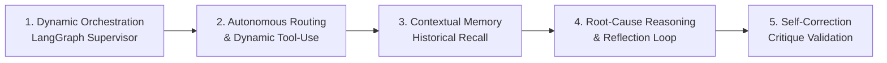

# 🏛️ Project Overview — DPR Agentic AI

## Executive Summary

**DPR Agentic AI** adalah sistem kecerdasan buatan berbasis **Genuine Multi-Agent Architecture (LangGraph)** yang dirancang khusus untuk **Dewan Perwakilan Rakyat Republik Indonesia (DPR RI)** periode keanggotaan **2024–2029**.

Sistem ini mengotomatisasi penyerapan data berita media nasional secara *real-time*, klasifikasi 24 struktur **Alat Kelengkapan Dewan (AKD)**, penilaian polaritas sentimen publik, deteksi anomali isu (*Z-Score Spikes*), penalaran akar masalah (*Root-Cause Reasoning*), formulasi rekomendasi kebijakan dengan validasi mandiri (*Self-Correction Loop*), serta penyusunan laporan ringkasan eksekutif (*Executive Briefing PDF*).

Sistem mencakup seluruh **24 struktur resmi AKD DPR RI**:
* **Ketua DPR RI & Pimpinan Parlemen**
* **13 Komisi (Komisi I s.d. Komisi XIII)** — termasuk komisi baru Komisi XII (Energi & Lingkungan Hidup) dan Komisi XIII (Reformasi Hukum, HAM & Imigrasi).
* **10 Badan & Panitia Khusus** — Banggar, Baleg, MKD, BURT, BAKN, BKSAP, Bamus, BAM (Badan Aspirasi Masyarakat), BPKPH, dan Pansus.

---

## 🌟 Pilar Inovasi Genuine Agentic AI



1. **Orkestrasi State Dinamis (LangGraph Supervisor Agent)**:
   * Bukan pipeline sekuensial statis, melainkan arsitektur berbasis graf (*StateGraph*) di mana Supervisor mengevaluasi kelengkapan state dan merutekan tugas ke agen yang tepat secara adaptif.
2. **Dynamic Tool Registry**:
   * Setiap agen dibekali daftar perkakas (*tools*) eksplisit yang dapat dipilih dan dipanggil secara mandiri sesuai konteks data (misal: `search_akd_lexicon`, `compute_zscore_anomalies`, `query_historical_memory`).
3. **Memori Kontekstual Jangka Panjang (*Active Memory*)**:
   * Basis data tidak sekadar pasif sebagai media simpan, melainkan berfungsi sebagai memori yang dipanggil oleh `InsightAgent` untuk mengenali kontinuitas isu dari waktu ke waktu.
4. **Penalaran & Refleksi Anomali (*Root-Cause Reasoning*)**:
   * `TrendAgent` tidak hanya menghitung lonjakan angka statistik murni, melainkan menganalisis narasi artikel pemicu lonjakan sentimen negatif atau volume berita.
5. **Validasi Mandiri (*Critique & Self-Correction Loop*)**:
   * Draft rekomendasi kebijakan fraksi/komisi divalidasi oleh simpul kritik (*Critic*) sebelum difinalisasi menjadi berkas PDF eksekutif.

---

## 📊 Matriks Kebutuhan Fungsional & Tingkat Otonomi (*Autonomy Levels*)

| No | Modul Fungsional | Deskripsi Kemampuan | Agen Pelaksana | Autonomy Level |
|---|---|---|---|---|
| **1** | **Orkestrasi Alur Kerja** | Mengatur siklus analisis, routing tugas, evaluasi state, dan error recovery. | `SupervisorAgent` | **L3 (Fully Agentic)** |
| **2** | **Penyerapan Berita (RSS)** | Mengambil berita dari 12+ portal nasional Tier-1, normalisasi WIB, dan deduplikasi URL. | `NewsCollectionAgent` | **L2 (Semi-Autonomous)** |
| **3** | **Deteksi Sumber Mati/Rusak** | Mendeteksi feed RSS yang berhenti update (>72 jam) atau error berulang, lalu mem-*flag* untuk investigasi. | `NewsCollectionAgent` | **L2 (Semi-Autonomous)** |
| **4** | **Klasifikasi AKD (24 Struktur)** | Memetakan isi berita ke portofolio komisi dengan hybrid fast-match & semantic reasoning. | `AnalysisAgent` | **L3 (Fully Agentic)** |
| **5** | **Kalibrasi Multi-Label Proporsional** | Mengevaluasi bobot relevansi proporsional multi-AKD (bukan dipaksa satu label), berdasarkan porsi konten per portofolio komisi. | `AnalysisAgent` | **L3 (Fully Agentic)** |
| **6** | **Analisis Sentimen Publik** | Mengukur polaritas teks (Positif, Negatif, Netral) menggunakan leksikon kontekstual berbobot. | `AnalysisAgent` | **L1 (Rule-Based)** |
| **7** | **Deteksi Anomali & Tren** | Menghitung lonjakan volume harian ($Z > 2.0$) dan menganalisis faktor penyebab (*root causes*). | `TrendAgent` | **L3 (Fully Agentic)** |
| **8** | **Self-Review Anomali (False-Positive Critique)** | Sebelum eskalasi, agen melakukan refleksi: sinyal nyata kebijakan atau noise kriminal/human-interest? | `TrendAgent` | **L3 (Fully Agentic)** |
| **9** | **Analisis Tren Komparatif Historis** | Membandingkan pola isu saat ini dengan pola historis serupa dan menyertakan konteks prediktif. | `TrendAgent` | **L3 (Fully Agentic)** |
| **10** | **Sintesis Narasi Eksekutif** | Merangkum dinamika isu strategis dengan mengintegrasikan memori histori parlemen. | `InsightAgent` | **L3 (Fully Agentic)** |
| **11** | **Deteksi Korelasi Lintas-AKD** | Mendeteksi efek domino antar-komisi (misal: isu pangan → berdampak ke harga → inflasi). | `InsightAgent` | **L3 (Fully Agentic)** |
| **12** | **Rekomendasi Kebijakan** | Merumuskan opsi tindakan fraksi/komisi dan memvalidasi kelayakan via critique loop. | `RecommendationAgent` | **L3 (Fully Agentic)** |
| **13** | **Penanganan Error Adaptif** | Memilih strategi mitigasi cerdas berdasarkan jenis kegagalan (timeout → model fallback, rate-limit → backoff). | `SupervisorAgent` | **L3 (Fully Agentic)** |
| **14** | **Penerbitan Briefing PDF** | Mengkompilasi berkas laporan resmi berformat PDF siap cetak untuk pimpinan DPR RI. | `ReportAgent` | **L2 (Semi-Autonomous)** |
| **15** | **Digest Terpersonalisasi per AKD** | Menyusun ringkasan yang disesuaikan relevansinya untuk staf tiap komisi dan pimpinan fraksi. | Dashboard Agent | **L3 (Fully Agentic)** |
| **16** | **Dasbor Interaktif** | Menyajikan visualisasi data analitik harian dan breakdown per AKD secara *real-time*. | Streamlit Dashboard | **L1 (Deterministic UI)** |

---

## 🛠️ Stack Teknologi & Infrastruktur

| Lapisan | Teknologi | Peran & Manfaat |
|---|---|---|
| **Bahasa & Runtime** | Python 3.11 | Lingkungan eksekusi utama berkinerja tinggi |
| **Package Manager** | `uv` (Astral) | Resolusi dependensi super cepat dan manajemen virtualenv |
| **Agent Framework** | LangGraph & LangChain Core | Orkestrasi graf multi-agen, state management, dan tool execution |
| **LLM Engine** | Google GenAI SDK (`gemini-3.6-flash` / `gemini-3.7-flash`) | Penalaran semantik, ekstraksi intent, dan perumusan rekomendasi |
| **Backend REST API** | FastAPI + Pydantic v2 | Endpoint asinkron berperforma tinggi |
| **Penyimpanan Data** | PostgreSQL 16 + AsyncSQLAlchemy | Penyimpanan relasional artikel, partisi harian, dan pemetaan AKD |
| **Broker & Task Queue** | Redis 7 + Celery | Antrean tugas asinkron dan *cache-aside* berkecepatan tinggi |
| **Koleksi Data** | Feedparser + Requests | Penguraian feed RSS 12+ media nasional secara tangguh |
| **Executive Dashboard** | Streamlit + Plotly | Dasbor analitik interaktif pimpinan dewan |
| **PDF Generation** | ReportLab | Pembuatan dokumen ringkasan eksekutif formal berstandar DPR RI |

---

## 🏛️ Struktur 24 Alat Kelengkapan Dewan (AKD) 2024–2029

```text
DPR RI (2024-2029)
├── Pimpinan: Ketua DPR RI (Puan Maharani) & Wakil Ketua
├── Komisi I s.d. XIII:
│   ├── Komisi I   : Pertahanan, Hubungan Luar Negeri, Kominfo, Siber, TNI
│   ├── Komisi II  : Pemerintahan Dalam Negeri, Otonomi Daerah, ASN, Pemilu, IKN
│   ├── Komisi III : Penegakan Hukum, Kepolisian, Kejaksaan, KPK, Peradilan
│   ├── Komisi IV  : Pertanian, Pangan, Kehutanan, Kelautan & Perikanan
│   ├── Komisi V   : Infrastruktur, Transportasi, Perumahan, BMKG, Basarnas
│   ├── Komisi VI  : Perdagangan, BUMN, Koperasi, UMKM, Investasi
│   ├── Komisi VII : Industri Manufaktur, Ekonomi Kreatif, Pariwisata
│   ├── Komisi VIII: Agama, Haji, Sosial, Kebencanaan, Perlindungan Perempuan & Anak
│   ├── Komisi IX  : Kesehatan, Ketenagakerjaan, BPJS, Kependudukan
│   ├── Komisi X   : Pendidikan, Kebudayaan, Riset, Olahraga, Atlet, Timnas
│   ├── Komisi XI  : Keuangan, Perbankan, APBN, Pajak, Bank Indonesia, OJK
│   ├── Komisi XII : Energi Baru Terbarukan, Migas, Tambang, Lingkungan Hidup
│   └── Komisi XIII: Reformasi Regulasi, Hak Asasi Manusia, Imigrasi, Pemasyarakatan
└── Badan & Panitia:
    ├── Badan Anggaran (Banggar)       ├── Badan Urusan Rumah Tangga (BURT)
    ├── Badan Legislasi (Baleg)         ├── Mahkamah Kehormatan Dewan (MKD)
    ├── Badan Kerja Sama Antar-Parlemen ├── Badan Akuntabilitas Keuangan Negara (BAKN)
    ├── Badan Musyawarah (Bamus)        ├── Badan Aspirasi Masyarakat (BAM)
    └── Badan Pemilihan (BPKPH)         └── Panitia Khusus (Pansus)
```
