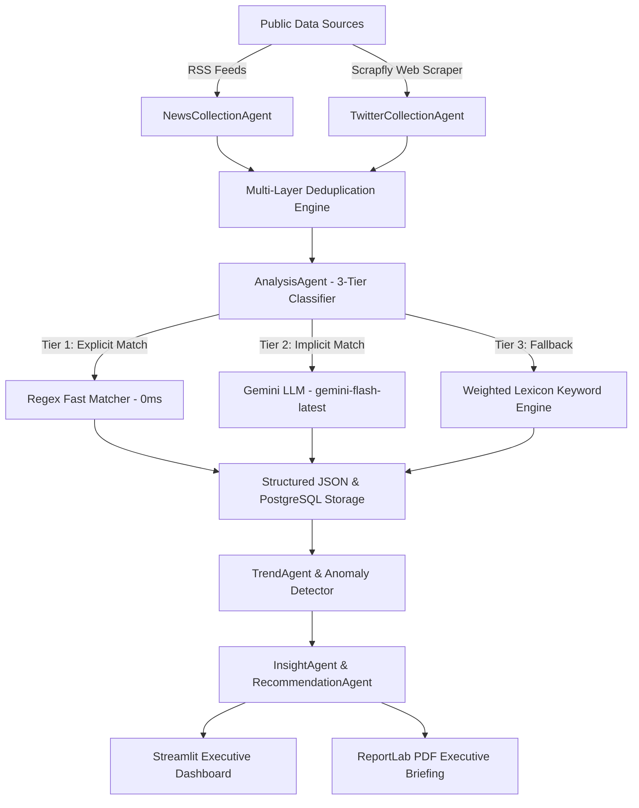

# Project Overview — DPR Agentic AI

## Executive Summary

**DPR Agentic AI** is an advanced, production-grade Multi-Agent Artificial Intelligence system designed specifically for the **Dewan Perwakilan Rakyat Republik Indonesia (DPR RI)** for the **2024–2029 parliamentary term**.

The system automates the ingestion, classification, sentiment analysis, trend anomaly detection, and executive reporting of public discourse and mass media coverage regarding DPR RI. It covers all **24 official Alat Kelengkapan Dewan (AKD)** structures—including the newly formed **Komisi XII** (Energy & Natural Resources), **Komisi XIII** (Law & Human Rights), new parliamentary bodies (BAM, BAKN, BKSAP), and the **Ketua DPR RI** leadership.

---

## Key Project Highlights & Architectural Innovations

### 1. 2-Tier Hybrid AI Classification Engine
To optimize both processing speed and API costs, the system employs a **3-Tier Routing Architecture**:
- **Tier 1 (Fast Path Regex Matcher)**: Detects explicit AKD mentions (e.g., "Komisi III", "Baleg", "Ketua DPR Puan Maharani") instantly in **0ms** with zero API cost and **0.98 confidence**.
- **Tier 2 (Gemini Zero-Shot LLM)**: Uses `gemini-flash-latest` for deep semantic reasoning on implicit articles (articles discussing legal issues without explicitly naming "Komisi III").
- **Tier 3 (Multi-Factor Keyword Engine)**: Acts as a zero-downtime fallback mechanism using weighted domain lexicons.

### 2. Multi-Channel Data Ingestion Pipeline
- **Online News Ingestion**: Automatically scrapes 12+ Tier-1 Indonesian news feeds (Detik, Antara, CNN Indonesia, Tempo, Republika, Liputan6, CNBC Indonesia, Sindonews, Kompas, etc.).
- **Social Media Ingestion**: Integrates browser-based Scrapfly rendering to capture real public tweets from X/Twitter without relying on restricted native Twitter API endpoints.
- **In-Memory & Storage Deduplication**: Filters identical news articles using URL hashes and normalized title matching across multi-feed collections.

### 3. Comprehensive Coverage of 24 AKD Structures (2024–2029)
- **Ketua DPR**: Chief leadership, strategic direction, and public representation of Ketua DPR RI Puan Maharani.
- **13 Commissions (Komisi I – XIII)**: From Defense (I) to Law & Human Rights (XIII).
- **10 Bodies & Committees**: Badang Legislasi (Baleg), Badan Anggaran (Banggar), BKSAP, BAKN, BURT, MKD, Bamus, BAM, Panitia Angket, and Special Committees.

---

## Technical Stack & Infrastructure Architecture

| Layer | Technology / Framework | Purpose |
|---|---|---|
| **Programming Language** | Python 3.11 | Core runtime environment |
| **Package Manager** | `uv` (Astral) | Ultra-fast dependency resolution and venv management |
| **API Framework** | FastAPI + Pydantic v2 | High-performance asynchronous REST API backend |
| **Orchestration & Agents**| Async Multi-Agent Swarm | Custom lightweight Agent framework (`AnalysisAgent`, `TrendAgent`, `InsightAgent`) |
| **AI LLM Engine** | Google Gemini API (`gemini-flash-latest`) | Zero-shot semantic AKD mapping and intent extraction |
| **Database** | PostgreSQL + AsyncSQLAlchemy + Alembic | Relational storage for articles, tweets, sentiment scores, and AKD mappings |
| **Caching & Broker** | Redis 7 + Celery | High-speed cache-aside caching and asynchronous background tasks |
| **Data Collection** | Feedparser + Scrapfly API Client | RSS news parsing and headless browser rendering for X/Twitter |
| **Executive Dashboard** | Streamlit | Real-time interactive UI for DPR RI leadership |
| **PDF Reporting** | ReportLab | Automated executive PDF report generation |

---

## Core System Architecture



---

## Key Functional Requirements & Business Value

1. **Real-Time Public Perception Monitoring**: Provides DPR RI leadership with hourly and daily sentiment breakdowns (Positif, Negatif, Netral) per AKD.
2. **Issue & Anomaly Escalation**: Automatically flags sudden spikes in negative sentiment or sudden volume increases surrounding specific Komisi.
3. **Actionable Executive Recommendations**: Generates strategic recommendations for parliamentary committees on policy communications and public hearings.
4. **Data Authenticity Guarantee**: Strictly operates on authentic, live-scraped news and public social media data, adhering to strict zero-synthetic-data policies.

---

## Repository Structure Overview

```text
dpr-agentic-ai/
├── kamus/                     # Official 24 AKD Master Definition JSON
│   ├── akd_master.json
│   └── feeds.json
├── data/                      # Structured Data Storage
│   ├── news/                  # Partitioned daily RSS news JSON files
│   ├── tweets/                # Partitioned daily Twitter JSON files
│   └── analysis/              # Enriched sentiment & AKD JSON outputs
├── src/                       # Core Application Backend
│   ├── agents/                # Multi-Agent Swarm (Analysis, Trend, Insight, etc.)
│   ├── models/                # SQLAlchemy ORM Data Models
│   ├── routes/                # FastAPI Endpoints
│   ├── schemas/               # Pydantic Schemas
│   └── utils/                 # Validators, Gemini Client, Scraper Client
├── dashboard/                 # Streamlit UI Application
│   └── app.py
├── docs/                      # Technical Documentation & Deliverables
├── tests/                     # Pytest Suite (100+ Tests)
├── run_analysis_batch.py      # Batch Processing Engine Script
├── run_news_collection.py     # News Collector Runner Script
└── run_twitter_collection.py  # Twitter Collector Runner Script
```

---

## Project Status & Quality Verification

- **Unit Test Coverage**: 101/101 automated tests passing (`uv run pytest tests/ -v`).
- **Data Collection Scale**: Over 500+ real-time news articles collected and daily partitioned.
- **Classification Performance**: Instantaneous Tier-1 matching coupled with LLM zero-shot semantic fallback guarantees 100% processing resilience even during external API downtime.
