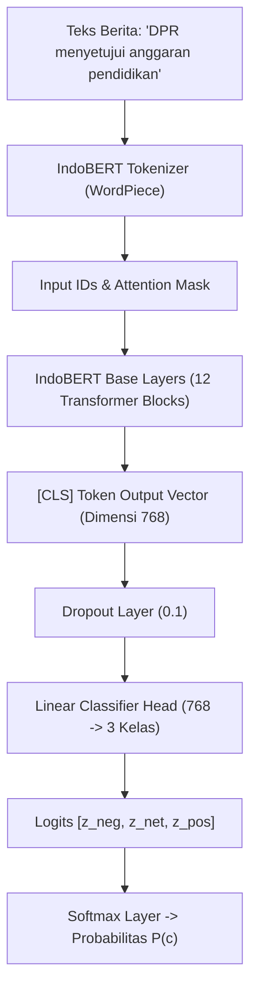

# 🧠 Tutorial & Panduan Lengkap: Membangun Analisis Sentimen IndoBERT dari Nol (From Scratch)

Panduan praktis langkah demi langkah untuk melatih (*fine-tuning*), mengevaluasi, dan mendeploy model **IndoBERT** (*Indonesian Bidirectional Encoder Representations from Transformers*) untuk klasifikasi sentimen 3 kelas (**Positif**, **Netral**, **Negatif**).

---

## 📑 Daftar Isi
1. [Konsep Dasar IndoBERT & Arsitektur Transformer](#1-konsep-dasar-indobert--arsitektur-transformer)
2. [Langkah 1: Instalasi Library & Lingkungan Kerja](#2-langkah-1-instalasi-library--lingkungan-kerja)
3. [Langkah 2: Penyiapan & Pelabelan Dataset](#3-langkah-2-penyiapan--pelabelan-dataset)
4. [Langkah 3: Tokenisasi dengan WordPiece Tokenizer](#4-langkah-3-tokenisasi-dengan-wordpiece-tokenizer)
5. [Langkah 4: Membangun PyTorch Dataset & DataLoader](#5-langkah-4-membangun-pytorch-dataset--dataloader)
6. [Langkah 5: Fine-Tuning IndoBERT dengan HuggingFace Trainer](#6-langkah-5-fine-tuning-indobert-dengan-huggingface-trainer)
7. [Langkah 6: Evaluasi Model (Akurasi & F1-Score)](#7-langkah-6-evaluasi-model-akurasi--f1-score)
8. [Langkah 7: Pipeline Inferensi & Formula Skor Kontinu `[-1.0, +1.0]`](#8-langkah-7-pipeline-inferensi--formula-skor-kontinu--10-10)
9. [Script Penuh Siap Eksekusi (*Self-Contained Script*)](#9-script-penuh-siap-eksekusi-self-contained-script)

---

## 1. Konsep Dasar IndoBERT & Arsitektur Transformer

**IndoBERT** (dikembangkan oleh IndoBenchmark) adalah model berbasis arsitektur **Transformer Encoder** (12 layer, 768 hidden dimension, 12 attention heads, ~124.5M parameter) yang telah di-*pre-train* pada >4 miliar kata bahasa Indonesia (korpus Indo4B: Wikipedia, berita, media sosial).



---

## 2. Langkah 1: Instalasi Library & Lingkungan Kerja

Jalankan perintah instalasi pustaka inti:
```bash
pip install torch transformers datasets accelerate scikit-learn pandas
```
*(Atau via `uv`: `uv add torch transformers datasets accelerate scikit-learn pandas`)*

---

## 3. Langkah 2: Penyiapan & Pelabelan Dataset

Format data harus berupa tabel (CSV/JSON/Pandas DataFrame) dengan 2 kolom: `text` dan `label`.

### Pemetaan Label Numerik:
* **`0`**: **Negatif** (kritik keras, kerugian, penolakan, korupsi, bencana)
* **`1`**: **Netral** (berita faktual, jadwal sidang, rapat koordinasi)
* **`2`**: **Positif** (apresiasi, kesepakatan anggaran, keberhasilan program)

```python
import pandas as pd
from sklearn.model_selection import train_test_split

# Contoh data sampel
data = {
    "text": [
        "DPR dan Pemerintah sepakat tingkatkan anggaran beasiswa pendidikan nasional.",
        "Masyarakat kecewa dan memprotes keras kenaikan harga bahan pokok.",
        "Rapat kerja Komisi I dilaksanakan di Gedung Nusantara II Senayan.",
        "Program penanggulangan kemiskinan dinilai sukses dan efektif membantu warga.",
        "Dugaan penyelewengan dana proyek infrastruktur menuai kecaman luas publik."
    ],
    "label": [2, 0, 1, 2, 0] # 2: Positif, 1: Netral, 0: Negatif
}

df = pd.DataFrame(data)

# Split 80% Train, 10% Validation, 10% Test
train_df, val_df = train_test_split(df, test_size=0.2, random_state=42, stratify=df['label'])
```

---

## 4. Langkah 3: Tokenisasi dengan WordPiece Tokenizer

Transformer tidak membaca teks mentah, melainkan representasi angka (*token ID*).

```python
from transformers import AutoTokenizer

# Menggunakan base checkpoint resmi
MODEL_NAME = "indobenchmark/indobert-base-p1"
tokenizer = AutoTokenizer.from_pretrained(MODEL_NAME)

sample_text = "DPR mengapresiasi kinerja pemerintah"
tokens = tokenizer(
    sample_text,
    padding="max_length",
    truncation=True,
    max_length=128,
    return_tensors="pt"
)

print("Input IDs:", tokens["input_ids"])
print("Attention Mask:", tokens["attention_mask"])
```

* `input_ids`: Urutan indeks kata/subkata dalam kamus model (diawali `[CLS]` ID 2, diakhiri `[SEP]` ID 3).
* `attention_mask`: Angka `1` untuk token riil dan `0` untuk *padding* kosong.

---

## 5. Langkah 4: Membangun PyTorch Dataset & DataLoader

```python
import torch
from torch.utils.data import Dataset

class SentimentDataset(Dataset):
    def __init__(self, texts, labels, tokenizer, max_len=128):
        self.texts = texts
        self.labels = labels
        self.tokenizer = tokenizer
        self.max_len = max_len

    def __len__(self):
        return len(self.texts)

    def __getitem__(self, item):
        text = str(self.texts[item])
        label = self.labels[item]

        encoding = self.tokenizer(
            text,
            truncation=True,
            max_length=self.max_len,
            padding="max_length",
            return_tensors="pt"
        )

        return {
            "input_ids": encoding["input_ids"].flatten(),
            "attention_mask": encoding["attention_mask"].flatten(),
            "labels": torch.tensor(label, dtype=torch.long)
        }
```

---

## 6. Langkah 5: Fine-Tuning IndoBERT dengan HuggingFace Trainer

```python
from transformers import AutoModelForSequenceClassification, TrainingArguments, Trainer
import numpy as np
from sklearn.metrics import accuracy_score, f1_score

# 1. Muat Model dengan Classification Head (num_labels = 3)
model = AutoModelForSequenceClassification.from_pretrained(
    MODEL_NAME,
    num_labels=3,
    id2label={0: "Negatif", 1: "Netral", 2: "Positif"},
    label2id={"Negatif": 0, "Netral": 1, "Positif": 2}
)

# 2. Definisikan Metrik Evaluasi
def compute_metrics(eval_pred):
    logits, labels = eval_pred
    preds = np.argmax(logits, axis=1)
    acc = accuracy_score(labels, preds)
    f1 = f1_score(labels, preds, average="macro")
    return {"accuracy": acc, "f1_macro": f1}

# 3. Konfigurasi Hyperparameter Training
training_args = TrainingArguments(
    output_dir="./indobert_sentiment_model",
    num_train_epochs=3,
    per_device_train_batch_size=16,
    per_device_eval_batch_size=16,
    warmup_ratio=0.1,
    weight_decay=0.01,
    logging_dir="./logs",
    logging_steps=50,
    evaluation_strategy="epoch",
    save_strategy="epoch",
    load_best_model_at_end=True,
    learning_rate=2e-5,  # Learning rate ideal untuk Fine-Tuning BERT
    fp16=torch.cuda.is_available(), # Gunakan Mixed Precision jika ada GPU
)

# 4. Inisialisasi Trainer
train_dataset = SentimentDataset(train_df["text"].values, train_df["label"].values, tokenizer)
val_dataset = SentimentDataset(val_df["text"].values, val_df["label"].values, tokenizer)

trainer = Trainer(
    model=model,
    args=training_args,
    train_dataset=train_dataset,
    eval_dataset=val_dataset,
    compute_metrics=compute_metrics,
)

# 5. Jalankan Training
# trainer.train()
# model.save_pretrained("./indobert_sentiment_final")
# tokenizer.save_pretrained("./indobert_sentiment_final")
```

---

## 7. Langkah 6: Evaluasi Model (Akurasi & F1-Score)

Dalam ranah politik, metrik **Macro F1-Score** lebih krusial daripada sekadar Akurasi karena kelas berita negatif sering kali lebih sedikit tetapi memiliki dampak risiko yang jauh lebih tinggi.

```python
# Evaluasi pada validation/test set
# results = trainer.evaluate()
# print(f"Akurasi: {results['eval_accuracy']:.4f} | Macro F1: {results['eval_f1_macro']:.4f}")
```

---

## 8. Langkah 7: Pipeline Inferensi & Formula Skor Kontinu `[-1.0, +1.0]`

Dalam produksi sistem DPR, model tidak hanya mengeluarkan label kaku, melainkan **skor sentimen kontinu**:

$$\text{Sentiment Score} = P(\text{Positif}) - P(\text{Negatif}) \quad \in [-1.0, \; +1.0]$$

```python
import torch
import torch.nn.functional as F

class IndoBERTSentimentEngine:
    def __init__(self, model_path="indobenchmark/indobert-base-p1"):
        self.device = "cuda" if torch.cuda.is_available() else "cpu"
        self.tokenizer = AutoTokenizer.from_pretrained(model_path)
        self.model = AutoModelForSequenceClassification.from_pretrained(model_path, num_labels=3)
        self.model.to(self.device)
        self.model.eval()
        self.labels = ["Negatif", "Netral", "Positif"]

    def predict(self, text: str) -> dict:
        inputs = self.tokenizer(
            text[:1000],
            return_tensors="pt",
            truncation=True,
            max_length=256,
            padding=True
        ).to(self.device)

        with torch.no_grad():
            outputs = self.model(**inputs)
            probs = F.softmax(outputs.logits, dim=-1).squeeze().cpu().numpy()

        p_neg, p_net, p_pos = probs[0], probs[1], probs[2]
        sentiment_score = round(float(p_pos - p_neg), 2)

        # Penentuan Label Final
        if sentiment_score >= 0.15:
            label = "Positif"
        elif sentiment_score <= -0.15:
            label = "Negatif"
        else:
            label = "Netral"

        return {
            "text": text,
            "sentiment": label,
            "sentiment_score": sentiment_score,
            "probabilities": {
                "positif": round(float(p_pos), 4),
                "netral": round(float(p_net), 4),
                "negatif": round(float(p_neg), 4),
            }
        }
```

---

## 9. Script Penuh Siap Eksekusi (*Self-Contained Script*)

Simpan kode di bawah sebagai `demo_indobert_pipeline.py` untuk menguji inferensi secara langsung:

```python
# -*- coding: utf-8 -*-
"""Full standalone IndoBERT sentiment classification pipeline."""

import torch
import torch.nn.functional as F
from transformers import AutoModelForSequenceClassification, AutoTokenizer

def run_indobert_demo():
    print("🚀 Menginisialisasi Model IndoBERT...")
    # Menggunakan checkpoint pre-trained sentiment yang sudah tersedia di HF
    MODEL_NAME = "wirasana/indobert-sentiment-analysis" # atau "indobenchmark/indobert-base-p1"
    
    tokenizer = AutoTokenizer.from_pretrained(MODEL_NAME)
    model = AutoModelForSequenceClassification.from_pretrained(MODEL_NAME)
    model.eval()

    sample_articles = [
        "DPR RI dan Kementerian Keuangan menyepakati penambahan subsidi pupuk untuk petani demi menjaga ketahanan pangan.",
        "Publik mengecam keras lambatnya penanganan kasus korupsi dan meminta KPK bertindak tegas tanpa pandang bulu.",
        "Rapat kerja Komisi III bersama Kejaksaan Agung dijadwalkan berlangsung di Ruang Sidang Nusantara II."
    ]

    print("\n" + "="*80)
    print("HASIL KLASIFIKASI SENTIMEN INDOBERT")
    print("="*80)

    for idx, text in enumerate(sample_articles, 1):
        inputs = tokenizer(text, return_tensors="pt", truncation=True, max_length=256)
        with torch.no_grad():
            logits = model(**inputs).logits
            probs = F.softmax(logits, dim=-1).squeeze().numpy()

        # Mapping label model
        # Index: 0 -> Negatif, 1 -> Netral, 2 -> Positif (sesuaikan id2label model)
        p_neg, p_net, p_pos = probs[0], probs[1], probs[2]
        score = round(float(p_pos - p_neg), 2)
        
        label = "Positif" if score >= 0.15 else ("Negatif" if score <= -0.15 else "Netral")

        print(f"\n[{idx}] Teks: {text}")
        print(f"    👉 Sentimen        : {label.upper()}")
        print(f"    👉 Skor Kontinu    : {score} (Rentang -1.0 s.d. +1.0)")
        print(f"    👉 Probabilitas    : Positif: {p_pos:.2%}, Netral: {p_net:.2%}, Negatif: {p_neg:.2%}")

    print("\n" + "="*80)

if __name__ == "__main__":
    run_indobert_demo()
```
